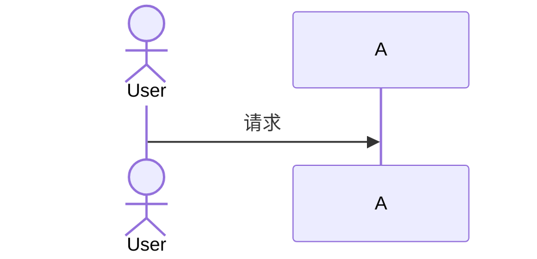

# 主题 11 章通用骨架

> 用于 `/add-theme` skill。每个主题的章节标题可随技术领域微调（例如 Runtime 工作流程章节可以是“调度工作流程”、“执行模型”等），但 11 章结构必须保持一致。

---

## index.md

```markdown
# [主题中文名]

> 一句话理解：**[用一句话点明该主题在 AI Infra 中的核心作用]**。

## 学习目标

读完本章，你应该能：

1. [目标 1]
2. [目标 2]
3. [目标 3]

## 本章结构

| 章节 | 内容 |
|---|---|
| [01 背景](01-background) | [一句话] |
| [02 核心思想](02-core-ideas) | [一句话] |
| [03 架构设计](03-architecture) | [一句话] |
| [04 Runtime 工作流程](04-runtime-workflow) | [一句话] |
| [05 核心模块](05-core-modules) | [一句话] |
| [06 源码分析](06-source-analysis) | [一句话] |
| [07 工程实践](07-mini-demo) | [一句话] |
| [08 企业生产实践](08-production-practice) | [一句话] |
| [09 最佳实践](09-best-practices) | [一句话] |
| [10 面试题](10-interview-questions) | [一句话] |
| [11 延伸阅读](11-further-reading) | [一句话] |

## 与其他主题的关系

- [上游主题]
- [下游主题]
- [相邻主题]
```

## 01-background.md

```markdown
# 1. 背景

> 一句话理解：**[为什么需要这个技术]**。

## 1.1 问题域

描述该主题要解决的真实工程问题。

## 1.2 历史演进

技术如何发展到今天。

## 1.3 现有方案的局限性

为什么 Kubernetes / 传统方案不够。

## 1.4 AI 场景的特殊性

训练/推理/平台化场景带来的独特挑战。

## 本章小结

[总结]
```

## 02-core-ideas.md

```markdown
# 2. 核心思想

> 一句话理解：**[用一个核心抽象概括]**。

## 2.1 关键概念

术语定义、模型抽象。

## 2.2 设计哲学

该技术背后的取舍。

## 2.3 与替代方案对比

表格对比优劣势。

## 本章小结

[总结]
```

## 03-architecture.md

```markdown
# 3. 架构设计

> 一句话理解：**[组件如何协作]**。

## 3.1 整体架构图


## 3.2 核心组件职责

| 组件 | 职责 |
|---|---|
| A | ... |
| B | ... |

## 3.3 数据流/控制流

## 3.4 与 Kubernetes / 上层系统的关系

## 本章小结

[总结]
```

## 04-runtime-workflow.md

```markdown
# 4. Runtime 工作流程

> 一句话理解：**[一个请求/任务从进入到完成的完整链路]**。

## 4.1 时序图



## 4.2 关键步骤解析

1. 步骤 1
2. 步骤 2
3. 步骤 3

## 4.3 错误与重试路径

## 4.4 与 Mini Demo 的对应

## 本章小结

[总结]
```

## 05-core-modules.md

```markdown
# 5. 核心模块

> 一句话理解：**[把架构拆开看每个模块的细节]**。

## 5.1 模块 A

## 5.2 模块 B

## 5.3 模块 C

## 5.4 配置与扩展点

## 本章小结

[总结]
```

## 06-source-analysis.md

```markdown
# 6. 源码分析

> 一句话理解：**[从源码入口理解实现]**。

## 6.1 仓库结构

## 6.2 关键调用链

## 6.3 核心数据结构

## 6.4 与生态组件的集成

## 本章小结

[总结]
```

## 07-mini-demo.md

```markdown
# 7. 工程实践：Mini Demo

> 一句话理解：**[Mini Demo 演示什么]**。

## 7.1 为什么需要这个 Mini Demo

## 7.2 快速开始

```bash
cd docs/<section>/<theme>/mini-demo
pip install -e ".[dev]"
pytest tests/ -v
python -m <pkg>.demo
```

## 7.3 端到端场景

| 场景 | 演示机制 | 对应真实组件 |
|---|---|---|

## 7.4 目录结构与模块对照

## 7.5 关键代码片段解读

## 7.6 测试覆盖

## 7.7 诚实的边界

## 7.8 本章小结

## 7.9 进一步阅读
```

## 08-production-practice.md

```markdown
# 8. 企业生产实践

> 一句话理解：**[真实环境怎么落地]**。

## 8.1 典型部署拓扑

## 8.2 安装/升级/回滚

## 8.3 多租户与隔离

## 8.4 可观测性与排障

## 8.5 常见故障案例

## 8.6 成本与容量规划

## 本章小结

[总结]
```

## 09-best-practices.md

```markdown
# 9. 最佳实践

> 一句话理解：**[怎么做对、怎么做错]**。

## 9.1 决策树 / 选型矩阵

## 9.2 配置 Checklist

## 9.3 性能优化

## 9.4 安全与合规

## 9.5 升级与兼容性

## 9.6 反模式

## 本章小结

[总结]
```

## 10-interview-questions.md

```markdown
# 10. 面试题

## 初级

1. Q1
2. Q2

## 中级

1. Q1
2. Q2

## 高级

1. Q1
2. Q2

## 参考答案提示

[可选]
```

## 11-further-reading.md

```markdown
# 11. 延伸阅读

> 一句话理解：**[本主题的出口与下一步学习地图]**。

## 11.1 官方文档

## 11.2 源码仓库

## 11.3 论文与演讲

## 11.4 相邻主题交叉引用

| 主题 | 关系 | 链接 |
|---|---|---|
| [相邻主题 A](/xx/xx/) | ... | ... |

## 11.5 推荐学习路径

## 本章小结

[总结]
```
