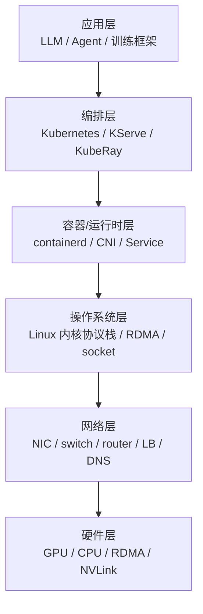

# 1. 背景：为什么 AI Infra 工程师必须懂计算机网络

## 1.1 一个真实的场景

你负责的 Kubernetes 集群上，一个 32 卡 A100 分布式训练任务跑到第 5 天，突然所有 worker 同时卡住，NCCL 报 `operation timed out`。

你检查了：

- GPU 利用率：0%；
- 显存：正常；
- 日志：没有 OOM，没有 NaN；
- 网络端口：交换机灯正常闪。

最后你发现：某个 ToR 交换机的瞬时缓冲区被 all-reduce 的同步 burst 打满，导致 RoCEv2 的 PFC 触发死锁，整个训练集群短暂“窒息”。

这个问题不在 PyTorch，不在 NCCL，不在 GPU——它在 **计算机网络**。

## 1.2 网络是 AI 平台的“血管系统”

如果把 AI 基础设施画成一栋楼：



网络层承上启下。它决定：

- 分布式训练的梯度能不能及时同步；
- 推理服务的请求能不能低延迟到达；
- 容器之间能不能稳定通信；
- 跨可用区的数据复制要花多长时间。

**AI Infra 工程师可以不写交换机配置，但必须能读懂网络行为。**

## 1.3 为什么不只是“会配网络”

很多工程师的日常网络能力包括：

- 会配 IP、子网、路由；
- 会用 `ping`、`curl`、`tcpdump`；
- 会配 Kubernetes Service 和 Ingress。

但这不够。AI 场景下的网络问题往往是**性能问题**和**边界问题**：

| 问题 | 表面现象 | 深层原因 |
|---|---|---|
| NCCL 超时 | 训练卡住 | PFC/ECN 配置、交换机缓冲区、incast、IRQ 绑定 |
| 推理 P99 高 | 延迟抖动 | DNS 解析、LB 策略、TCP 拥塞、容器网卡队列 |
| Pod 间通信失败 | 连不上 | CNI、iptables/ipvs、MTU、NetworkPolicy |
| 跨 AZ 复制慢 | 带宽低 | TCP 窗口、RTT、带宽时延积、QoS |
| checkpoint 上传慢 | I/O 慢 | 网络文件系统、TCP 拥塞、对象存储网关 |

这些问题的根因都在计算机网络。

## 1.4 AI 工作负载对网络的特殊要求

AI 训练和推理不是普通的 Web 服务。它们对网络有独特需求：

### 高带宽

分布式训练需要在每次迭代中同步大量梯度。大模型训练的 all-reduce 通信量可能达到几百 GB/s。

### 低延迟

推理服务需要快速响应。网络路径上的每一跳（DNS → LB → Service → Pod → 容器网卡 → 内核协议栈）都会增加延迟。

### 低尾延迟

AI 推理的 P99/P999 延迟很重要。网络中的缓冲区膨胀、队列竞争、重传都会导致长尾延迟。

### 同步 burst（incast）

all-reduce 往往是同步的：所有 worker 同时向一个节点发送数据，形成 incast，交换机缓冲区容易被打满。

### 可靠性

训练任务可能跑数周，期间不能出现网络分区、丢包导致的 NCCL 崩溃。

## 1.5 网络技术栈概览

AI Infra 工程师需要理解从物理层到应用层的网络技术栈：

```
应用层：HTTP/gRPC/NCCL
传输层：TCP / UDP / QUIC
网络层：IP / 路由 / ARP / NAT
数据链路层：Ethernet / VLAN / VXLAN
物理层：铜缆/光纤 / NIC / switch / RDMA / InfiniBand
```

在不同的 AI 场景里，重点不同：

- **分布式训练**：关注 RDMA/RoCE/InfiniBand、NCCL、数据中心拓扑、incast；
- **推理服务**：关注 DNS、负载均衡、HTTP/gRPC、服务网格、TLS；
- **Kubernetes 平台**：关注 CNI、Service、kube-proxy、CoreDNS、NetworkPolicy。

## 1.6 本章的学习路径

学习计算机网络，建议按这个顺序建立直觉：

1. **先理解分层模型和核心思想**（分组交换、复用、可靠传输、拥塞控制）；
2. **再看数据中心网络拓扑和 RDMA/InfiniBand/RoCE**；
3. **然后看一个数据包的完整旅程**；
4. **接着看 Kubernetes 网络和负载均衡/DNS**；
5. **最后学排障和性能调优**。

不要着急记命令。先理解机制，命令只是机制的表面。

## 1.7 本节小结

- AI Infra 工程师必须懂网络，因为分布式训练、推理服务、K8s 平台都高度依赖网络；
- 网络决定带宽、延迟、尾延迟、可靠性和成本；
- AI 工作负载有高带宽、低延迟、低尾延迟、incast、高可靠性的要求；
- 学习网络要从机制入手，而不是死记命令。

下一节，我们从最核心的概念开始：**分层、分组、可靠与拥塞**。
