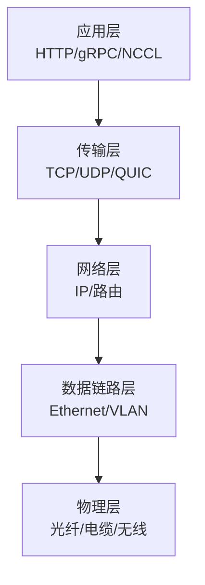

# 2. 核心思想：分层、分组、可靠与拥塞

计算机网络看似复杂，但底层只回答几个问题：

1. **数据怎么编址？**（IP、MAC、DNS）
2. **数据怎么可靠传输？**（TCP、重传、滑动窗口）
3. **网络拥塞了怎么办？**（拥塞控制、流量控制）
4. **数据怎么走？**（路由、交换）
5. **很多连接怎么共享链路？**（复用、分组交换）

本章先建立这些核心概念的直觉。

## 2.1 分层模型：OSI 与 TCP/IP

网络协议被组织成层次结构，每一层只和相邻层交互。



| OSI 层 | TCP/IP 层 | 例子 |
|---|---|---|
| 应用层 | 应用层 | HTTP, gRPC, DNS, NCCL |
| 表示层 | — | TLS/SSL（常放在应用层） |
| 会话层 | — | — |
| 传输层 | 传输层 | TCP, UDP, QUIC |
| 网络层 | 网络层 | IP, ICMP, ARP, NAT |
| 数据链路层 | 网络接口层 | Ethernet, VLAN, VXLAN |
| 物理层 | 网络接口层 | 光纤、电缆、NIC、switch port |

分层的好处：

- **隔离变化**：上层不需要知道下层具体怎么实现；
- **模块化**：每一层可以独立演进；
- **标准化**：不同厂商设备可以互联互通。

## 2.2 分组交换 vs 电路交换

### 电路交换

打电话是电路交换：通话前先建立一条独占的物理通路，通话期间这条通路一直被占用。

优点：稳定带宽、低延迟抖动。
缺点：资源利用率低，不适合 burst 流量。

### 分组交换

互联网使用分组交换：数据被切分成一个个包，每个包独立传输，按需占用链路资源。

优点：资源利用率高，适合 burst 流量。
缺点：可能出现排队、丢包、延迟抖动。

AI 训练流量就是典型的 burst：all-reduce 时带宽打满，其他时候可能很空闲。分组交换更灵活，但也带来了 incast 和拥塞问题。

## 2.3 复用与解复用

一条物理链路怎么同时承载多个连接？靠 **复用（Multiplexing）**。

- **时分复用（TDM）**：不同连接轮流使用链路；
- **频分复用（FDM）**：不同连接使用不同频率；
- **统计复用**：分组交换网络中，包按需共享链路，靠队列调度。

TCP/IP 中，端口号就是传输层的复用/解复用标识：同一个 IP 上，不同端口号对应不同应用。

## 2.4 端到端原则

互联网设计的核心原则之一：**端到端原则（End-to-End Principle）**。

> 如果某个功能可以由通信两端的应用实现，就不应该放在网络中间设备里。

例子：

- 可靠性由 TCP 在端主机实现，而不是路由器；
- 加密由 TLS 在端主机实现，而不是交换机。

好处：网络中间设备保持简单，新功能可以在端主机快速迭代。

但 AI 基础设施里也有很多“网络内智能”：PFC/ECN、RDMA offloading、智能网卡、交换机上做集合通信。这是性能和灵活性的 trade-off。

## 2.5 可靠传输

网络会丢包、乱序、重复。TCP 通过以下机制保证可靠传输：

- **序列号（Sequence Number）**：给每个字节编号；
- **确认应答（ACK）**：接收方告诉发送方收到了哪些数据；
- **超时重传（Retransmission Timeout, RTO）**：没收到 ACK 就重传；
- **滑动窗口（Sliding Window）**：一次性发送多个包，提高吞吐；
- **流量控制（Flow Control）**：接收方告诉发送方自己的接收窗口，防止被压垮。

## 2.6 拥塞控制

可靠传输解决“接收方丢包”，拥塞控制解决“网络中间丢包”。

当网络负载过高，路由器缓冲区满，包会被丢弃。TCP 通过拥塞控制动态调整发送速率：

- **慢启动（Slow Start）**：初始窗口小，指数增长；
- **拥塞避免（Congestion Avoidance）**：达到阈值后线性增长；
- **快速重传/快速恢复（Fast Retransmit/Recovery）**：收到 3 个重复 ACK 时快速调整；
- **AIMD（Additive Increase Multiplicative Decrease）**：加性增、乘性减。

常见拥塞控制算法：

| 算法 | 特点 |
|---|---|
| Reno | 经典 AIMD，丢包为信号 |
| CUBIC | Linux 默认，窗口按三次函数增长，适合高 BDP 链路 |
| BBR | 基于带宽和 RTT 测量，不依赖丢包，适合高带宽+低延迟链路 |
| DCTCP | 数据中心 TCP，利用 ECN 精确控制窗口，减少缓冲区占用 |

AI 训练常用 RDMA 或 RoCE，它们 bypass 内核 TCP，但同样面临拥塞控制问题（PFC/ECN）。

## 2.7 带宽时延积（BDP）

```
BDP = 带宽 × RTT
```

BDP 表示“链路上正在传输但尚未确认的数据量”。为了让高带宽链路满载，发送窗口必须至少等于 BDP。

例子：100 Gbps 链路，RTT 100 μs，BDP = 1.25 MB。如果 TCP 窗口只有 64 KB，链路利用率会极低。

AI 集群中，高带宽 RDMA 网络的 BDP 很大，需要调大缓冲区或窗口。

## 2.8 Incast

Incast 是多对一的同步流量模式：多个发送方同时向一个接收方发数据，接收方所在交换机的缓冲区瞬间被占满，导致丢包或 PFC 反压。

AI 训练中的 all-reduce、all-gather 都容易引发 incast。解决方法：

- 交换机大缓冲区；
- PFC + ECN 流量控制；
- 集合通信算法优化（ring/tree 替代 naive all-to-all）；
- 调度发送时机，避免完全同步。

## 2.9 命名、寻址与路由

- **命名（Name）**：人类可读的标识，如 `ai-infra.cypggs.com`；
- **地址（Address）**：机器可定位的标识，如 IP 地址；
- **路由（Route）**：从源地址到目的地址的路径选择。

DNS 负责名字→地址，路由协议负责地址→路径。

## 2.10 核心概念速查表

| 概念 | 一句话解释 |
|---|---|
| 分层模型 | 把网络功能分成若干层，每层只和相邻层交互 |
| 分组交换 | 数据切成包独立传输，按需共享链路 |
| 电路交换 | 通信前建立独占通路 |
| 复用 | 多个连接共享一条物理链路 |
| 端到端原则 | 能在端主机做的功能，不放在网络中间设备 |
| 可靠传输 | 通过序列号、ACK、重传、滑动窗口保证数据不丢不错序 |
| 拥塞控制 | 根据网络拥塞程度动态调整发送速率 |
| BDP | 带宽 × RTT，决定需要多大的发送窗口 |
| Incast | 多对一同步 burst 导致交换机缓冲区溢出 |
| DNS | 名字到地址的分布式数据库 |

## 2.11 本节小结

- 网络用分层模型组织协议，每层负责不同问题；
- 互联网基于分组交换和统计复用，灵活但不稳定；
- 端到端原则让网络中间设备保持简单，但 AI 场景也会用网络内智能提升性能；
- TCP 通过序列号、ACK、滑动窗口、流量控制实现可靠传输；
- 拥塞控制通过慢启动、AIMD、CUBIC/BBR 等算法避免网络崩溃；
- BDP 和 incast 是 AI 集群网络的两个关键概念。

下一节，我们看数据中心网络架构和 AI 集群拓扑。
