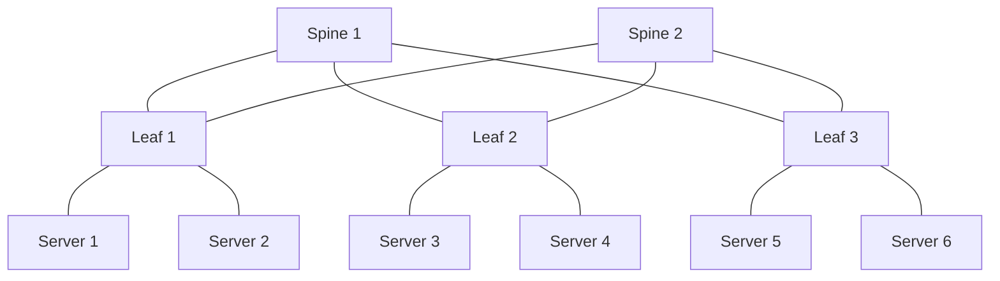
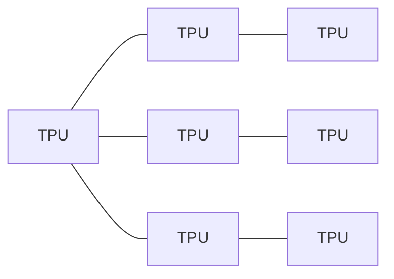
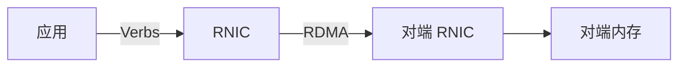

# 3. 架构设计：数据中心网络与 AI 集群拓扑

理解网络架构，能帮你回答：为什么 1000 张 GPU 训练一个大模型，网络不会变成瓶颈？为什么有的集群用 InfiniBand，有的用 RoCE，有的用 NVLink？

## 3.1 数据中心网络演进

早期数据中心网络是简单的三层架构：

```
核心层（Core）
   ↓
汇聚层（Aggregation）
   ↓
接入层（Access/ToR）
   ↓
服务器
```

这种架构扩展性差，汇聚层容易成为瓶颈。现代数据中心多用 **Spine-Leaf** 或 **Clos** 网络。

## 3.2 Spine-Leaf 架构



- **Leaf**：直接连接服务器的接入交换机（ToR）；
- **Spine**：连接所有 Leaf 的核心交换机；
- 任意两台服务器通信，最多经过 **3 跳**（src → leaf → spine → leaf → dst，实际取决于路径对称性）。

Spine-Leaf 的优点：

- 横向扩展：加 Leaf/Spine 就能扩展带宽；
- 低延迟、高带宽、无阻塞（如果上下行带宽对称）；
- 适合 east-west 流量（服务器之间通信）。

## 3.3 Clos 与 Fat-Tree

Clos 网络是一种多级无阻塞网络。Fat-Tree 是 Clos 网络的一种实现，每一层链路带宽逐级“变胖”，保证无阻塞。

现代 AI 集群常用 **fat-tree** 构建大规模网络。Meta 的 24k/129k GPU 集群、OpenAI 的 Azure AI 超级计算机都基于 fat-tree 或变体。

## 3.4 Google 的 3D-Torus + OCS

Google TPU 集群使用 **3D-torus** 拓扑：每个 TPU 直接连接到 6 个邻居，形成三维环面。



3D-torus 的优点：

- 高带宽、低延迟的近邻通信；
- 不需要大量交换机。

缺点：

- 任意两点之间路径不唯一，需要复杂路由；
- 故障时需要重配置。

Google 用 **OCS（Optical Circuit Switch，光路交换机）** 动态重配置 3D-torus 拓扑。当某条链路故障时，OCS 可以在毫秒级重新路由，保持高可用。

## 3.5 InfiniBand vs RoCE vs TCP

AI 集群的节点间通信有三种常见网络技术：

| 技术 | 特点 | 适用场景 |
|---|---|---|
| TCP/IP over Ethernet | 通用、成熟、便宜 | 通用计算、推理服务、对象存储 |
| RoCE（RDMA over Converged Ethernet） | 在以太网上跑 RDMA，需要 PFC/ECN | 大规模分布式训练 |
| InfiniBand | 专用网络，高带宽、低延迟、内置 RDMA | 顶级超算、万卡训练集群 |
| NVLink/NVSwitch | GPU 片内/节点内互连，带宽最高 | 单机多卡、DGX/HGX 基板 |

### RDMA 基础架构

RDMA（Remote Direct Memory Access）让网卡直接读写远程内存，CPU 不参与数据搬运。



关键概念：

- **RNIC**：支持 RDMA 的网卡；
- **QP（Queue Pair）**：发送队列和接收队列；
- **CQ（Completion Queue）**：完成队列；
- **Verbs**：RDMA 编程接口；
- **MR（Memory Region）**：注册的内存区域。

RDMA 有两种传输模式：

- **RC（Reliable Connection）**：类似 TCP，可靠、按序；
- **UD（Unreliable Datagram）**：类似 UDP，低延迟但不保证可靠。

## 3.6 Kubernetes 网络模型

Kubernetes 对网络有以下几个基本要求：

1. Pod 有独立 IP；
2. 所有 Pod 可以直接互相通信，不需要 NAT；
3. 节点上的 agent（kubelet）可以和所有 Pod 通信。

### CNI（Container Network Interface）

CNI 是 Kubernetes 调用容器网络插件的标准接口。常见 CNI 插件：

| CNI | 特点 |
|---|---|
| bridge/host-local | 简单桥接，适合测试 |
| Calico | BGP 路由，性能好，网络安全强 |
| Cilium | 基于 eBPF，高性能可观测，支持 Service Mesh |
| Flannel | 简单 overlay，UDP/VXLAN |
| Weave | 自动发现，适合小集群 |
| Multus | 多网卡，适合 RDMA/SR-IOV |

### Service 与 kube-proxy

Kubernetes Service 为一组 Pod 提供稳定的虚拟 IP。kube-proxy 负责把 Service IP 的流量转发到后端 Pod：

- **userspace**：早期方式，已淘汰；
- **iptables**：默认方式，规则多时有性能问题；
- **ipvs**：基于内核 IPVS，性能更好，适合大规模集群；
- **eBPF**（Cilium）：绕过 kube-proxy，直接 eBPF 转发。

## 3.7 负载均衡架构

### L4 负载均衡

工作在传输层，根据 IP + 端口分发流量。不关心 HTTP 内容。

常见实现：LVS、Nginx stream、Envoy TCP proxy、云厂商 SLB。

### L7 负载均衡

工作在应用层，可以根据 URL、Header、Cookie 分发流量。

常见实现：Nginx、HAProxy、Envoy、Ingress Controller、Gateway API。

### DNS 负载均衡

通过 DNS 返回不同 IP 实现流量分发。优点是简单，缺点是 TTL 缓存导致切换慢。

AI 推理服务常用多层负载均衡：

```
DNS / GeoDNS
  ↓
L4 LB（Anycast / ECMP）
  ↓
L7 Gateway（Envoy / Istio）
  ↓
K8s Service / Pod
```

## 3.8 本节小结

| 架构 | 特点 |
|---|---|
| Spine-Leaf | 现代数据中心主流，低延迟、易扩展 |
| Fat-Tree/Clos | 大规模无阻塞网络，适合 AI 集群 |
| 3D-Torus + OCS | Google TPU 集群，高近邻带宽、动态重配置 |
| InfiniBand | 专用 RDMA 网络，顶级训练集群 |
| RoCE | 以太网上的 RDMA，需要 PFC/ECN |
| TCP/IP | 通用，成本低，但延迟和 CPU 开销高 |
| NVLink/NVSwitch | GPU 片内/节点内最高带宽互连 |
| CNI | K8s 容器网络插件标准 |
| kube-proxy | Service IP 到 Pod IP 的转发 |
| L4/L7 LB | 传输层/应用层流量分发 |

下一节，我们跟踪一个训练/推理数据包的完整旅程。
