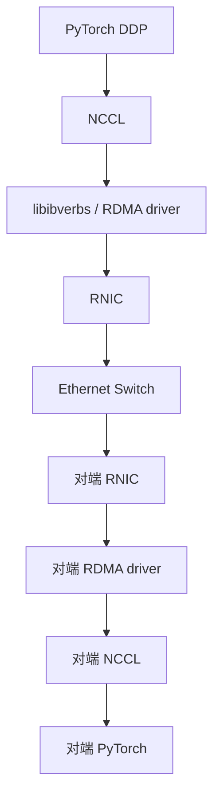
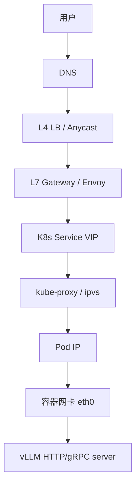
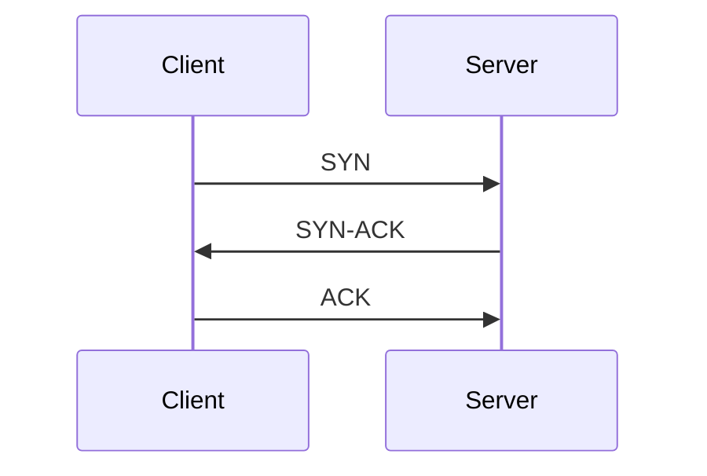

# 4. 网络工作流程：一个训练/推理包的完整旅程

理解一个数据包从发送方到接收方的完整路径，是网络排障的基础。本章跟踪两条典型路径：分布式训练中的 NCCL 通信包，以及 LLM 推理服务中的 HTTP/gRPC 请求包。

## 4.1 分布式训练：NCCL all-reduce 包的路径

假设一个 PyTorch DDP 训练任务，两个节点各 8 张 GPU，使用 NCCL + RoCE 进行 all-reduce。

### 应用层：PyTorch DDP

PyTorch 把梯度交给 DDP（DistributedDataParallel）。DDP 决定：

- 哪些梯度需要同步；
- 使用 all-reduce、reduce-scatter 还是 all-gather。

### 集合通信层：NCCL

NCCL（NVIDIA Collective Communications Library）把梯度划分成 chunk，选择 ring 或 tree 算法，生成发送/接收计划。

### RDMA 层：libibverbs

NCCL 调用 libibverbs，通过 Verbs API 创建 QP、注册 MR、下发 RDMA send/receive。

### 网卡：RNIC

RNIC 把数据封装成 RoCEv2 帧（Ethernet + IP + UDP + RoCE header），通过 DMA 直接从内存读取数据。

### 交换机

Ethernet switch 根据目的 MAC/IP 转发。如果发生拥塞，交换机会：

- 优先尝试 ECN 标记；
- 如果 ECN 失效，触发 PFC 反压上游。

### 对端

对端 RNIC 收到包，通过 DMA 写入远程内存，产生 CQ completion。NCCL 等待 completion 后继续下一步。

## 4.2 推理服务：HTTP/gRPC 请求包的路径

假设一个 vLLM 推理服务部署在 Kubernetes 上，用户通过 HTTPS 访问。

### DNS 解析

用户请求 `llm.example.com`：

1. 本地 DNS 缓存查询；
2. 递归 DNS 查询权威 DNS；
3. 返回 L4 LB 的 IP。

这一步可能引入几十到几百毫秒延迟。

### L4 负载均衡

L4 LB 根据源 IP/端口、目标 IP/端口，用 ECMP（Equal-Cost Multi-Path）或 consistent hashing 分发到某个 L7 Gateway。

### L7 Gateway

Envoy/Istio 终止 TLS，解析 HTTP/2 或 gRPC，根据路由规则转发到对应的 K8s Service。

### K8s Service

Service 是一个虚拟 IP。kube-proxy（ipvs 或 iptables 模式）把 Service IP 映射到后端 Pod IP。

### Pod 内网络

包进入节点后：

1. 经过节点的物理网卡；
2. 经过 CNI 创建的 veth pair；
3. 进入容器的 eth0；
4. 被 vLLM 进程接收。

## 4.3 连接建立：TCP 三次握手

HTTP/gRPC over TCP 需要先建立连接：

三次握手需要 1.5 RTT。对于短连接频繁的推理服务，建议使用连接池或 QUIC。

## 4.4 ARP 与路由

在以太网里，发送 IP 包之前需要知道下一跳的 MAC 地址。

1. 主机查路由表，确定下一跳 IP；
2. 查 ARP 缓存，如果没有则发送 ARP 请求；
3. 拿到 MAC 地址后封装 Ethernet 帧；
4. 网卡把帧发到交换机。

在 Kubernetes 中，CNI 插件通常负责 Pod 路由表的维护。

## 4.5 NAT

NAT（Network Address Translation）把私有 IP 转换为公网 IP。常见场景：

- 容器访问外网：源 NAT（SNAT）；
- 外网访问集群：目的 NAT（DNAT），如 LoadBalancer Service。

NAT 会改变包的源/目的 IP 和端口，某些协议（如 FTP、SIP）需要 ALG 辅助。

## 4.6 VXLAN / Overlay

Overlay 网络在现有物理网络之上再建一层虚拟网络。VXLAN 把二层帧封装到 UDP 包里，通过三层网络传输。

优点：

- 不依赖底层网络支持 VLAN；
- 支持跨子网、跨可用区部署。

缺点：

- MTU 开销（VXLAN header 50 字节）；
- 封装/解封装带来 CPU 开销。

## 4.7 本节小结

- 分布式训练包路径：PyTorch → NCCL → libibverbs → RNIC → switch → 对端 RNIC → 对端 NCCL → 对端 PyTorch；
- 推理请求包路径：DNS → L4 LB → L7 Gateway → K8s Service → kube-proxy → Pod IP → 容器网卡 → vLLM；
- TCP 需要三次握手建立连接；
- ARP 负责 IP 到 MAC 解析；
- NAT 负责私网/公网地址转换；
- Overlay（VXLAN）在三层网络上构建二层虚拟网络。

下一节进入核心模块：NIC、协议栈、CNI、DNS、负载均衡、可观测。
