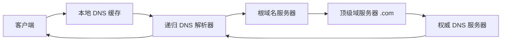

# 5. 核心模块

网络可以拆成多个核心模块。本章聚焦 AI Infra 工程师最经常打交道的几个：NIC、协议栈、RDMA、CNI、DNS、负载均衡、网络可观测。

## 5.1 NIC 与网卡驱动

NIC（Network Interface Card）是服务器连接网络的硬件。现代 NIC 已经从简单的收发设备变成强大的“网络协处理器”。

### 传统 NIC

- 数据收发都要经过内核协议栈；
- CPU 负责中断处理、协议解析、数据拷贝。

### SmartNIC / DPU

- 把网络、存储、安全卸载到网卡；
- 常见：NVIDIA ConnectX / BlueField、Intel IPU、AWS Nitro、Alibaba XPU。

### RDMA NIC

- 支持 RDMA 的网卡，如 NVIDIA ConnectX-6/7；
-  bypass 内核，直接读写远程内存；
- 需要支持 RoCE 或 InfiniBand 的交换机。

## 5.2 Linux 网络协议栈

Linux 内核网络协议栈从底到上：

```
应用层：socket API
↓
传输层：TCP / UDP
↓
网络层：IP / ICMP / ARP
↓
数据链路层：Ethernet / VLAN
↓
网卡驱动 / NIC
```

### NAPI

传统网卡每收到一个包就中断 CPU，高吞吐下中断风暴会拖垮 CPU。NAPI 让网卡在收到一批包后才中断一次。

### RPS / RFS / XPS

| 技术 | 作用 |
|---|---|
| RPS | 把软中断分发到多个 CPU |
| RFS | 把同一 flow 的处理固定到同一个 CPU |
| XPS | 把发送队列映射到特定 CPU |

分布式训练常用 RFS 把同一 NCCL 通信流的处理固定，减少缓存失效。

### XDP / DPDK / RDMA

| 技术 | 特点 |
|---|---|
| XDP | 内核早期包处理，可 drop/redirect，延迟低 |
| DPDK | 用户态轮询网卡，完全 bypass 内核 |
| RDMA | 网卡直接读写远程内存，CPU 不参与数据搬运 |

## 5.3 RDMA 与 Verbs

RDMA 编程基于 **Verbs API**：

```c
ibv_create_qp();      // 创建 Queue Pair
ibv_reg_mr();         // 注册 Memory Region
ibv_post_send();      // 下发发送请求
ibv_poll_cq();        // 轮询完成队列
```

### RoCEv1 vs RoCEv2

| 协议 | 层级 | 特点 |
|---|---|---|
| RoCEv1 | 二层（Ethernet） | 不需要 IP，但无法跨三层路由 |
| RoCEv2 | 三层（UDP/IP） | 可路由，主流选择 |

RoCEv2 需要网络支持 **PFC（Priority Flow Control）** 和 **ECN（Explicit Congestion Notification）** 来避免丢包和死锁。

## 5.4 CNI 插件

### bridge

最简单的 CNI：每个节点创建一个 Linux bridge，Pod veth 连到 bridge，bridge 通过 host 路由出节点。

### Calico

- 使用 BGP 在节点之间发布 Pod 路由；
- 性能好，支持 NetworkPolicy；
- 适合大规模集群。

### Cilium

- 基于 eBPF 实现 CNI、kube-proxy、NetworkPolicy、Service Mesh；
- 高性能可观测；
- 支持 RDMA/SR-IOV 集成。

### Multus

允许一个 Pod 拥有多个网卡，适合：

- RDMA 网络和管理网络分离；
- 存储网络（如 NFS/RDMA）独立。

## 5.5 DNS

DNS 是互联网的命名系统，把域名解析为 IP。

### DNS 解析流程



### DNS 在 Kubernetes 中

Kubernetes 用 CoreDNS 为集群提供 DNS：

- Service DNS：`my-svc.my-namespace.svc.cluster.local`；
- Pod DNS：`pod-ip.my-namespace.pod.cluster.local`。

AI 推理服务中，DNS 解析延迟和 TTL 缓存会影响冷启动和故障切换速度。

## 5.6 负载均衡

### kube-proxy 模式

| 模式 | 特点 |
|---|---|
| iptables | 默认，规则多时有性能问题 |
| ipvs | 内核级，性能好 |
| eBPF | Cilium 直接转发，延迟最低 |

### Ingress / Gateway API

- **Ingress**：K8s 的七层入口抽象；
- **Gateway API**：Ingress 的下一代，更灵活，支持 TCP/UDP/HTTP/TLS 路由。

### 服务网格

Istio/Envoy 提供：

- 流量管理（路由、灰度、熔断、重试）；
- 安全（mTLS）；
- 可观测（trace、metrics）。

AI 推理服务常用 Envoy 做 L7 网关。

## 5.7 网络可观测工具

| 工具 | 用途 |
|---|---|
| ping | 测试连通性和 RTT |
| traceroute / mtr | 追踪路径 |
| tcpdump | 抓包分析 |
| ss / netstat | 查看 socket 状态 |
| iperf / iperf3 | 测带宽 |
| nccl-tests | 测 NCCL all-reduce 带宽和延迟 |
| nvidia-smi topo | 查看 GPU/NIC 拓扑 |
| perftest | RDMA 性能测试 |
| bpftool / bcc / bpftrace | eBPF 动态追踪 |

## 5.8 本节小结

| 模块 | 核心关注点 |
|---|---|
| NIC | 传统 NIC / SmartNIC / DPU / RDMA NIC |
| Linux 协议栈 | socket/TCP/UDP/IP、NAPI、RPS/RFS/XPS、XDP/DPDK/RDMA |
| RDMA | Verbs、QP/CQ/MR、RoCEv2、PFC/ECN |
| CNI | bridge/Calico/Cilium/Multus |
| DNS | 解析流程、CoreDNS、TTL |
| 负载均衡 | kube-proxy、Ingress/Gateway API、Envoy/Istio |
| 可观测 | ping、tcpdump、iperf、nccl-tests、perftest、bcc |

下一节，我们通过源码分析深入一个具体机制。
