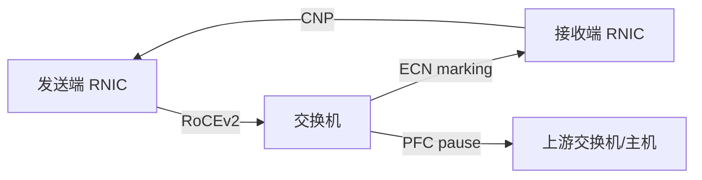

# 8. 企业生产实践

AI 集群的网络生产实践，核心是**在带宽、延迟、成本和稳定性之间找到可运营的平衡点**。本章从 RoCE/InfiniBand 部署、Kubernetes 网络、NCCL 调优、推理服务入口网络、排障手册五个维度展开。

## 8.1 RDMA 网络：InfiniBand vs RoCE

### 8.1.1 选型建议

| 维度 | InfiniBand | RoCEv2 |
|---|---|---|
| 带宽/延迟 | 极高，专为 HPC 设计 | 高，依赖无损以太网 |
| 成本 | 高（专用交换机和网卡） | 低（复用数据中心以太网） |
| 运维复杂度 | 封闭生态，工具链成熟 | 需要 PFC/ECN 精细调参 |
| 扩展性 | 单集群可达数万卡 | 通常数千卡，需分 fabric |
| 典型用户 | OpenAI、xAI、超算中心 | 多数云厂商和互联网公司 |

### 8.1.2 RoCE 的无损以太网三板斧

RoCE 要求网络在丢包前通过流控降低速率，否则 RDMA 性能暴跌。

1. **PFC（Priority Flow Control）**：在 L2 上按优先级 pause 上游端口，防止缓冲区溢出。
2. **ECN（Explicit Congestion Notification）**：IP 头标记 congestion experienced，端侧 CNP（Congestion Notification Packet）通知发送方降速。
3. **DCQCN / Swift**：端侧拥塞控制算法，根据 ECN/CNP 调整发送速率。



### 8.1.3 调参 checklist

- 全网 MTU 一致，推荐使用 Jumbo frame（9000 或 9216）。
- 交换机缓冲区足够大，关注 dynamic buffer 配置。
- ECN 阈值：通常 Kmin/Kmax 根据 RTT 和队列深度设置。
- PFC 优先级与 NIC VLAN/CoS 对齐。
- 开启 `collective buffer` / adaptive routing（IB/SHARP 或交换机支持）。
- BIOS 关闭 C-states，CPU 频率锁定，NUMA 对齐（网卡和 GPU 在同一 NUMA）。

## 8.2 Kubernetes 网络实战

### 8.2.1 CNI 选型

| CNI | 特点 | 适用场景 |
|---|---|---|
| bridge + host-local | 简单，性能一般 | 测试、轻量 GPU 集群 |
| Calico | BGP/IP-in-IP，网络策略强 | 传统 K8s，L3 网络 |
| Cilium | eBPF 数据面，可观测性强 | 大规模、需要 Hubble、L7 策略 |
| Multus | 多网卡 | AI 训练：管理网 + RDMA 数据网 |
| SR-IOV / DPDK | 高性能 | 需要硬件支持，配置复杂 |

AI 训练 Pod 常见模型：

```text
eth0 —— 管理网（CNI，Kubernetes Service）
eth1 —— 数据网（SR-IOV / Macvlan / host-device，直接用于 RDMA）
```

### 8.2.2 kube-proxy 模式

- `iptables`：默认，连接数大时规则遍历开销高。
- `ipvs`：性能更好，适合大规模 Service。
- `eBPF`（Cilium kube-proxy replacement）：无 conntrack，延迟最低，但依赖内核版本。

### 8.2.3 DNS 规模化

CoreDNS 在 AI 集群里容易成为瓶颈：

- 训练 Job 启动时大量 Pod 同时解析 Service；
- 推理服务 Pod 滚动更新导致 DNS 记录变化；
- NodeLocal DNSCache 可以显著降低 CoreDNS 负载。

## 8.3 NCCL 调优

NCCL 是 NVIDIA 集合通信库，参数调优直接影响多机训练吞吐。

### 8.3.1 关键环境变量

| 变量 | 含义 | 常用值 |
|---|---|---|
| `NCCL_DEBUG` | 日志级别 | `INFO`、`WARN` |
| `NCCL_IB_DISABLE` | 禁用 InfiniBand | `0` 或 `1` |
| `NCCL_SOCKET_IFNAME` | 指定 TCP 通信网卡 | `eth1` |
| `NCCL_NET_GDR_LEVEL` | GPU Direct RDMA 级别 | `SYS`、`PIX` |
| `NCCL_TREE_THRESHOLD` | tree/ring 算法切换阈值 | 默认 1M |
| `NCCL_ALGO` | 强制算法 | `RING`、`TREE` |
| `NCCL_BUFFSIZE` | 通信缓冲区大小 | 按网络调整 |

### 8.3.2 常见性能问题

- **NCCL timeout**：网络抖动、PFC 配置错误、交换机 buffer 不足。
- **带宽不达标**：检查 PCIe、NUMA、GDR、链路速率、是否 fallback 到 TCP。
- **incast**：all-to-all 流量同时到达交换机，开启 ECN + 增大 buffer。
- **多租户互相干扰**：用 NetworkPolicy 或物理网络隔离训练/推理流量。

## 8.4 LLM 推理服务网络

### 8.4.1 入口链路

```text
用户请求
  → DNS（GSLB/Anycast）
  → L4/L7 负载均衡（Envoy/NGINX/AWS ALB）
  → Gateway API / Ingress
  → Kubernetes Service
  → Pod 容器网卡
  → vLLM / TensorRT-LLM / Triton 进程
```

### 8.4.2 优化点

- **连接池与 keep-alive**：减少 TCP 握手和 TLS 开销。
- **Batch 编排**：在网关层做请求合并，提高 GPU 利用率。
- **长连接负载均衡**：避免某 Pod 因长连接积累而过载。
- **超时与重试**：设置合理的 read timeout 和 retry budget。
- **Warm replica**：预热副本，避免冷启动时 DNS/TCP 建立延迟。

## 8.5 排障手册

| 现象 | 可能原因 | 排查命令 |
|---|---|---|
| NCCL timeout / hang | 网络抖动、PFC、路由不对称 | `nccl-tests`、`ib_write_bw`、`dmesg` |
| RDMA 带宽低 | NUMA 不对齐、GDR 未启用、fallback TCP | `nvidia-smi topo -m`、`ib_write_bw` |
| 推理 P99 延迟高 | DNS 慢、LB 不均衡、长连接倾斜 | `dig`、`ss -tin`、`curl -w` |
| Pod 间偶发不通 | CNI 插件 bug、IP 冲突、安全组 | `ping`、`tcpdump`、`cilium connectivity test` |
| 交换机丢包 | buffer 不足、incast | 交换机 CLI、SNMP、sFlow |

### 8.5.1 一条常用的端到端验证命令

```bash
# 测试两台机器之间的 RDMA 带宽
ib_write_bw -d mlx5_0 --report_gbits -F
# 对端
ib_write_bw -d mlx5_0 --report_gbits -F <server_ip>
```

### 8.5.2 训练前的网络体检清单

- [ ] 所有节点网卡速率一致且 Up。
- [ ] `ibdev2netdev` / `ibstatus` 显示状态正常。
- [ ] 同交换机下 `ib_write_bw` 达到线速 90% 以上。
- [ ] 跨 Spine `ib_write_bw` 带宽符合预期。
- [ ] `nccl-tests` all_reduce_bus_bandwidth 达到理论值 80% 以上。
- [ ] DNS 解析 Service 延迟 < 5ms。
- [ ] Pod 跨节点 ping RTT 稳定。

## 8.6 本章小结

生产环境的网络优化不能靠单点参数，而要靠**端到端观测 + 分层验证**：从网卡、交换机、内核、CNI、NCCL 到应用，每一层都有明确的验收指标。下一章把这些经验整理成可落地的最佳实践检查清单。
