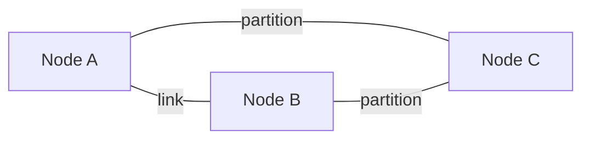

# 2. 核心思想

分布式系统有一组贯穿所有设计的核心概念。理解它们之后，你会发现 Kubernetes、Ray、etcd、对象存储、FSDP 本质上是同一套思想的不同实现。

## 2.1 故障模型

设计分布式协议的第一步，是明确“系统要面对什么样的故障”。

| 故障模型 | 描述 | 典型协议 |
|---|---|---|
| **Fail-stop** | 节点突然停止运行，且其他节点能检测到 | 最简单的 crash 模型 |
| **Crash-recovery** | 节点会崩溃，但之后可能恢复，恢复后需要从持久化状态继续 | Raft、etcd |
| **Omission** | 节点可能丢消息（发送或接收） | TCP 重传、RPC 重试 |
| **Timing** | 消息可能延迟超过预期 | 超时、lease |
| **Byzantine** | 节点可能任意行为，包括撒谎或发送错误信息 | PBFT、区块链共识 |

AI Infra 的主流假设是 **crash-recovery + 网络分区**，因为数据中心内的机器通常不会恶意作恶，但会宕机、断网、重启。

## 2.2 网络分区



网络分区（network partition）指集群被分成多个互相无法通信的子集。分区是分布式系统中最难处理的情况之一，因为它让系统无法同时满足一致性和可用性——这就是 CAP 定理。

## 2.3 CAP 定理

CAP 定理指出：在一个分布式数据存储中，以下三个属性最多只能同时满足两个：

- **C：Consistency（一致性）** — 所有节点在同一时间看到相同的数据；
- **A：Availability（可用性）** — 每个请求都能在有限时间内得到响应；
- **P：Partition tolerance（分区容忍性）** — 即使网络分区，系统仍然能继续运行。

由于网络分区无法避免，**P 是必须接受的**。因此实际选择通常是 **CP** 或 **AP**：

| 选型 | 代表系统 | 适合场景 |
|---|---|---|
| CP | etcd、ZooKeeper、Spanner | K8s 状态、分布式锁、配置中心 |
| AP | Dynamo、Cassandra、Gossip | 会话状态、推荐特征、可容忍延迟一致的缓存 |
| 可调 | CockroachDB、TiDB | 按业务选择一致级别 |

在 AI Infra 中：

- **checkpoint 元数据**需要 CP，否则训练无法正确恢复；
- **推理缓存**可以是 AP，稍微陈旧的数据不会导致系统崩溃。

## 2.4 PACELC

PACELC 是 CAP 的扩展：

> 如果有分区（P），必须在 A 和 C 之间选择；否则（E，即正常情况），必须在 L（延迟）和 C（一致性）之间选择。

例如：

- Dynamo 选择 AP + 低延迟；
- Spanner 选择 CP + 高一致性，但跨洲提交需要等待时钟同步。

## 2.5 一致性谱系

一致性不是“有或无”，而是一个连续光谱：

```text
强一致性 ◄──────────────────────────────────► 弱一致性
线性一致性 → 顺序一致性 → 因果一致性 → 最终一致性
```

| 一致性级别 | 含义 | 例子 |
|---|---|---|
| **线性一致性** | 所有操作看起来按全局实时顺序原子执行 | etcd、ZooKeeper |
| **顺序一致性** | 所有进程看到的操作顺序一致，但不要求与实时一致 | 某些内存模型 |
| **因果一致性** | 有因果关系的事件顺序一致，无关事件可以乱序 | 向量时钟、CRDT |
| **最终一致性** | 如果没有新写入，最终所有副本会一致 | DNS、S3（旧版）、Cassandra |

AI Infra 选型：

- 训练调度状态 → 线性一致；
- 特征缓存 → 最终一致；
- 分布式训练中的梯度同步 → 因果/顺序一致即可。

## 2.6 复制与分区

### 2.6.1 复制（Replication）

把同一份数据保存多份，提高可用性和耐久性。

- **同步复制**：所有副本确认后才返回，一致性强但延迟高；
- **异步复制**：主副本确认后即返回，延迟低但可能丢失数据；
- **半同步复制**：多数副本确认后返回，折中方案。

### 2.6.2 分区（Partitioning / Sharding）

把数据切分到不同节点，提高吞吐和容量。

- **范围分片**：按 key 范围切分，适合范围查询；
- **哈希分片**：按 key 哈希切分，负载均衡；
- **一致性哈希**：减少节点增减时的数据迁移。

AI Infra 例子：

- 对象存储按 key 前缀分片；
- 分布式训练按数据并行/模型并行/流水线并行切分计算和参数。

## 2.7 Quorum

Quorum 是复制系统中的一种投票机制。设副本总数为 N，写需要 W 个副本确认，读需要 R 个副本确认：

- 如果 `W + R > N`，则读写一定有一个重叠副本，保证读到最新值；
- 如果 `W + R ≤ N`，则读可能返回旧值，但可用性更高。

常见配置：

| 配置 | 特点 |
|---|---|
| W=1, R=N | 写快读慢 |
| W=N, R=1 | 写慢读快 |
| W=R=2, N=3 | 读写均衡，容忍 1 个副本故障 |

Dynamo 使用 `N=3, W=2, R=2` 作为默认配置。

## 2.8 共识（Consensus）

共识问题：多个节点如何在某个值上达成一致，即使部分节点故障。

经典算法：

- **Paxos**：理论优雅但难以实现；
- **Raft**：为可理解性设计，etcd、Consul、TiKV 使用；
- **ZAB**：ZooKeeper 使用；
- **Viewstamped Replication (VR)**：早期复制状态机协议。

AI Infra 中的共识：

- etcd 用 Raft 维护 K8s 状态；
- Kafka 用类 Raft 协议选 controller；
- MongoDB/TiDB 用 Raft 做复制集。

## 2.9 FLP 不可能性与工程妥协

FLP 结果（Fischer-Lynch-Paterson, 1985）指出：

> 在异步网络中，即使只有一个节点可能故障，也不存在确定性的共识算法。

工程上的应对是引入**超时（timeout）和随机化**：

- Raft 选举使用随机超时，避免所有候选人同时发起选举；
- 网络请求设置超时，超时就重试或切换；
- lease 机制在一致性和可用性之间做折中。

## 2.10 时间与顺序

分布式系统中没有全局时钟，因此需要其他方式定义事件顺序：

- **物理时钟**：NTP/PTP，但仍有漂移；
- **逻辑时钟**：Lamport 时间戳，能判断 happens-before 关系；
- **向量时钟**：每个节点维护一个向量，能精确判断并发事件；
- **TrueTime**：Spanner 用原子钟 + GPS 提供有界误差的全局时间。

AI Infra 中，逻辑时钟和向量时钟常用于事件溯源、日志排序、冲突检测。

## 2.11 一句话总结

**分布式系统的核心思想，是在“故障、分区、延迟、时钟不一致”的约束下，用复制、分区、quorum、共识和超时机制，为上层应用提供可接受的一致性、可用性和性能。**
