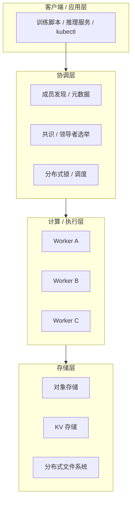
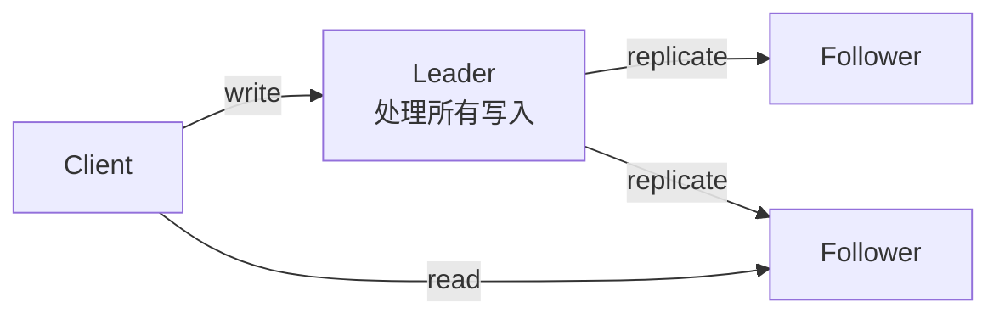
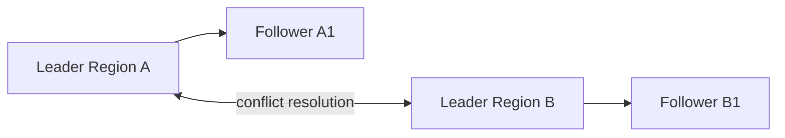
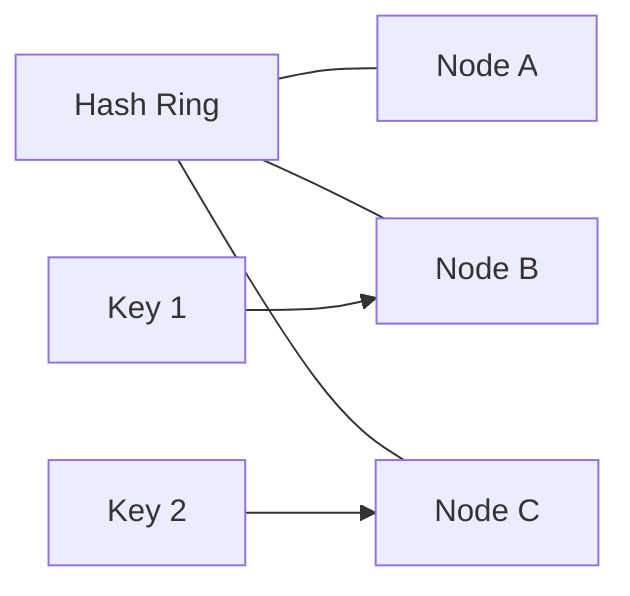

# 3. 架构设计

分布式系统的“架构”不是一幅静态图纸，而是一组在故障、延迟、容量之间做 trade-off 的组织原则。本章把这些原则抽象成几个常见模式：分层、Leader-Follower、复制拓扑、分片与故障域。

## 3.1 分层架构

一个典型的分布式系统可以拆成四层：



| 层级 | 职责 | AI Infra 例子 |
|---|---|---|
| 客户端 | 发起任务、读写数据 | `kubectl apply`、训练脚本 `torchrun` |
| 协调层 | 发现、调度、一致性、锁 | Kubernetes apiserver/etcd、Ray GCS |
| 计算层 | 实际执行计算 | GPU worker、推理副本 |
| 存储层 | 数据持久化与共享 | 对象存储、并行文件系统、KV 元数据 |

分层的好处是：每层可以独立扩展、独立容错、独立选型。例如存储层可以用最终一致的对象存储，而协调层必须用强一致的 etcd。

## 3.2 Leader-Follower



**Leader-Follower（主从复制）**是最常见的复制模式：

- 所有写请求发给 Leader；
- Leader 把操作复制到 Follower；
- 读请求可以走 Leader（强一致）或 Follower（可能读到旧数据）。

优点：简单、一致性强。
缺点：Leader 是单点写入瓶颈，故障时需要选举新 Leader。

代表系统：MySQL 主从、Redis Sentinel、Kafka partition leader、Raft 集群。

## 3.3 Multi-Leader



**Multi-Leader（多主复制）**允许存在多个写入节点，常用于：

- 多区域部署，降低写入延迟；
- 离线设备同步；
- 需要高可用的写入口。

代价是必须处理写冲突（conflict resolution），常用方法：

- 最后写入者胜（LWW）；
- 向量时钟 / 版本向量；
- CRDT（无冲突复制数据类型）。

代表系统：Couchbase、TIDB 部分场景、PostgreSQL logical replication。

## 3.4 Leaderless

**Leaderless（无主复制）**中，任何节点都可以接受写请求，客户端直接向多个副本读写，通过 quorum 判断最新值。

典型代表是 Dynamo：

- 写：客户端并发写 N 个副本中的 W 个；
- 读：客户端并发读 R 个副本，合并版本；
- 如果 R + W > N，保证读到至少一个最新副本。

优点：高可用、无单点。
缺点：读修复（read repair）、冲突合并逻辑复杂。

## 3.5 State Machine Replication

**状态机复制（State Machine Replication, SMR）**是复制系统最核心的抽象：

1. 所有副本从相同初始状态开始；
2. 所有副本按相同顺序执行相同操作；
3. 因此所有副本最终状态一致。

```
Client ──▶ Leader ──▶ Log: [op1, op2, op3] ──▶ Apply ──▶ State Machine
                           │
                           ▼
                        Followers apply same log
```

共识算法（Raft/Paxos）解决的是“如何让所有副本对日志顺序达成一致”。

代表系统：etcd、ZooKeeper、Raft-based KV 存储。

## 3.6 分片与一致性哈希

### 3.6.1 分片（Sharding）

当数据量超过单节点容量时，需要把数据切分到多个节点。分片策略包括：

- **范围分片**：按 key 范围切分，适合范围查询；
- **哈希分片**：按 key 哈希切分，负载均衡但不支持范围查询；
- **复合分片**：先按时间/租户分片，再按 key 哈希。

### 3.6.2 一致性哈希



一致性哈希把节点和数据都映射到一个环上：

- 数据 key 顺时针找到第一个节点；
- 增加或删除节点时，只影响相邻的一小段数据，不需要全量迁移。

代表系统：Cassandra、Dynamo、Memcached 客户端分片。

## 3.7 复制拓扑

| 拓扑 | 结构 | 适用场景 |
|---|---|---|
| 链式复制 | Leader → Follower1 → Follower2 | 高吞吐写入，读取延迟可接受 |
| 星型复制 | Leader 直接复制到所有 Follower | 最常见，读写均衡 |
| 全互联 | 每个节点互相复制 | 多主、P2P |
| 树形复制 | 分层聚合复制 | 跨数据中心、日志聚合 |

AI Infra 例子：

- 模型训练中的梯度聚合：环状 all-reduce（类似链式复制思想）；
- 对象存储跨区域复制：主从或树形复制。

## 3.8 故障域与爆炸半径

**故障域（Fault Domain）**指一起失效的一组资源。常见层级：

```text
进程 → 节点 → 机架 → 机柜 → 可用区（AZ） → 区域（Region） → 云服务商
```

设计系统时，要让关键组件分散在不同故障域：

- etcd 的 3/5/7 节点应跨机架、跨可用区部署；
- 分布式训练的重要副本不要放在同一个机柜；
- 对象存储的多副本应跨 AZ。

**爆炸半径（Blast Radius）**指一个故障影响的范围。好的设计会把爆炸半径控制在局部：

- 按租户/命名空间隔离；
- 分片独立故障；
- 降级开关（circuit breaker）防止级联失败。

## 3.9 架构选型速查表

| 需求 | 推荐架构 | 代表系统 |
|---|---|---|
| 强一致、小数据量 | Leader-Follower + 共识 | etcd、ZooKeeper |
| 高可用、大数据量 | 分片 + Leader-Follower | TiDB、CockroachDB |
| 低延迟写、可容忍冲突 | Leaderless / Multi-Leader | Dynamo、Cassandra |
| 全局低延迟读 | 副本 + 就近路由 | CDN、S3 跨区域复制 |
| 线性扩展计算 | 分片 + 无状态 worker | Ray、FSDP |

## 3.10 一句话总结

**分布式系统架构的本质，是把“状态、计算、协调”拆成可独立复制、分片和容错的单元，并通过 Leader-Follower、分片、quorum、共识等模式，在一致性、可用性和性能之间取得平衡。**
