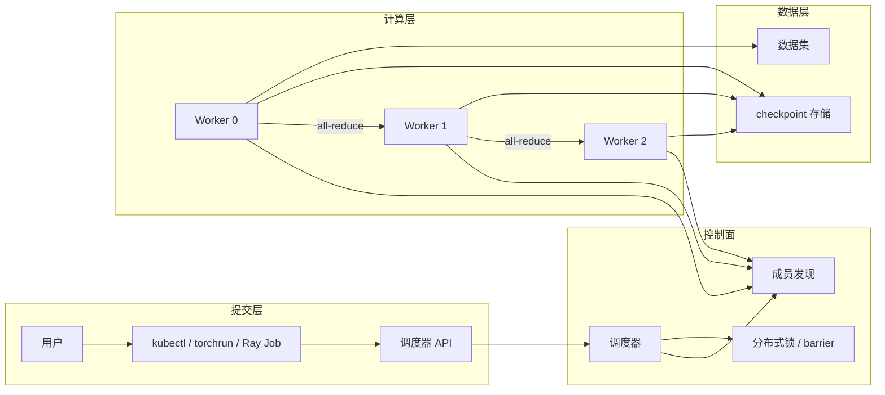
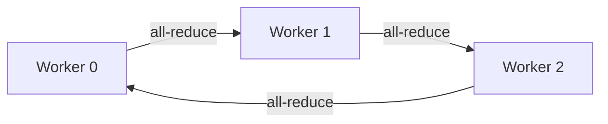

# 4. 分布式工作流程

本章把前面章节的概念串成一条线：从用户提交一个分布式训练 job，到它在集群中实际运行、通信、容错、保存 checkpoint 的完整链路。

## 4.1 一条分布式 AI 训练 job 的全链路

## 4.2 阶段 1：Job 提交与资源调度

1. 用户通过 `kubectl apply -f training-job.yaml` 或 `torchrun --nproc_per_node=8 train.py` 提交 job；
2. 调度器根据 GPU、显存、网络拓扑、优先级决定把 job 放在哪些节点；
3. 调度结果写入控制面（K8s apiserver / Ray GCS / Slurm controller）；
4. 每个 worker 被拉起，获得唯一的 rank、world size、master address。

这一步本质上是**把“一个逻辑任务”映射到“多个物理进程”**。

## 4.3 阶段 2：成员发现与初始化

分布式训练需要所有 worker 知道彼此地址，以便建立通信组：

- **PyTorch DDP/FSDP**：由 rank 0 作为 coordinator，其他 worker 通过 `MASTER_ADDR` / `MASTER_PORT` 连接；
- **Ray Train**：由 Ray GCS 维护 actor 列表，每个 worker 通过 GCS 发现彼此；
- **Kubernetes + MPI Operator**：由 MPI operator 生成 hostfile；
- **Horovod**：由 driver 维护 worker 列表。

成员发现必须满足：

- **一致性**：所有 worker 对“谁是成员”达成一致；
- **活性**：新 worker 加入、旧 worker 退出能被及时感知；
- **容错性**：coordinator 故障时不能导致整个 job 崩溃。

## 4.4 阶段 3：建立通信组

成员发现完成后，worker 之间需要建立集合通信组：

- **NCCL / Gloo / MPI**：提供 all-reduce、all-gather、broadcast、reduce-scatter 等原语；
- **ring / tree / hierarchical all-reduce**：根据网络拓扑选择最优梯度聚合算法；
- **barrier**：在关键节点同步，确保所有 worker 进度一致。

## 4.5 阶段 4：Forward / Backward / All-Reduce 循环

一次训练 step 的分布式执行：

1. 每个 worker 读取自己的 mini-batch（数据并行）；
2. 各自执行 forward 计算 loss；
3. 各自执行 backward 计算梯度；
4. 通过 all-reduce 把梯度同步到所有 worker；
5. 每个 worker 用相同的梯度更新本地模型副本。

因为 all-reduce 后所有 worker 拥有相同梯度，所以模型副本保持一致。

## 4.6 阶段 5：Barrier 与同步

在以下场景需要 barrier：

- 每个 epoch 开始时重新分片数据；
- checkpoint 保存前确保所有 worker 处于同一步；
- 动态调整 batch size 或学习率时。

barrier 的实现依赖底层通信库或分布式协调服务：

- `torch.distributed.barrier()`；
- Ray 的 `tune.report()` + 同步调度器；
- Kubernetes 的 Init Container 或 MPI 的 `MPI_Barrier()`。

## 4.7 阶段 6：Checkpoint 协同保存

分布式 checkpoint 比单机复杂得多：

- 每个 worker 保存自己负责的 shard（模型并行）或副本（数据并行）；
- 需要保存“元数据”记录每个 shard 属于哪个 rank；
- 写入过程必须原子：要么全部成功，要么回滚；
- 通常使用分布式事务或两阶段提交保证一致性。

常见做法：

- **同步 checkpoint**：所有 worker 同时保存，简单但会造成停顿；
- **异步 checkpoint**：后台线程保存，训练继续，但恢复时需要处理不一致；
- **增量 checkpoint**：只保存变化的部分，减少 IO。

## 4.8 阶段 7：故障检测与回滚

训练过程中可能出现：

- 某个 worker OOM 或 NCCL 超时；
- 某个节点掉卡；
- 网络分区导致部分 worker 失联。

处理流程：

1. **检测**：心跳、watchdog、NCCL timeout；
2. **定位**：通过日志、监控、分布式追踪确定故障范围；
3. **决策**：重启 job、弹性伸缩、或从 checkpoint 恢复；
4. **恢复**：重新成员发现、重新建立通信组、加载 checkpoint。

现代训练框架越来越强调**弹性训练**：

- PyTorch Elastic Training：允许 worker 动态加入/退出；
- Kubernetes + Volcano：自动重新调度失败 pod；
- Ray Train：自动容错与 lineage 重建。

## 4.9 推理服务的分布式工作流

推理服务的工作流与训练不同：

1. 模型加载到多个 GPU / 多个副本；
2. 请求通过负载均衡器路由到某个副本；
3. 副本内部可能使用张量并行或流水线并行；
4. 输出返回给用户，同时更新 KV Cache（如果共享）。

关键分布式问题：

- 多副本之间是否需要共享 KV Cache？
- 如何保持模型版本一致（A/B 测试、金丝雀）？
- 某个副本故障时如何快速摘除而不影响整体可用性？

## 4.10 一句话总结

**一次分布式 AI job 的完整流程，本质上是“提交 → 发现 → 通信 → 计算 → 同步 → 持久化 → 容错”的循环；每个阶段都依赖分布式系统的共识、复制、分区与超时机制。**
