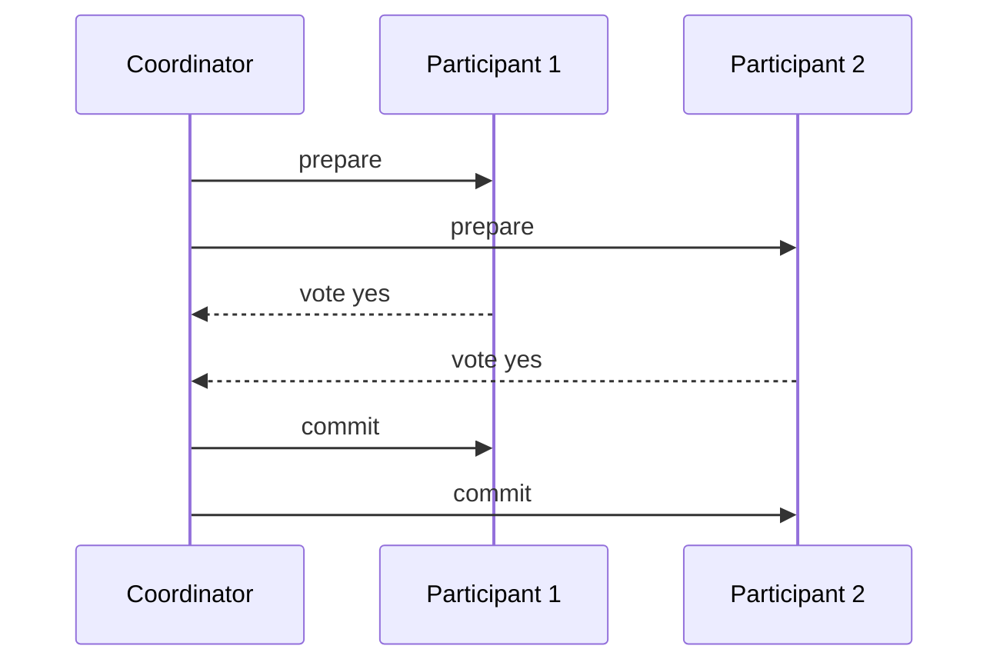

# 5. 核心模块

分布式系统由若干可复用模块组成。本章把最常见的模块抽象出来，并说明它们在 AI Infra 中的对应实现。

## 5.1 RPC 与消息传递

进程间通信是分布式系统的“血液循环”。

### 5.1.1 RPC 语义

| 语义 | 含义 | 例子 |
|---|---|---|
| **At-most-once** | 最多执行一次 | 不重试的同步调用 |
| **At-least-once** | 至少执行一次，可能重复 | 简单重试 |
| **Exactly-once** | 恰好一次 | 幂等 + 去重 |

AI Infra 中：

- 训练 job 提交 → at-least-once 即可，重复提交会被调度器去重；
- 扣费 / 配额扣减 → 必须 exactly-once；
- 推理请求 → 通常 at-most-once 或 at-least-once，取决于重试策略。

### 5.1.2 消息队列与流式通信

- **消息队列**：Kafka、RabbitMQ、RocketMQ，用于解耦与削峰；
- **流式通信**：gRPC streaming、WebSocket，用于实时指标、日志、推理 token 流。

## 5.2 成员服务与发现

成员发现解决“当前有哪些节点、它们在哪里”的问题。

| 方案 | 特点 | 代表 |
|---|---|---|
| 静态配置 | 简单，但不适合动态扩缩容 | `MASTER_ADDR` + hostfile |
| 中心注册表 | 强一致，适合控制面 | etcd、ZooKeeper、Consul |
| Gossip | 去中心，最终一致，适合大规模 | Cassandra、Serf、Redis Cluster |
| DNS / 服务网格 | 与基础设施结合 | Kubernetes Service、Istio |

AI Infra 例子：

- PyTorch 训练用 `MASTER_ADDR` 做静态发现；
- Ray 用 GCS 做中心注册表；
- Kubernetes 用 etcd + DNS 做服务发现。

## 5.3 失败检测

失败检测器判断“某个节点是不是死了”。难点在于：

- 网络延迟 vs 节点宕机很难区分；
- 检测太快会误杀（false positive）；
- 检测太慢会延迟故障恢复（false negative）。

常见策略：

- **心跳超时**：固定阈值，简单；
- **Phi Accrual**：根据历史心跳延迟动态调整阈值（Cassandra 使用）；
- **Gossip 协议**：通过多节点间接传播存活信息。

## 5.4 领导者选举

领导者选举解决“多个节点中谁负责决策”的问题。

实现方式：

- **基于锁**：谁拿到分布式锁谁就是 leader（ZooKeeper ephemeral node、etcd lease）；
- **基于共识**：Raft / Paxos 选主，天然解决脑裂；
- **基于租约**：leader 定期续约，过期后重新选举。

AI Infra 例子：

- Kubernetes controller-manager 通过 lease 选举 leader；
- Kafka controller 通过 ZooKeeper / KRaft 选举；
- etcd 自身通过 Raft 选举 leader。

## 5.5 复制日志

复制日志是 State Machine Replication 的核心数据结构：

```
Index:  1   2   3   4   5
Entry:  x=1 x=2 x=3 x=4 x=5
Term:   1   1   2   2   3
```

每条日志条目通常包含：

- **index**：在日志中的位置；
- **term**：leader 任期，用于检测过期 leader；
- **command**：要应用到状态机的操作。

共识算法保证：

- 所有节点日志顺序一致；
- 已提交的条目不会丢失；
- 不同 term 的 leader 不会覆盖已提交条目。

## 5.6 分布式事务

分布式事务保证跨多个节点的一组操作要么全部成功，要么全部失败。

### 5.6.1 两阶段提交（2PC）



- **阶段一**：协调者询问所有参与者是否可以提交；
- **阶段二**：如果全部同意，协调者发出 commit；否则 abort。

2PC 的问题：

- 协调者单点故障会导致参与者阻塞；
- 阻塞期间参与者持有锁，影响可用性。

### 5.6.2 三阶段提交（3PC）

3PC 在 2PC 基础上增加预提交阶段，减少阻塞时间，但实现更复杂，网络分区时仍可能不一致。实际系统很少直接用 3PC。

### 5.6.3 实际替代方案

- **Saga**：把长事务拆成多个本地事务，通过补偿回滚；
- **TCC（Try-Confirm-Cancel）**：预留资源再确认；
- **Percolator / Spanner**：基于 MVCC + 2PC + TrueTime；
- **分布式 KV 的跨分片事务**：TiDB、CockroachDB。

AI Infra 中，分布式事务常用于：

- 训练元数据 + checkpoint 一致性；
- 模型注册 + 存储系统 artifact 原子写入；
- 配额扣减 + 任务启动。

## 5.7 分布式锁

分布式锁用于协调多个节点对共享资源的访问。

常见实现：

- **Redis Redlock**：基于多个 Redis 实例的锁；
- **ZooKeeper**：基于临时顺序节点；
- **etcd**：基于 lease + 前缀 + 版本号。

设计要点：

- **互斥**：同一时刻只有一个 holder；
- **防死锁**：锁必须有过期时间；
- **防误删**：释放锁时检查是不是自己加的；
- **可重入**：同一进程可以重复获取；
- **高可用**：锁服务本身不能单点故障。

AI Infra 例子：

- Kubernetes 用 etcd lease 选举 leader；
- 分布式训练用 barrier lock 同步所有 worker；
- MLflow Model Registry 用数据库锁防止并发注册冲突。

## 5.8 幂等性与去重

### 5.8.1 幂等性

幂等操作：多次执行和一次执行效果相同。

| 操作 | 是否天然幂等 | 说明 |
|---|---|---|
| GET | 是 | 只读 |
| PUT 全量更新 | 是 | 覆盖写 |
| DELETE | 是 | 删除一次和多次结果相同 |
| POST 创建 | 否 | 多次创建多个资源 |
| PATCH 增量更新 | 否 | 可能重复累加 |

### 5.8.2 去重策略

- **客户端生成唯一 idempotency key**；
- **服务端维护已处理 key 的索引**；
- **设置 key 过期时间**，避免无限增长。

AI Infra 例子：

- 推理服务重试时携带 `x-request-id`，避免重复计费；
- 训练任务提交时携带 job id，调度器去重；
- webhook 回调时根据 event id 去重。

## 5.9 可观测性模块

分布式系统必须有可观测性，否则排障等于盲人摸象。

| 信号 | 用途 | 工具 |
|---|---|---|
| **Metrics** | 监控延迟、吞吐、错误率、饱和度 | Prometheus、Grafana |
| **Logs** | 记录事件与错误 | ELK、Loki |
| **Traces** | 追踪请求跨服务路径 | Jaeger、Tempo、OpenTelemetry |
| **Profiles** | 定位性能瓶颈 | Pyroscope、Parca |

AI Infra 特别关注：

- GPU 利用率、显存占用、NCCL 带宽；
- 训练 step 时间、数据加载延迟；
- 推理 P99 延迟、TPOT、TTFT；
- etcd / Ray GCS 的 watch 延迟与选举事件。

## 5.10 一句话总结

**分布式系统的核心模块——RPC、发现、失败检测、领导者选举、复制日志、事务、锁、幂等、可观测性——是构建任何 AI 基础设施的“积木”；理解它们的工作原理，才能在生产环境中做出正确选型与排障决策。**
