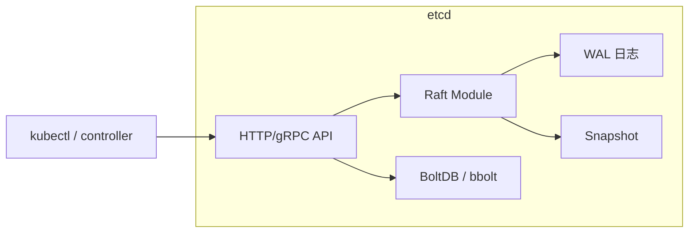
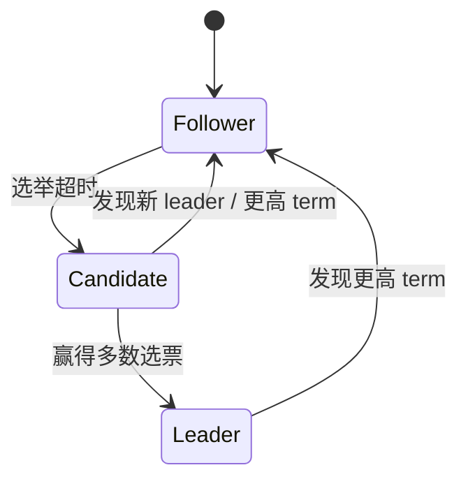
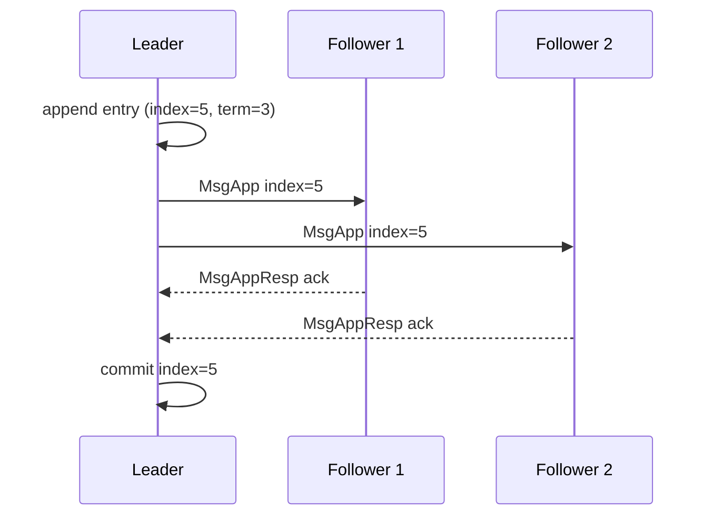

# 6. 源码分析：etcd Raft

本章选取 **etcd Raft** 作为源码分析对象。原因很直接：Kubernetes 的 etcd 是 AI Infra 控制面的核心，而 etcd 的共识引擎就是 Raft。理解 etcd Raft，等于理解了 Kubernetes 状态一致性的底座。

## 6.1 etcd 与 Raft 的关系



etcd 把 Raft 作为独立模块实现（`go.etcd.io/etcd/raft/v3`），上层 etcd server 通过 `Node` 接口与之交互。这种分层设计让 Raft 库可以被 TiKV、CockroachDB 等复用。

## 6.2 Raft 模块核心接口

Raft 模块对外暴露的核心类型是 `raft.Node`：

```go
// 简化版接口
interface Node {
    Tick()
    Propose(ctx context.Context, data []byte) error
    Step(ctx context.Context, msg raftpb.Message) error
    Ready() <-chan Ready
    Advance()
    Campaign(ctx context.Context) error
}
```

- `Tick()`：驱动选举超时和心跳超时；
- `Propose()`：leader 收到客户端写请求后，把数据提案给 Raft；
- `Step()`：把收到的网络消息喂给 Raft 状态机；
- `Ready()`：Raft 准备好一批需要处理的状态变更（日志、消息、快照、commit index）；
- `Advance()`：上层处理完 Ready 后通知 Raft 继续；
- `Campaign()`：主动发起选举。

## 6.3 状态机

每个 Raft 节点有三种状态：



- **Follower**：被动接收 leader 的日志和心跳；
- **Candidate**：选举超时后发起投票；
- **Leader**：处理写请求、复制日志、发送心跳。

## 6.4 领导者选举

当 Follower 在 `electionTimeout` 内没有收到 leader 消息时，会变成 Candidate：

1. 自增 `currentTerm`；
2. 给自己投票；
3. 向所有其他节点发送 `MsgVote`；
4. 如果收到多数选票，成为 Leader；
5. 如果发现更高 term 的节点，退回 Follower。

```go
// raft/raft.go 简化逻辑
func (r *raft) becomeCandidate() {
    r.state = StateCandidate
    r.Term++
    r.Vote = r.id
}
```

投票规则：

- 每个 term 内一个节点只能投一票；
- 如果候选人的日志至少和自己一样新，才投票。

## 6.5 日志复制

Leader 收到 `Propose` 后：

1. 把条目追加到本地日志；
2. 向所有 follower 发送 `MsgApp`（AppendEntries）；
3. 收到多数确认后，该条目被标记为 `committed`；
4. 把 committed 条目应用到状态机（etcd 里是 bbolt）。



如果 follower 日志不一致，leader 会递减 `nextIndex` 并重新发送更早的条目，直到匹配成功。

## 6.6 Commit Index 与 Advance

Raft 使用 `Ready` 结构把状态变更一次性交给上层：

```go
type Ready struct {
    Entries          []pb.Entry      // 需要持久化的新日志
    Snapshot         pb.Snapshot     // 需要持久化的快照
    CommittedEntries []pb.Entry      // 可以应用到状态机的已提交日志
    Messages         []pb.Message    // 需要发送给其他节点的消息
    HardState        pb.HardState    // term/vote/commit index 硬状态
}
```

上层处理流程：

1. 把 `Entries` 写入 WAL；
2. 把 `HardState` 写入 WAL；
3. 发送 `Messages`；
4. 把 `CommittedEntries` 应用到状态机；
5. 调用 `Advance()` 让 Raft 继续推进。

## 6.7 Snapshot

日志不能无限增长，etcd 会定期生成 snapshot：

- 把当前状态机数据压缩成快照文件；
- 删除旧的 WAL 日志；
- 新节点加入或落后太多时，直接发送 snapshot 而不是逐条日志。

```go
// raft/node.go 简化
func (n *node) Ready() <-chan Ready {
    return n.readyc
}
```

## 6.8 Leader 切换与 ReadIndex

etcd 的线性一致读通过 `ReadIndex` 实现：

1. Leader 收到读请求；
2. 把读请求作为一个没有数据的 heartbeat 广播；
3. 收到多数确认后，说明当前 leader 仍然是合法 leader；
4. 在本地状态机读到该读请求对应 commit index 之后的数据，返回结果。

这样即使 leader 网络分区，也不会读到过期数据。

## 6.9 与 Kubernetes 的关系

Kubernetes apiserver 把所有资源对象（Pod、Node、Deployment 等）写入 etcd。etcd 的 Raft 保证：

- 所有 apiserver 看到一致的 K8s 状态；
- 某个 etcd 节点故障不影响服务；
- 网络分区时不会出现脑裂。

controller、scheduler、kubelet 通过 watch 机制监听 etcd 变更，形成整个 K8s 控制面。

## 6.10 一句话总结

**etcd Raft 是 Kubernetes 控制面的“心脏”：它通过领导者选举、日志复制、commit index、snapshot 和 ReadIndex，把多个 etcd 节点组织成一个强一致、高可用的状态机；理解它的调用链，就理解了 K8s 状态为什么不丢、不旧、不裂。**
