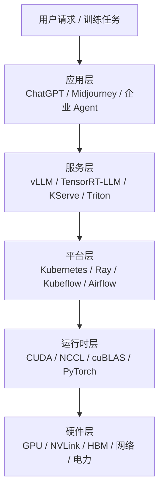

# 1. 背景：为什么 AI 离不开 GPU

## 1.1 一句话问题

训练一个 GPT-4 级别的大模型，需要几万张 GPU 连续跑几个月。为什么不用 CPU？

答案藏在两种芯片的设计哲学里：

- **CPU**：像一位“瑞士军刀型专家”，核心少但极其聪明，擅长复杂控制、分支判断、串行任务。
- **GPU**：像一座“流水线工厂”，工人（核心）成千上万，只做一件简单的事，但一起做就极其惊人。

AI 训练推理的本质，是**海量矩阵乘法**。这件事不需要太多聪明才智，但需要**大量并行工人**。

## 1.2 CPU vs GPU：两种设计哲学

| 维度 | CPU | GPU |
|---|---|---|
| 核心数 | 几十核（如 64/96/128） | 几千上万核心（H100 有 14,592 CUDA Core + 528 Tensor Core） |
| 单核能力 | 强，高频，复杂分支预测 | 弱，低频，简单控制 |
| 擅长任务 | 操作系统、数据库、通用业务逻辑 | 矩阵乘、图像渲染、深度学习 |
| 内存带宽 | 几百 GB/s | 几 TB/s（H100 SXM 3.35 TB/s） |
| 设计目标 | 低延迟（Latency） | 高吞吐（Throughput） |

类比：

- CPU 是**跑车**：能在复杂路况下快速到达目的地。
- GPU 是**货运列车**：一次拉几千吨货，沿着固定轨道匀速前进。

AI 模型训练就像“把同样的计算模板复制上亿份”，这正是货运列车最喜欢的活。

## 1.3 从图形卡到 AI 加速器

GPU 最初不是为 AI 设计的。

1999 年，NVIDIA 推出 GeForce 256，自称“世界第一款 GPU”，专门用来加速 3D 游戏里的像素计算。游戏渲染的核心是：对屏幕上每个像素做同样的着色计算。

2006 年，NVIDIA 发布 **CUDA（Compute Unified Device Architecture）**，把 GPU 从“图形专用芯片”变成了“通用并行计算设备”。研究人员发现，深度学习里的卷积、矩阵乘，和像素着色本质上是一回事：

> **同样的指令，作用在大量数据上。**

2012 年，AlexNet 在 ImageNet 上用两块 GTX 580 GPU 夺冠，开启了深度学习 + GPU 的时代。从那以后，GPU 的演进方向越来越像“AI 专用加速器”：

- Pascal（2016）：引入 FP16，加速训练。
- Volta（2017）：引入第一代 **Tensor Core**，专门做矩阵乘累加（MMA）。
- Ampere（2020）：TF32、稀疏性加速、MIG。
- Hopper（2022）：Transformer Engine、FP8、NVLink 4。
- Blackwell（2024-2025）：FP4、第二代 Transformer Engine、NVLink 5、GB200 全互联架构。

可以说，**现代 NVIDIA GPU 的每一次重大架构更新，都是在回答一个问题：怎么让 AI 模型更快、更省、更大。**

## 1.4 AI 工作负载的两大特征

为什么 GPU 特别适合 AI？因为 AI 计算有两个显著特征。

### 特征一：数据并行度高

一次训练迭代中，模型要对成千上万个 token、像素或样本做几乎相同的矩阵运算。每个样本可以独立计算，天然适合并行。

### 特征二：计算密度高

大模型的核心操作是矩阵乘法。一个 $4096 \times 4096$ 的矩阵乘，需要大约 $2 \times 4096^3 \approx 1370$ 亿次浮点运算，但输入输出数据只有约 $128$ MB。

这意味着：**计算量远远大于数据量**。只要数据能留在高速缓存里反复用，GPU 就能火力全开。

## 1.5 GPU 在 AI Infra 中的位置

如果把 AI 基础设施画成一座冰山：

GPU/CUDA 位于**运行时层与硬件层的交界处**。AI Infra 工程师不一定写 CUDA kernel，但必须理解：

- 调度器把 Pod 放到 GPU 上后，GPU 内部发生了什么；
- 为什么 TensorRT-LLM 能把延迟压到那么低；
- 为什么 NCCL all-reduce 会占满 NVLink；
- 为什么一张 H100 的显存比另一张 H100 贵一倍。

## 1.6 本章的学习态度

学习 GPU/CUDA，不要一开始就陷入寄存器分配或 PTX 指令。建议按这个顺序建立直觉：

1. **先理解“为什么 GPU 快”**（并行度、带宽、计算密度）；
2. **再理解 CUDA 编程模型**（Grid/Block/Thread、内存层次）；
3. **然后看真实架构演进**（Tensor Core、HBM、NVLink）；
4. **最后才是写 kernel 和调性能**（occupancy、coalescing、fusion）。

下一节，我们从最核心的概念开始：**SIMT、Warp、Latency Hiding 和计算密度**。
