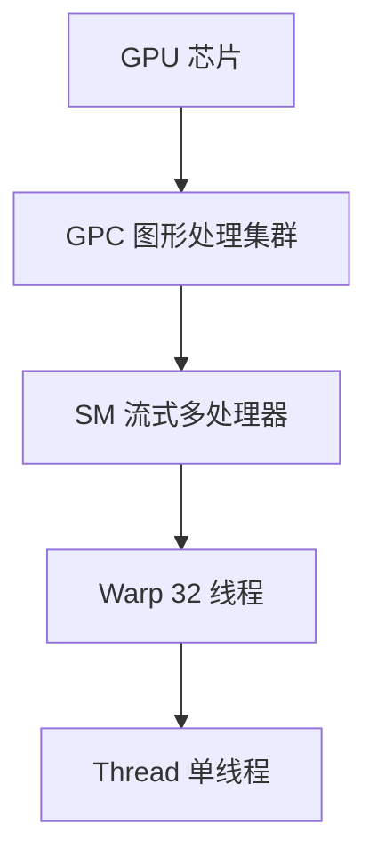
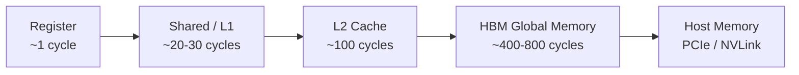

# 2. 核心思想：SIMT、Warp、Latency Hiding 与计算密度

GPU 的世界里有几个概念，一旦理解了它们，剩下的知识就会像拼图一样自然拼上。

它们是：**SIMT、Warp、Thread Block、SM、Latency Hiding、内存层次、计算密度、Roofline Model**。

## 2.1 SIMT：单指令，多线程

CPU 的多线程通常是 **MIMD（Multiple Instruction, Multiple Data）**：不同核心可以跑完全不同的指令。

GPU 的核心执行模型是 **SIMT（Single Instruction, Multiple Threads）**：

> 很多线程一起执行**同一条指令**，但作用在**不同的数据**上。

想象一支合唱团：指挥给出同一个指令“唱 do”，每个人唱出来的音高一样，但每个人手里的歌词位置不同——对应的就是每个线程处理的数据不同。

SIMT 的好处是控制逻辑简单、芯片面积可以省下来堆更多计算单元。代价是：如果线程之间需要走不同的分支，性能就会下降（后面会讲 **warp divergence**）。

## 2.2 Warp：GPU 调度的基本单位

NVIDIA GPU 中，一个 **warp** 由 32 个线程组成。这 32 个线程一起被发射、一起执行、一起停顿。

你可以把 warp 理解为“一艘小船”：

- 船上有 32 名乘客（线程）；
- 船一起出发、一起到达；
- 船长（调度器）以 warp 为单位管理船只，而不是逐个管理乘客。

一个 SM（Streaming Multiprocessor，流式多处理器）可以同时驻留多个 warp，通过快速切换来隐藏延迟。

## 2.3 SM：GPU 的“车间”

GPU 由很多个 **SM** 组成。每个 SM 就像工厂里的一个车间：

- 车间里有若干条生产线（CUDA Core / Tensor Core / Load-Store Unit）；
- 车间里有仓库（寄存器、共享内存、L1 缓存）；
- 车间一次可以容纳多个 warp（工人小组），但具体能同时干活的 warp 受资源限制。



不同架构的 SM 数量和内部结构不同。例如：

| GPU | 架构 | SM 数量 | 每 SM 关键资源 |
|---|---|---|---|
| A100 | Ampere | 108 | 64 FP32 CUDA Core, 4 Tensor Core |
| H100 SXM | Hopper | 132 | 128 FP32 CUDA Core, 4 Tensor Core |
| B200 | Blackwell | ~160 | 更多 Tensor Core，第二代 Transformer Engine |

## 2.4 Thread Block 与 Grid

CUDA 程序以 **kernel** 为单位启动。一个 kernel 会启动一个 **Grid**，Grid 由若干 **Thread Block** 组成，每个 Block 由若干 Thread 组成。

```
Grid  = 所有 Block 的集合
Block = 若干 Thread 的集合（通常 128/256/512/1024 个线程）
Warp  = 32 个 Thread（硬件调度单位）
```

一个 Block 里的线程可以：

- 通过 **共享内存（Shared Memory）** 快速交换数据；
- 通过 `__syncthreads()` 同步。

不同 Block 之间的线程一般不能直接通信，需要通过 **全局内存（Global Memory）** 或后续 kernel 间接同步。

## 2.5 Latency Hiding：用大量线程掩盖等待

GPU 的显存访问延迟很高（几百个时钟周期）。如果 GPU 傻等数据回来，计算单元会大量空闲。

GPU 的解决方法是：**同时准备很多 warp，一个 warp 在等数据时，调度器立刻换另一个 warp 执行。**

这就像餐厅服务员同时服务很多桌：一桌在等上菜，他就去服务另一桌，而不是站在原地发呆。

> **足够的并发 warp 数，是 GPU  hiding 内存延迟的关键。**

这个概念直接引出 **Occupancy（占用率）**：实际驻留的 warp 数 / SM 理论最大 warp 数。Occupancy 越高，越能 hiding 延迟。

## 2.6 内存层次：离计算越近，越快越小

GPU 的内存是一个层级结构：

| 层级 | 速度 | 容量 | 生命周期 | 可见范围 |
|---|---|---|---|---|
| Register | 最快 | 极小 | 线程 | 单个线程 |
| Shared Memory / L1 | 很快 | 几十 KB | Block | Block 内线程 |
| L2 Cache | 快 | 几 MB~几十 MB | kernel | 全 GPU |
| Global Memory / HBM | 慢 | 几十 GB | 程序 | 全 GPU |
| Host Memory | 最慢 | 很大 | 程序 | CPU |



优化的核心原则：**把数据搬到离计算近的地方，尽量复用。**

这就是为什么矩阵乘法要做 **tiling**：把一小块数据搬到 shared memory，反复计算后再写回 global memory。

## 2.7 计算密度（Arithmetic Intensity）

计算密度 = 计算量 / 访存量（单位：FLOPs / byte）。

它决定了一个 kernel 是**计算瓶颈**还是**内存瓶颈**：

- 计算密度高：GPU 算力是瓶颈，Tensor Core 能大展拳脚；
- 计算密度低：显存带宽是瓶颈，优化重点在访存模式。

### 一个直觉例子

**矩阵乘 $C = A \times B$**，假设三个矩阵都是 $N \times N$：

- 计算量：$2N^3$ FLOPs
- 访存量：$3N^2 \times \text{sizeof}(float) = 12N^2$ bytes（FP32）
- 计算密度：$\frac{2N^3}{12N^2} = \frac{N}{6}$ FLOPs/byte

当 $N = 4096$ 时，计算密度约为 682 FLOPs/byte，远高于 H100 的“算力/带宽”平衡点，所以矩阵乘通常是**计算瓶颈**，Tensor Core 能充分发挥。

但如果是 **element-wise 加法 $C = A + B$**：

- 计算量：$N$ FLOPs
- 访存量：$3N \times 4 = 12N$ bytes
- 计算密度：$\frac{1}{12}$ FLOPs/byte

这远低于 GPU 的算力/带宽比，所以是**内存瓶颈**，优化重点在合并访问和减少读写。

## 2.8 Roofline Model：一眼看清瓶颈

Roofline Model 把 GPU 性能画成一张图：

- 横轴：计算密度（FLOPs/byte）
- 纵轴：实际性能（FLOPs/s）
- 斜线：受内存带宽限制的天花板
- 平顶：受峰值算力限制的天花板

```text
实际性能 = min(峰值算力, 内存带宽 × 计算密度)
```

一个 kernel 落在斜线上，说明是内存瓶颈；落在平顶上，说明是计算瓶颈。

 Roofline 告诉我们：**不要无脑优化算力，先判断瓶颈在哪里。**

## 2.9 核心概念速查表

| 概念 | 一句话解释 |
|---|---|
| SIMT | 单指令多线程，32 个线程一起执行同一条指令 |
| Warp | 32 个线程的调度单位 |
| SM | GPU 的核心计算单元，包含 CUDA Core / Tensor Core / 寄存器 / 共享内存 |
| Thread Block | 可协作、可同步的线程组，共享 shared memory |
| Grid | 一次 kernel 启动的所有 Block |
| Latency Hiding | 用足够多的 warp 轮换执行，掩盖内存访问延迟 |
| Occupancy | SM 上实际驻留 warp 数 / 最大 warp 数 |
| Coalescing | 相邻线程访问相邻内存地址，合并成一次总线事务 |
| Bank Conflict | 多个线程同时访问 shared memory 的同一个 bank，导致串行化 |
| Arithmetic Intensity | 计算量 / 访存量，决定瓶颈在算力还是带宽 |

## 2.10 本节小结

GPU 快的秘密可以总结为：

1. **大量简单核心**，用 SIMT 方式并行执行；
2. **以 warp 为单位调度**，通过快速切换 hiding 延迟；
3. **显存带宽极高**，但延迟也高，需要高并发 warp 和合并访问；
4. **计算密度决定瓶颈**，矩阵乘是计算瓶颈，element-wise 是内存瓶颈。

下一节，我们把镜头拉近，看 NVIDIA GPU 架构从 Fermi 到 Blackwell 的演进。
