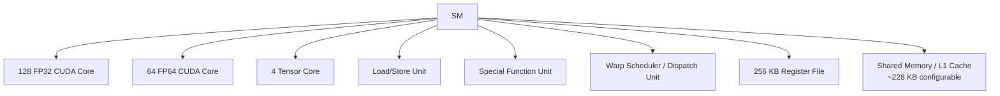
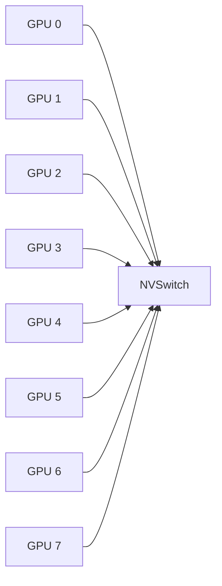

# 3. 架构设计：从 Fermi 到 Blackwell

理解 GPU 架构演进，不是为了背年份，而是为了明白：**为什么 H100 比 A100 更适合大模型？为什么 B200 强调 FP4 和 Transformer Engine？为什么 NVLink 比 PCIe 重要得多？**

## 3.1 架构演进时间线

| 架构 | 年份 | 代表卡 | 关键创新 |
|---|---|---|---|
| Fermi | 2010 | GTX 480 | 第一代完整 CUDA Core 架构，引入 L1/L2 缓存 |
| Kepler | 2012 | GTX 680 / K20 | GK110，更多 SM，动态并行 |
| Maxwell | 2014 | GTX 980 / M40 | 能效提升，统一内存雏形 |
| Pascal | 2016 | P100 / GTX 1080 | NVLink 1，FP16，第一代针对 HPC/AI 的设计 |
| Volta | 2017 | V100 | 第一代 **Tensor Core**，NVLink 2 |
| Turing | 2018 | RTX 2080 / T4 | RT Core、第二代 Tensor Core、INT8 |
| Ampere | 2020 | A100 / RTX 3090 | 第三代 Tensor Core、TF32、稀疏加速、MIG |
| Hopper | 2022 | H100 / H200 | 第四代 Tensor Core、FP8、Transformer Engine、NVLink 4 |
| Blackwell | 2024-2025 | B200 / GB200 | 第五代 Tensor Core、FP4、第二代 Transformer Engine、NVLink 5、解耦架构 |

每一代架构的更新，几乎都围绕三个方向：

1. **算力**：更多 CUDA Core、更强 Tensor Core、更低精度支持；
2. **显存**：更大容量、更高带宽（HBM2e → HBM3 → HBM3e）；
3. **互联**：更快 NVLink、更多 GPU 直连。

## 3.2 SM 内部结构：一个“车间”里有什么

以 Hopper H100 的 SM 为例，简化后包含：



### CUDA Core

CUDA Core 是通用浮点/整数计算单元，负责标量和向量运算。它就像车间里的“万能钳工”。

### Tensor Core

Tensor Core 是专门做 **矩阵乘累加（Matrix Multiply Accumulate, MMA）** 的专用单元。

- Volta V100：每个 Tensor Core 每个周期可做 $4 \times 4 \times 4$ FP16 MMA。
- Ampere A100：支持 TF32、BF16、FP16、INT8。
- Hopper H100：支持 FP8，引入 **Transformer Engine**（动态在 FP16/BF16 和 FP8 之间切换精度）。
- Blackwell B200：支持 FP4，第二代 Transformer Engine，第五代 Tensor Core。

Tensor Core 是 AI 加速的“秘密武器”。它让矩阵乘法的有效吞吐，比单纯用 CUDA Core 高出数倍到数十倍。

## 3.3 Tensor Core 为什么快

传统 CUDA Core 做矩阵乘，是把大矩阵拆成很多标量乘加。Tensor Core 则直接一次吃掉一个小矩阵块：

```text
C = A × B + C
```

其中 A、B、C 可以是 $4 \times 4$、$8 \times 8$、$16 \times 8$ 等小矩阵，具体尺寸随架构和精度变化。

这意味着：

- **同样晶体管预算下，专用电路比通用电路效率高得多**；
- **数据在寄存器里复用，减少了从 shared memory / global memory 搬运**。

### 精度演进

| 精度 | 位宽 | 典型用途 |
|---|---|---|
| FP32 | 32 bit | 训练默认，数值稳定 |
| TF32 | 19 bit | Ampere 起训练加速，接近 FP32 稳定 |
| BF16 | 16 bit | 训练与推理，动态范围接近 FP32 |
| FP16 | 16 bit | 推理、混合精度训练 |
| FP8 | 8 bit | H100/H200 推理、部分训练（DeepSeek-V3） |
| FP4 | 4 bit | B200 推理量化 |

精度越低，同样功耗和面积下算力越高，但数值稳定性越差。Transformer Engine 的核心价值就是：**在需要稳定的地方用 FP16/BF16，在允许损失的地方自动切到 FP8/FP4。**

## 3.4 HBM：GPU 的“主粮仓”

GPU 显存主要用 **HBM（High Bandwidth Memory）**，因为它能提供极高的带宽。

| GPU | 显存类型 | 容量 | 带宽 |
|---|---|---|---|
| A100 SXM | HBM2e | 80 GB | 2,039 GB/s |
| H100 SXM | HBM3 | 80 GB | 3,350 GB/s |
| H200 SXM | HBM3e | 141 GB | 4.8 TB/s |
| B200 | HBM3e | 180-192 GB | ~8 TB/s |

HBM 通过把多层 DRAM 芯片堆叠起来，用硅通孔（TSV）连接，实现高带宽、低功耗，但成本极高。

## 3.5 NVLink 与 NVSwitch：GPU 之间的高速公路

单卡 GPU 不够用，需要多卡通信。PCIe 带宽太低（PCIe 4.0 x16 约 32 GB/s，PCIe 5.0 x16 约 64 GB/s），成为瓶颈。

**NVLink** 是 NVIDIA 的芯片间高速互联：

| 代际 | 每链路带宽 | 典型配置 |
|---|---|---|
| NVLink 2 | 25 GB/s | V100 |
| NVLink 3 | 50 GB/s | A100 |
| NVLink 4 | 100 GB/s | H100 |
| NVLink 5 | 100 GB/s+ | B200/GB200 |

**NVSwitch** 是芯片级交换机，让一台机器里的所有 GPU 以全互联方式通信。DGX H100 有 8 块 GPU，通过 NVSwitch 实现任意两块 GPU 之间 900 GB/s 双向带宽。



在多机训练中，NVLink + NVSwitch 构成了 node 内部的高速网络；跨机则通常用 InfiniBand 或 RoCE。

## 3.6 2025-2026 年的主流 GPU 对比

| GPU | 架构 | FP8 稠密算力 | 显存 | 显存带宽 | 典型定位 |
|---|---|---|---|---|---|
| H100 SXM | Hopper | 3,958 TFLOPS | 80 GB | 3.35 TB/s | 训练主力 |
| H200 SXM | Hopper | 3,958 TFLOPS | 141 GB | 4.8 TB/s | 长上下文推理 |
| B200 | Blackwell | ~9,000 TFLOPS | 180-192 GB | ~8 TB/s | 下一代训练/推理 |
| GB200 NVL72 | Blackwell | 72 GPU 全互联 | ~1.3 TB 总显存 | 通过 NVLink 5 全互联 | 万亿参数模型训练 |

## 3.7 Blackwell 的革新

2024 年 GTC 发布的 Blackwell 架构，不只是“H100 的升级版”。它有几个面向未来大模型的关键设计：

### 第二代 Transformer Engine

- 在 FP4 精度下提供更高吞吐；
- 引入 **微张量缩放（Micro-tensor Scaling）**，让小粒度矩阵块也能稳定低精度训练。

### 第五代 Tensor Core

- 支持更大的 MMA 操作尺寸；
- 原生支持 FP4、FP6、FP8、FP16、BF16、TF32 等精度。

### NVLink 5 与解耦设计

GB200 把两颗 B200 GPU 和一颗 Grace CPU 封装在一起（GB200 Grace Blackwell Superchip），并通过 NVLink 5 实现 CPU-GPU、GPU-GPU 之间的高速统一内存访问。

GB200 NVL72 机柜把 72 颗 GPU 用 NVLink 全互联，形成“一台超大 GPU”，特别适合万亿参数 MoE 模型。

## 3.8 GPU 架构与 AI 工作负载的匹配

| AI 场景 | 对 GPU 的关键需求 | 推荐选择 |
|---|---|---|
| 大模型训练 | FP8/FP16 高算力、NVLink、大显存、高 MFU | H100/H200/B200/GB200 |
| 长上下文推理 | 大显存、高带宽 | H200、B200 |
| 低延迟推理 | 高频率、低精度 FP8/FP4 | B200、H100 |
| 多租户云 | MIG、MPS、显存隔离 | A100/H100 |
| 边缘/消费级 | 低功耗、低成本 | RTX 4090、Jetson |

## 3.9 本节小结

GPU 架构演进史，就是一部“让矩阵乘法更快、让显存更大、让 GPU 之间连得更紧”的历史：

- **Fermi → Pascal**：通用计算成熟，NVLink 诞生；
- **Volta → Ampere**：Tensor Core 出现并成熟，TF32/MIG 加入；
- **Hopper**：FP8 + Transformer Engine，面向大模型训练；
- **Blackwell**：FP4 + 第二代 Transformer Engine + GB200 全互联，面向下一代万亿参数模型。

下一节，我们从硬件回到软件，看 CUDA 编程模型如何把这些硬件能力暴露给程序员。
