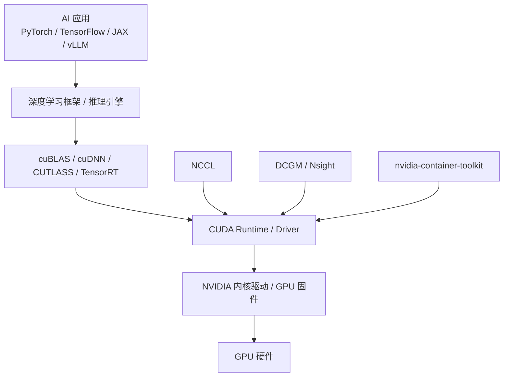

# 5. 核心模块：NVIDIA 软件栈全景

写 CUDA kernel 只是最底层。实际 AI 工程中，绝大多数代码不会直接调用 CUDA Runtime，而是通过一层层库和框架间接使用 GPU。

理解 NVIDIA 软件栈的全景，能帮你定位问题、选择工具、与上下游团队沟通。



## 5.1 CUDA Driver 与 CUDA Runtime

CUDA 有两套 API：

- **Driver API**（`cu*` 函数）：更底层，需要手动管理 context、module、kernel；
- **Runtime API**（`cuda*` 函数）：更高级，自动管理 context，是大多数应用使用的接口。

PyTorch、TensorFlow 等框架通常调用 Runtime API。Driver API 主要用于需要更细粒度控制的场景，比如动态加载 PTX、多 context 管理。

## 5.2 cuBLAS

**cuBLAS** 是 NVIDIA 针对 GPU 优化的高性能线性代数库，提供 BLAS（Basic Linear Algebra Subprograms）接口。

- `cublasSgemm`：单精度矩阵乘；
- `cublasHgemm`：FP16 矩阵乘；
- `cublasGemmEx`：支持混合精度（FP32/FP16/BF16/INT8）。

PyTorch 的 `torch.matmul`、TensorFlow 的 `tf.matmul`，底层很多都是 cuBLAS。

### 为什么 cuBLAS 比手写 kernel 快

cuBLAS 团队针对每一代 GPU 架构做了大量手工优化：

- 选择最优的 tiling 尺寸；
- 利用 Tensor Core；
- 针对不同矩阵形状（如 tall-skinny）切换算法；
- 处理边界条件、bank conflict、occupancy。

所以，**除非你是 CUDA 专家，否则不要自己写通用矩阵乘 kernel**。

## 5.3 cuDNN

**cuDNN（CUDA Deep Neural Network library）** 是面向深度学习的原语库，提供：

- 卷积（Convolution）
- 池化（Pooling）
- RNN / LSTM
- 归一化（BatchNorm、LayerNorm）
- 激活函数
- Attention 融合算子

在 Transformer 时代，cuDNN 的 **Flash Attention / Fused Attention** 实现尤其重要。

## 5.4 NCCL：集合通信库

**NCCL（NVIDIA Collective Communications Library）** 是多 GPU 训练的核心。它实现了标准的集合通信原语：

- `AllReduce`：所有 GPU 求和并广播结果（数据并行核心）；
- `AllGather`：收集所有 GPU 的分片数据；
- `ReduceScatter`：规约后分散；
- `Broadcast`、`Reduce`、`AllToAll`。

NCCL 会针对 NVLink、PCIe、InfiniBand 等拓扑自动选择最优通信路径和算法（Ring、Tree、NVLink-SHARP）。

### NCCL 与 MPI 的区别

| 特性 | MPI | NCCL |
|---|---|---|
| 定位 | 通用并行计算 | GPU 深度学习专用 |
| 通信原语 | 完整 | 聚焦集合通信 |
| GPU 感知 | 弱 | 强，支持 CUDA buffer 直接通信 |
| 拓扑优化 | 一般 | 针对 NVLink/IB 深度优化 |

PyTorch Distributed、DeepSpeed、Megatron-LM 底层都依赖 NCCL。

## 5.5 CUTLASS

**CUTLASS（CUDA Templates for Linear Algebra Subroutines and Solvers）** 是 NVIDIA 开源的 C++ 模板库，用于编写接近 cuBLAS 性能的手工 kernel。

它把矩阵乘拆成多层抽象：

```
Gemm <- GemmKernel <- MmaCore <- Warp-level MMA <- Tensor Core instruction
```

**什么时候用 CUTLASS？**

- 你需要一个 cuBLAS 不支持的自定义矩阵乘变体；
- 你要写 Flash Attention 这类融合算子；
- 你要针对特定精度或稀疏模式极致优化。

**普通 AI Infra 工程师更可能“读 CUTLASS”而不是“写 CUTLASS”**，但知道它存在很重要。

## 5.6 Thrust、cuFFT、cuRAND

- **Thrust**：类似 C++ STL 的并行算法库（sort、reduce、scan 等）；
- **cuFFT**：快速傅里叶变换；
- **cuRAND**：随机数生成。

这些库在信号处理、科学计算、数据增强等场景有用。

## 5.7 NVIDIA 驱动与容器化

### nvidia-container-toolkit

在 Docker/Kubernetes 中使用 GPU，需要 **nvidia-container-toolkit**。它把宿主机的 NVIDIA 驱动和 GPU 设备挂载到容器里，让容器内的 CUDA 程序能直接访问 GPU。

Kubernetes 中配合 NVIDIA Device Plugin，实现 GPU 资源的分配和调度。

### NVIDIA Driver

驱动是 Host 与 GPU 之间的桥梁。它负责：

- 初始化 GPU；
- 管理显存分配；
- 提交 kernel 到硬件；
- 处理中断和错误（如 Xid 错误码）。

驱动版本需要与 CUDA Toolkit 版本匹配。通常建议用 NVIDIA 官方推荐的组合。

## 5.8 DCGM：数据中心 GPU 监控

**DCGM（Data Center GPU Manager）** 是 NVIDIA 针对数据中心的 GPU 监控和诊断工具。

它能采集：

- GPU 利用率、SM 利用率、显存利用率；
- 温度、功耗、时钟频率；
- PCIe 重传、Xid 错误；
- NVLink 错误、 retired page 数量。

DCGM Exporter 可以把指标暴露给 Prometheus，在 Grafana 中展示。这是 Kubernetes GPU 集群可观测性的关键组件。

## 5.9 GPU Feature Discovery 与 MIG Manager

- **GPU Feature Discovery**：自动给节点打上 GPU 能力标签（如 `nvidia.com/gpu.product=H100-SXM5-80GB`），帮助调度器做决策；
- **MIG Manager**：在 Kubernetes 中动态管理 MIG（Multi-Instance GPU）切分，把一张物理 GPU 切成多个独立实例。

这两个组件属于 Kubernetes GPU Operator 生态，详细调度逻辑在 [Kubernetes 主题](/02-cloud-native/kubernetes/) 中讨论。

## 5.10 软件栈选择建议

| 场景 | 推荐栈 | 说明 |
|---|---|---|
| 训练大模型 | PyTorch + cuBLAS + cuDNN + NCCL | 生态最成熟 |
| 推理优化 | TensorRT-LLM / vLLM / SGLang + cuBLAS + NCCL | 引擎层已高度优化 |
| 自定义算子 | CUDA C++ / Triton（OpenAI）/ CUTLASS | 根据复杂度选择 |
| 集群调度 | Kubernetes + GPU Operator + Device Plugin + DCGM | 生产标准 |
| 性能分析 | Nsight Compute + Nsight Systems + DCGM | 见下一节 |

## 5.11 本节小结

NVIDIA 软件栈的核心层次：

1. **CUDA Runtime/Driver**：管理 GPU、内存、kernel 启动；
2. **cuBLAS/cuDNN**：高性能线性代数和深度学习原语；
3. **NCCL**：多 GPU 集合通信；
4. **CUTLASS**：可定制的高性能 kernel 模板库；
5. **DCGM / Nsight**：监控与性能分析；
6. **nvidia-container-toolkit / GPU Operator**：容器化与编排。

AI Infra 工程师不一定要精通每一层，但要能在问题发生时判断：**是硬件、驱动、通信、框架，还是应用代码。**

下一节，我们看 CUDA 程序的源码与编译链路。
