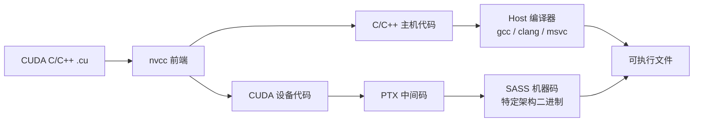
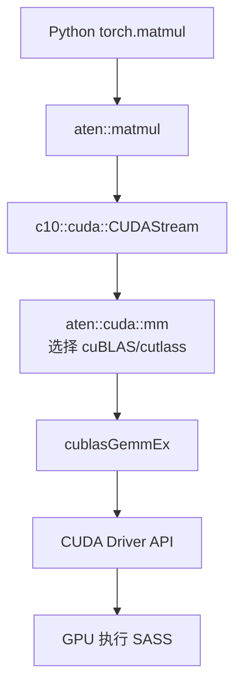

# 6. 源码分析：nvcc 编译链路与 PyTorch CUDA 调用栈

源码分析的目的不是逐行读 CUDA driver，而是理解：

1. 你写的 `.cu` 文件怎么变成 GPU 能执行的机器码？
2. PyTorch 调用 `.cuda()` 后，底层发生了哪些事情？
3. 为什么 Flash Attention 能比标准 Attention 快几倍？

## 6.1 CUDA 编译链路：从 CUDA C 到 SASS

一个 CUDA 程序的编译过程大致如下：



### 各阶段产物

| 阶段 | 产物 | 说明 |
|---|---|---|
| CUDA C/C++ | `.cu` 源码 | 主机代码 + 设备代码混写 |
| PTX | `.ptx` | 类似 LLVM IR 的虚拟指令集，架构兼容但非机器码 |
| SASS | 二进制 | 特定 GPU 架构的真实机器码 |
| Cubin | `.cubin` | 包含 SASS 的目标文件 |

### PTX 的作用

PTX 是 NVIDIA 的虚拟 ISA。编译时可以选择：

- **编译到具体架构**（如 `sm_80` for A100, `sm_90` for H100）：生成 SASS，运行时直接执行；
- **编译到 PTX**：程序启动时由 driver 即时编译（JIT）成目标架构的 SASS。

PTX 的好处是**向前兼容**：老程序可以在新 GPU 上运行。坏处是 JIT 会增加启动时间。

### 常用 nvcc 选项

```bash
nvcc -arch=sm_90 -o program program.cu
# sm_90 对应 Hopper H100
# sm_89 对应 Ada Lovelace RTX 4090
# sm_80 对应 Ampere A100
```

## 6.2 PyTorch CUDA 调用栈

当你在 PyTorch 中写：

```python
x = torch.randn(1024, 1024).cuda()
y = torch.matmul(x, x)
```

底层发生了什么？



### ATen：张量运算库

ATen 是 PyTorch 的底层张量库，实现了 `torch.add`、`torch.mm` 等算子。`aten/src/ATen/cuda` 下包含大量 CUDA 实现。

### c10：基础设施

c10 提供跨平台抽象，包括：

- `c10::TensorImpl`：张量元数据；
- `c10::cuda::CUDAStream`：CUDA 流；
- `c10::cuda::CUDACachingAllocator`：显存分配器。

### CUDA Stream

CUDA Stream 是一系列按顺序执行的 GPU 操作队列。同一个 stream 内的 kernel 按提交顺序执行，不同 stream 之间可以并发（受资源限制）。

```python
stream = torch.cuda.Stream()
with torch.cuda.stream(stream):
    y = model(x)
```

### CUDA Allocator

PyTorch 的显存分配器是**缓存分配器**：

- 第一次分配时从 CUDA Runtime 申请大块显存；
- 释放时不立即还给 OS，而是留在缓存池里供下次复用；
- 碎片化严重时可能触发 `cudaMalloc` 或 OOM。

这就是为什么有时 `nvidia-smi` 显示显存占用高，但 `torch.cuda.memory_allocated()` 显示占用低——空闲缓存还在池里。

## 6.3 一个简单的自定义 CUDA Op

假设我们给 PyTorch 写一个自定义 CUDA kernel：

```cpp
// my_op.cpp
torch::Tensor my_op_forward(torch::Tensor x) {
    auto y = torch::empty_like(x);
    AT_DISPATCH_FLOATING_TYPES(x.scalar_type(), "my_op_forward", ([&] {
        my_kernel<<<blocks, threads>>>(x.data_ptr<scalar_t>(), y.data_ptr<scalar_t>(), N);
    }));
    return y;
}
```

```cuda
// my_kernel.cu
template <typename T>
__global__ void my_kernel(const T* x, T* y, int N) {
    int idx = blockIdx.x * blockDim.x + threadIdx.x;
    if (idx < N) {
        y[idx] = x[idx] * 2.0f;
    }
}
```

编译时用 `torch.utils.cpp_extension.load` 或 `setuptools` 配合 PyTorch 的 CUDA extension 工具链。

## 6.4 Flash Attention 为什么快

Flash Attention 是近年来最具影响力的 CUDA kernel 优化之一。它的核心思想不是新算法，而是**内存访问优化**。

标准 Attention：

```
Q × K^T → S → softmax → P → P × V → O
```

每一步都把中间结果写回 HBM，再读回来。对于长序列，这些中间矩阵非常大，导致大量 HBM 读写。

Flash Attention 的做法：

1. **分块（Tiling）**：把 Q、K、V 分成小块，一次只处理一小块；
2. **在 SRAM（shared memory）里完成 softmax 和矩阵乘**；
3. **online softmax**：边算边更新归一化因子，避免存储完整 S 矩阵；
4. **重计算 backward**：前向不存 S/P，反向时重新计算。

结果是：

- HBM 访问从 $O(N^2)$ 降到接近 $O(N)$；
- 长序列下速度提升数倍，显存占用大幅下降。

Flash Attention 的代码大量使用了 CUTLASS 风格的 tiling、shared memory 管理和 warp-level 原语。

## 6.5 Triton（OpenAI）：用 Python 写 GPU kernel

如果不想写 CUDA C++，可以用 **Triton**。

```python
import triton
import triton.language as tl

@triton.jit
def add_kernel(x_ptr, y_ptr, output_ptr, n_elements, BLOCK_SIZE: tl.constexpr):
    pid = tl.program_id(axis=0)
    block_start = pid * BLOCK_SIZE
    offsets = block_start + tl.arange(0, BLOCK_SIZE)
    mask = offsets < n_elements
    x = tl.load(x_ptr + offsets, mask=mask)
    y = tl.load(y_ptr + offsets, mask=mask)
    tl.store(output_ptr + offsets, x + y, mask=mask)
```

Triton 会自动处理 tiling、shared memory、coalescing 等细节，让研究者用 Python 就能写出接近手写 CUDA 性能的 kernel。PyTorch 2.0 的 `torch.compile` 也大量依赖 Triton 生成 fusion kernel。

## 6.6 本节小结

源码分析的关键洞察：

1. **CUDA 程序经历 CUDA C → PTX → SASS 的编译链路**，PTX 提供架构兼容性；
2. **PyTorch 的 CUDA 调用栈**：Python → ATen → c10 CUDA stream/allocator → cuBLAS/cuDNN → CUDA Driver → GPU；
3. **显存分配器有缓存池机制**，`nvidia-smi` 和 `torch.cuda.memory_allocated()` 含义不同；
4. **Flash Attention 快的本质是减少 HBM 访问**，通过 tiling 和 online softmax 实现；
5. **Triton 降低了写高性能 kernel 的门槛**，正在改变 AI kernel 开发方式。

下一节，我们用一个 CPU 可运行的 Mini Demo，把前面的概念变成可触摸的代码。
