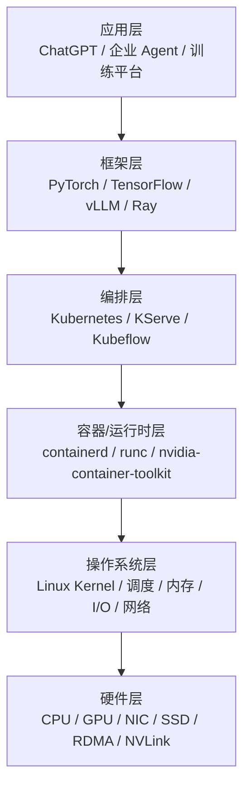

# 1. 背景：为什么 AI Infra 工程师必须懂 Linux

## 1.1 一个真实的场景

你负责的 Kubernetes 集群上，一个 8 卡 H100 训练任务跑着跑着， suddenly 某个 worker 的 GPU 利用率从 95% 掉到 30%。

你检查了：

- NVIDIA 驱动：正常；
- NCCL：没有报错；
- 网络：IB 端口 up；
- 模型代码：没有改。

最后你发现：这个 worker 上的另一个高优先级进程抢占了 CPU，导致数据加载线程（DataLoader）无法及时给 GPU 喂数据。GPU 在等数据。

这个问题不在 Kubernetes，不在 GPU，不在网络——它在 **Linux 进程调度**。

## 1.2 Linux 是 AI 平台的“地面”

如果把 AI 基础设施画成一栋楼：

Linux 操作系统层承上启下。它决定：

- 进程什么时候跑、跑在哪个 CPU 上；
- 内存怎么分配、不够了怎么回收；
- 磁盘 I/O 怎么排队、网络包怎么处理；
- 容器里的资源限制怎么生效。

**AI Infra 工程师可以不写内核模块，但必须能读懂 Linux 的行为。**

## 1.3 为什么不只是“会用 Linux”

很多工程师的日常 Linux 能力包括：

- 会写 shell 脚本；
- 会用 `kubectl`、`docker`、`nvidia-smi`；
- 会装驱动、配网络、起服务。

但这不够。AI 场景下的 Linux 问题往往是**性能问题**和**边界问题**：

| 问题 | 表面现象 | 深层原因 |
|---|---|---|
| 训练慢 | GPU 利用率低 | DataLoader 被 CPU 调度饿死 / I/O 瓶颈 / NUMA 远程访问 |
| 推理延迟抖动 | P99 高 | CPU 抢占 / 内核态开销 / cgroup throttling |
| OOM | 容器被 kill | cgroup memory limit + 内核 OOM killer 策略 |
| NCCL 慢 | all-reduce 时间长 | IRQ 未绑定 / 网络中断在错误 CPU / RDMA 参数 |
|  checkpoint 慢 | 保存时间长 | page cache 回写策略 / I/O scheduler / 网络 fs |

这些问题的根因都在 Linux 内核层面。

## 1.4 AI 工作负载对 Linux 的特殊要求

AI 训练和推理不是普通的 Web 服务。它们对操作系统有独特需求：

### 高 CPU/GPU 协同

GPU 需要 CPU 准备数据、启动 kernel、处理通信。CPU 调度不畅会直接导致 GPU 空闲。

### 大内存 footprint

大模型训练需要几十 GB 到几百 GB 显存，CPU 内存也常被激活值、数据加载、检查点占满。

### 大 I/O 压力

数据加载、检查点保存、日志写入都会产生巨大的顺序/随机 I/O。

### 低延迟网络

分布式训练依赖 RDMA/InfiniBand，要求内核网络栈尽可能不成为瓶颈（DPDK、XDP、RDMA kernel bypass）。

### 稳定性

训练任务可能跑数周，期间不能出现内核 panic、soft lockup、内存泄漏。

## 1.5 Linux 发行版选择

生产环境常用的服务器 Linux 发行版：

| 发行版 | 特点 | 适用场景 |
|---|---|---|
| Ubuntu Server LTS | 生态好、驱动新、社区活跃 | 云原生、AI 平台主流选择 |
| RHEL / Rocky Linux / AlmaLinux | 稳定、长支持、企业支持 | 金融、电信、传统企业 |
| Debian | 稳定、包管理严谨 | 长期运行的服务器 |
| Container-Optimized OS | 轻量、专为容器设计 | GKE 等托管 K8s |

AI 平台通常选择 **Ubuntu Server LTS** 或 **RHEL/Rocky**，因为 NVIDIA 驱动、CUDA、Docker 对它们的支持最好。

## 1.6 本章的学习路径

学习 Linux 系统与性能调优，建议按这个顺序建立直觉：

1. **先理解“内核 vs 用户空间”和“系统调用”**；
2. **再理解进程/线程/调度**；
3. **然后看内存管理**；
4. **接着看 I/O 和网络**；
5. **最后学 cgroup/namespace 和性能分析工具**。

不要着急记命令。先理解机制，命令只是机制的表面。

## 1.7 本节小结

- AI Infra 工程师必须懂 Linux，因为上层所有问题最终都可能落在操作系统层面；
- Linux 决定进程调度、内存管理、I/O、网络、容器隔离；
- AI 工作负载对 Linux 有高协同、大内存、大 I/O、低延迟、高稳定性的要求；
- 学习 Linux 要从机制入手，而不是死记命令。

下一节，我们从最核心的概念开始：**Kernel/User Space、系统调用、进程模型**。
