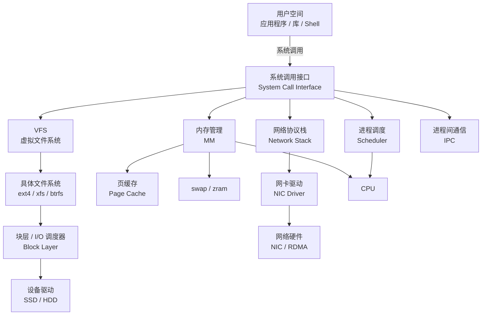

# 3. 架构设计：Linux 内核全景

Linux 内核是一个巨大的软件，但我们可以用一张图先抓住它的骨架。理解架构的好处是：遇到问题你能判断“这事归哪个子系统管”。

## 3.1 Linux 内核整体架构



这张图简化了很多，但足够建立直觉：

- **系统调用接口**：用户空间和内核的分界线；
- **VFS**：统一不同文件系统的抽象层；
- **进程调度**：决定哪个进程/线程在 CPU 上运行；
- **内存管理**：虚拟内存、物理内存、swap；
- **网络协议栈**：socket、TCP/IP、网卡驱动；
- **块层/I/O 调度器**：管理磁盘 I/O 请求；
- **设备驱动**：让内核能操作具体硬件。

## 3.2 系统调用接口

系统调用接口是内核暴露给用户空间的大门。所有 `libc` 函数（如 `fopen`、`malloc`、`pthread_create`）最终都会调用到这里。

Linux 的系统调用号定义在 `arch/x86/entry/syscalls/syscall_64.tbl` 等架构相关文件中。

进入内核的方式（x86-64）：

1. 用户程序把系统调用号放到 `rax` 寄存器；
2. 参数放到 `rdi`、`rsi`、`rdx` 等寄存器；
3. 执行 `syscall` 指令；
4. CPU 切换到内核态，内核根据系统调用号找到处理函数；
5. 处理完后通过 `sysret` 返回用户态。

## 3.3 虚拟文件系统（VFS）

VFS 是 Linux 文件系统的抽象层。它让内核可以用统一的接口支持 ext4、xfs、btrfs、nfs、procfs、sysfs 等完全不同的文件系统。

VFS 定义了四个核心对象：

| 对象 | 含义 |
|---|---|
| superblock | 文件系统的整体信息 |
| inode | 文件的元数据（权限、大小、时间、块位置） |
| dentry | 目录项，加速路径查找 |
| file | 打开的文件实例，包含读写位置 |

当你 `open("/data/model.bin")` 时：

1. VFS 根据路径找到 dentry；
2. dentry 指向 inode；
3. inode 指向具体文件系统的数据块；
4. 返回一个 file descriptor 给用户空间。

## 3.4 进程调度子系统

Linux 的进程调度器决定：在任意时刻，哪个进程在哪个 CPU 上运行。

主要调度类：

| 调度类 | 用途 |
|---|---|
| CFS（Completely Fair Scheduler） | 普通进程，默认调度类 |
| RT（Real-Time） | 实时进程，SCHED_FIFO / SCHED_RR |
| Deadline | 截止时间调度，SCHED_DEADLINE |
| Idle / Stop | 特殊用途 |

CFS 是绝大多数 AI 程序的调度类。它的核心思想是：**尽量让每个进程获得公平的 CPU 时间**。它用红黑树维护进程的 `vruntime`（虚拟运行时间），总是选择 vruntime 最小的进程运行。

## 3.5 内存管理子系统

Linux 内存管理负责：

- 虚拟地址到物理地址的映射（页表）；
- 物理内存的分配与回收；
- Swap 和 OOM；
- Page cache；
- HugePages；
- NUMA 内存策略。

### 页表与 TLB

每个进程有自己的页表，记录虚拟页到物理页的映射。CPU 通过 MMU（Memory Management Unit）做地址转换。

为了加速地址转换，CPU 有 **TLB（Translation Lookaside Buffer）** 缓存最近用过的页表项。TLB miss 会导致额外的内存访问，降低性能。

### HugePages

标准页大小是 4KB。大页（HugePages）可以是 2MB 或 1GB。大页的好处：

- 减少页表项数量；
- 减少 TLB miss；
- 大模型训练常用来 pin 住大段内存。

## 3.6 网络子系统

Linux 网络协议栈从底到上大致是：

```
应用层 → Socket API → TCP/UDP/IP → Netfilter → 网卡驱动 → 网卡硬件
```

现代 AI 基础设施对网络有两个优化方向：

1. **内核 bypass**：DPDK、RDMA、XDP 绕过内核协议栈，直接操作网卡；
2. **内核优化**：busy polling、RPS/RFS、XPS、IRQ affinity，减少中断和上下文切换。

## 3.7 块层与 I/O 调度器

块层处理所有块设备（磁盘、SSD）的 I/O 请求。

传统 I/O 调度器：

| 调度器 | 特点 |
|---|---|
| noop | 几乎不做调度，适合 SSD/NVMe |
| deadline | 保证每个请求有截止时间，适合混合读写 |
| cfq | 按进程队列轮转，公平分配带宽 |

现代 NVMe 通常用 `none` 或 `mq-deadline`，因为 SSD 延迟低、并行度高，复杂的调度反而成为瓶颈。

## 3.8 中断与软中断

当硬件有事件需要内核处理（如网卡收到包、磁盘 I/O 完成），会触发 **中断（Interrupt）**。

- **硬中断（Hardware IRQ）**：硬件直接触发，处理要非常快；
- **软中断（Soft IRQ）**：硬中断把大部分工作延后到软中断处理；
- **Tasklet / Workqueue**：更灵活的延后处理机制。

网络高吞吐场景下，中断处理可能成为瓶颈。常用优化：

- **RPS（Receive Packet Steering）**：把软中断分发到多个 CPU；
- **RFS（Receive Flow Steering）**：把同一条流的处理绑定到同一个 CPU；
- **XPS（Transmit Packet Steering）**：优化发送端；
- **IRQ affinity**：把硬中断绑定到特定 CPU。

## 3.9 现代 Linux 发行版组件

一个现代服务器 Linux 系统还包含：

| 组件 | 作用 |
|---|---|
| systemd | 初始化系统和服务管理 |
| journald | 系统日志 |
| udev | 设备文件动态管理 |
| SELinux / AppArmor | 强制访问控制 |
| NetworkManager / systemd-networkd | 网络配置 |
| chrony / ntpd | 时间同步 |

AI 平台工程师经常需要和 systemd unit、cgroup 集成、journal 日志打交道。

## 3.10 本节小结

Linux 内核可以分成几个核心子系统：

1. **系统调用接口**：用户空间和内核的分界线；
2. **VFS**：统一文件系统抽象；
3. **进程调度**：CFS/RT/Deadline；
4. **内存管理**：虚拟内存、页表、TLB、HugePages；
5. **网络协议栈**：socket、TCP/IP、网卡驱动；
6. **块层/I/O 调度器**：磁盘 I/O 管理；
7. **中断/软中断**：硬件事件处理；
8. **systemd 等用户态组件**：服务管理与初始化。

下一节，我们深入进程与系统调用。
