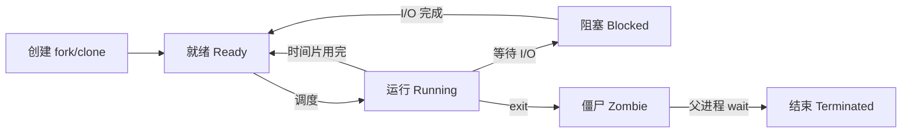
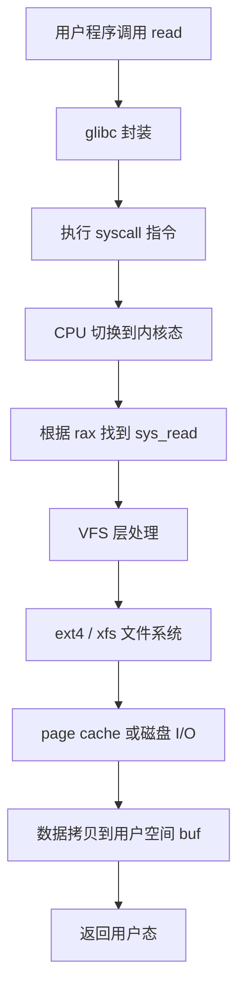

# 4. 进程与系统调用

进程是 Linux 资源分配的基本单位，系统调用是用户空间进入内核的唯一正门。理解这两个主题，才能解释“为什么我的程序有时候会卡”。

## 4.1 进程生命周期

一个 Linux 进程从创建到结束，大致经历以下状态：



### fork / clone

`fork()` 创建一个几乎完全复制父进程的新进程。现代 Linux 用 **写时复制（Copy-on-Write, COW）** 优化：只有父子之一修改内存页时，才真正复制那一页。

`clone()` 更底层，可以精确控制父子共享哪些资源。Linux 的线程库 `pthread_create` 底层就是 `clone()`，共享地址空间、文件描述符等。

### execve

`execve()` 把当前进程的地址空间替换为一个新程序。常见的 `exec` 族函数（`execl`、`execvp` 等）都是对 `execve` 的包装。

fork + exec 的组合是 Shell 启动命令的经典方式：

```bash
$ ls
```

Shell 先 `fork()` 出子进程，子进程再 `execve("/bin/ls", ...)`，父进程 `wait()` 等待子进程结束。

### exit / wait

`exit()` 终止进程，释放大部分资源，但会留下一个 **僵尸进程（Zombie）**，直到父进程调用 `wait()` 读取退出状态。

如果父进程先死，子进程会被 `init`（PID 1，现代是 systemd）收养，最终由 systemd 回收。

## 4.2 进程调度

Linux 调度器决定哪个进程在哪个 CPU 上运行、运行多久。

### CFS（Completely Fair Scheduler）

CFS 是普通进程的默认调度器。它的目标是让每个进程获得“公平的 CPU 时间”。

核心机制：

- 每个进程有一个 `sched_entity`，其中记录 `vruntime`（虚拟运行时间）；
- 红黑树按 vruntime 排序；
- 调度器总是选择 vruntime 最小的进程运行；
- `nice` 值影响 vruntime 增长速度：nice 越低，vruntime 增长越慢，进程越容易获得 CPU。

```
vruntime += delta_exec * (NICE_0_LOAD / weight)
```

`weight` 由 nice 值决定，nice 越低 weight 越大，vruntime 增长越慢。

### 实时调度

| 策略 | 特点 |
|---|---|
| SCHED_FIFO | 一旦运行就一直运行，直到主动放弃或被更高优先级任务抢占 |
| SCHED_RR | 同优先级之间按时间片轮转 |
| SCHED_DEADLINE | 基于截止时间的调度，适合有严格时序要求的任务 |

实时调度优先级高于 CFS。AI 场景里，某些延迟敏感的推理服务可能会考虑 `SCHED_FIFO`，但要非常小心：如果高优先级任务死循环，低优先级任务可能永远拿不到 CPU。

### CPU 亲和性

`taskset` 和 `sched_setaffinity()` 可以把进程绑定到特定 CPU 核心。

AI 训练/推理常用 CPU 亲和性减少缓存抖动和上下文切换开销。

```bash
taskset -c 0-7 python train.py
```

## 4.3 上下文切换

上下文切换是 CPU 从一个进程/线程切换到另一个时的开销。它包括：

- 保存当前进程的寄存器、程序计数器；
- 切换页表（如果是不同进程）；
- 切换内核栈；
- 恢复新进程的寄存器、程序计数器；
- 刷新 TLB（部分或全部）。

上下文切换次数太多会浪费 CPU。`vmstat` 的 `cs` 列就是上下文切换次数。

## 4.4 系统调用的完整流程

以 `read(fd, buf, count)` 为例：



1. 用户程序调用 `read`；
2. glibc 把系统调用号放到 `rax`，参数放到寄存器；
3. 执行 `syscall` 指令，CPU 特权级切换到 ring 0；
4. 内核入口根据系统调用号分发到 `sys_read`；
5. VFS 找到文件对应的 inode；
6. 如果数据在 page cache，直接拷贝到用户空间；
7. 如果不在，发起磁盘 I/O，进程进入阻塞状态；
8. I/O 完成后，数据拷贝到用户空间，进程重新变为就绪；
9. 返回用户态，glibc 把结果返回给调用者。

## 4.5 strace / ptrace

`strace` 是一个强大的调试工具，它可以跟踪进程发出的所有系统调用。

```bash
strace -c python train.py
```

这个命令会统计每个系统调用的次数和耗时，非常适合定位“是不是某个系统调用太慢”。

`strace` 底层用 `ptrace()` 系统调用，可以让一个进程控制并观察另一个进程。

## 4.6 systemd 与进程管理

现代 Linux 用 systemd 作为初始化系统（PID 1）。它负责：

- 启动系统服务；
- 管理进程生命周期；
- 收集日志（journald）；
- 与 cgroup 集成，限制服务资源。

一个典型的 systemd unit：

```ini
[Unit]
Description=My AI Service

[Service]
ExecStart=/usr/local/bin/serve
CPUQuota=200%
MemoryLimit=4G

[Install]
WantedBy=multi-user.target
```

`CPUQuota=200%` 会被翻译成 cgroup v2 的 `cpu.max`；`MemoryLimit=4G` 会翻译成 `memory.max`。

## 4.7 进程状态速查

用 `ps aux` 或 `top` 看到的进程状态：

| 状态 | 含义 |
|---|---|
| R | Running / Runnable |
| S | Sleeping（可中断） |
| D | Uninterruptible Sleep（不可中断，通常在等 I/O） |
| T | Stopped |
| Z | Zombie |
| I | Idle（内核线程） |

如果看到很多 `D` 状态进程，通常说明 I/O 子系统有瓶颈（磁盘、NFS、网络文件系统等）。

## 4.8 本节小结

- 进程生命周期：`fork`/`clone` → `execve` → 运行/阻塞/就绪 → `exit`/`wait`；
- CFS 用 vruntime 和红黑树实现公平调度；
- 实时调度 `SCHED_FIFO`/`SCHED_RR`/`SCHED_DEADLINE` 用于特殊场景；
- 系统调用涉及用户态/内核态切换、VFS、文件系统、page cache；
- `strace` 是定位系统调用问题的利器；
- systemd 把服务和 cgroup 资源限制绑定在一起。

下一节进入核心模块：CPU、内存、I/O、网络、cgroup、namespace。
