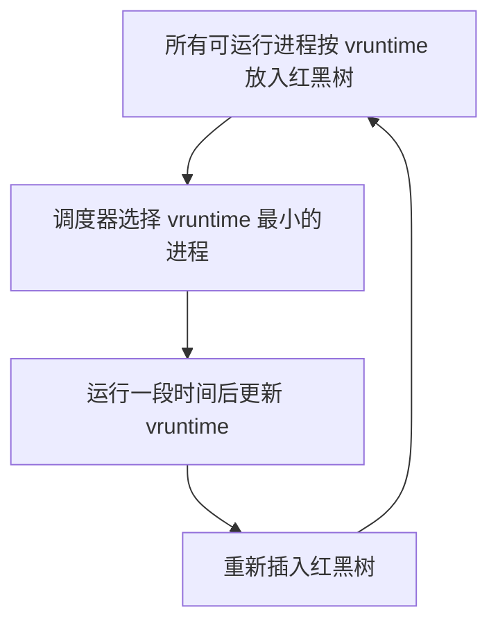
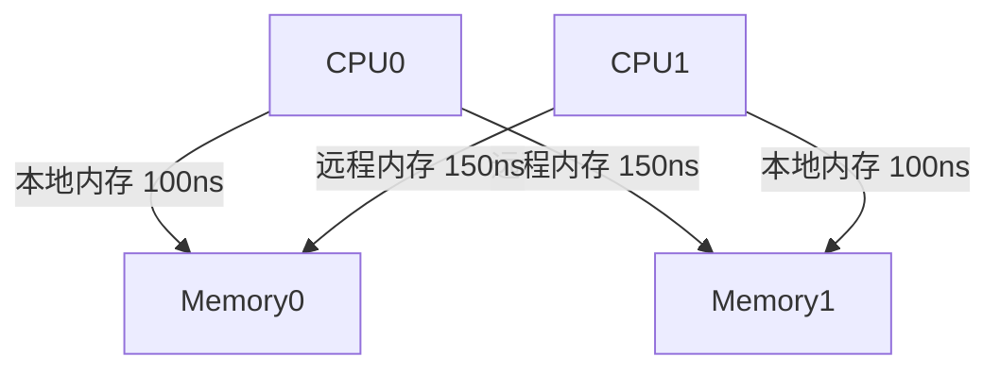
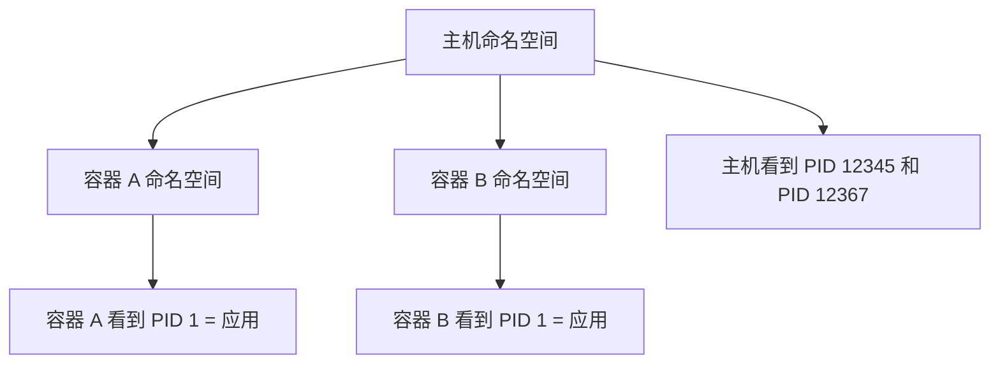

# 5. 核心模块

Linux 内核可以拆成多个子系统。本章聚焦 AI Infra 工程师最经常打交道的几个：CPU 调度、内存管理、文件系统、网络、cgroup、namespace、systemd 和性能工具。

## 5.1 CPU 调度

### CFS 的公平性

CFS 不是按固定时间片轮转，而是按“虚拟运行时间”公平分配。



### nice 与优先级

| nice 值 | 效果 |
|---|---|
| -20 | 最高优先级，vruntime 增长最慢 |
| 0 | 默认 |
| 19 | 最低优先级，vruntime 增长最快 |

nice 只影响 CFS 内部权重，不影响实时任务。

### CPU 负载均衡

多核 CPU 上，Linux 会尝试把任务均匀分配到各个核心。如果某个核心太忙，内核会把任务迁移到空闲核心。

负载均衡的代价是缓存失效：迁移到新核心后，L1/L2 缓存大概率是冷的。

### CPU 亲和性

- `taskset`：命令行绑定；
- `sched_setaffinity()`：程序内绑定；
- Kubernetes 的 `cpu-manager-policy=static`：把独占核心分配给 Guaranteed Pod。

AI 训练常把数据加载线程绑定到特定 NUMA 节点，避免跨 NUMA 访问内存。

## 5.2 内存管理

### 虚拟内存与页表

每个进程看到的都是虚拟地址。MMU 根据页表把虚拟地址翻译成物理地址。

Linux 使用多级页表。x86-64 上常见 4 级或 5 级页表。

```
虚拟地址 → PGD → P4D → PUD → PMD → PTE → 物理页
```

页表本身也占用内存。大模型进程的页表可能达到几十 MB 甚至更大。

### TLB

TLB 是 CPU 内部的地址转换缓存。TLB miss 需要查页表，代价是几次内存访问。

优化 TLB 的方法：

- **HugePages**：减少页表项，提高 TLB 命中率；
- **CPU 亲和性**：减少跨 CPU 的 TLB 刷新；
- **减少工作集**：避免进程访问过于分散的内存。

### NUMA

Non-Uniform Memory Access：多路服务器上，每个 CPU 有自己的本地内存，访问远程内存更慢。



Linux 提供 `numactl` 和 `libnuma` 来控制内存分配策略：

- `--membind=0`：只在节点 0 分配内存；
- `--cpunodebind=0`：在 CPU 节点 0 上运行；
- `--interleave=all`：在所有节点上轮询分配。

AI 训练机器通常配置为 `NUMA node 0 ↔ GPU 0-3`，`NUMA node 1 ↔ GPU 4-7`。错误绑定会导致 PCIe 和内存访问变慢。

### HugePages

- 透明大页（THP）：系统自动把相邻 4KB 页合并为 2MB 大页；
- 静态大页（hugetlbfs）：启动时预留，应用程序显式使用。

大模型训练框架（如 PyTorch FSDP、DeepSpeed）常建议开启 HugePages。

### Swap 与 OOM

当物理内存不足时，Linux 会把不活跃的内存页换到 swap 分区或 swap 文件。

如果 swap 也不足，内核会触发 **OOM Killer**，根据 OOM score 选择一个进程杀掉。

OOM score 主要考虑：

- 内存占用大小（占越大越容易被杀）；
- nice 值（nice 低的进程更关键，更不容易被杀）；
- 运行时间（运行久的进程通常更稳定，不容易被杀）；
- `oom_score_adj`（用户可以调整）。

容器场景下，cgroup memory limit 会先于系统 OOM 触发 cgroup OOM，杀掉容器内最胖的进程。

### Page Cache

Linux 会把磁盘文件缓存到内存里，这就是 **page cache**。读文件时如果命中 page cache，速度比磁盘快几个数量级。

写操作通常先写入 page cache，再由内核异步回写到磁盘。可以用 `fsync()` 强制刷盘。

AI 场景：

- 数据集通常很大，page cache 装不下，需要直接 I/O（`O_DIRECT`）或预读策略；
- checkpoint 写入大文件时，page cache 回写策略会影响 I/O 抖动。

## 5.3 文件系统

### VFS 回顾

VFS 提供统一接口：`open`、`read`、`write`、`close`、`mmap`、`fsync`。

### ext4 / xfs / btrfs

| 文件系统 | 特点 |
|---|---|
| ext4 | Linux 最常用，稳定，性能好 |
| xfs | 大文件、高并发 I/O 性能好，适合 AI 训练数据 |
| btrfs | Copy-on-Write，快照功能强，但大文件性能一般 |

AI 训练数据通常是很多大文件，xfs  often 更受欢迎。

### Direct I/O 与 Buffered I/O

| 模式 | 特点 |
|---|---|
| Buffered I/O | 默认，走 page cache，适合随机读、小文件 |
| Direct I/O | `O_DIRECT`，绕过 page cache，适合大文件顺序读写 |

PyTorch DataLoader 读取大模型数据集时，常讨论 `O_DIRECT` 和 `num_workers` 的搭配。

## 5.4 网络子系统

### Socket 与协议栈

```
应用层
↓ Socket API
TCP / UDP
↓ IP
↓ Netfilter（iptables/nftables）
↓ 网卡驱动
↓ 网卡硬件
```

### NAPI

传统网卡每收到一个包就中断 CPU，高吞吐下中断风暴会拖垮 CPU。NAPI（New API）让网卡在收到一批包后才中断一次，把处理放到软中断里。

### RPS / RFS / XPS

| 技术 | 作用 |
|---|---|
| RPS | 把软中断分发到多个 CPU |
| RFS | 把同一 flow 的处理固定到同一个 CPU |
| XPS | 把发送队列映射到特定 CPU |

分布式训练常用 RFS 把同一 NCCL 通信流的处理固定，减少缓存失效。

### XDP / DPDK / RDMA

| 技术 | 特点 |
|---|---|
| XDP | 内核早期包处理，可 drop/redirect，延迟低 |
| DPDK | 用户态轮询网卡，完全 bypass 内核 |
| RDMA | 网卡直接读写远程内存，CPU 不参与数据搬运 |

RDMA（InfiniBand/RoCE）是大模型分布式训练的标配。

## 5.5 cgroup

cgroup 把进程分组，并对每组做资源限制和统计。

### cgroup v1 vs v2

| 特性 | cgroup v1 | cgroup v2 |
|---|---|---|
| 层级 | 每个子系统独立挂载 | 统一层级 |
| 控制器 | cpu、memory、blkio、pids 等 | 统一接口，支持更多控制器 |
| 根进程 | 每个子系统必须有唯一根 | 单根层级 |
| CPU 控制 | shares、quota、period | 统一为 weight 和 max |
| Memory 控制 | limit、soft limit | 更精细的 memory.high/memory.max |

Kubernetes 1.25+ 默认使用 cgroup v2。

### CPU 限制

cgroup v2 中：

- `cpu.weight`：相对权重，类似 v1 的 shares；
- `cpu.max`：`quota period`，例如 `"200000 100000"` 表示每 100ms 最多用 200ms（即 2 核）。

注意：**CPU limit 可能导致 throttle**。如果一个容器配置了 1 核 limit，但进程想跑满 2 核，内核会强制它在某些周期内 sleep，造成延迟抖动。

### Memory 限制

cgroup v2 中：

- `memory.max`：硬限制，超过触发 OOM；
- `memory.high`：软限制，内核会积极回收，但不强制 kill；
- `memory.min` / `memory.low`：保护内存不被回收。

Kubernetes QoS：

- Guaranteed：limit=request，cgroup 设置 `memory.max` = limit；
- Burstable：设置 `memory.max` = limit，`memory.high` 可能设置；
- BestEffort：没有 request/limit，只受节点总内存限制。

## 5.6 namespace

namespace 提供视图隔离。容器里 PID 1 可以是你的应用，但主机上它可能是 PID 12345。



namespace 不限制资源，只改变进程能看到的系统视图。

## 5.7 systemd

systemd 是现代 Linux 的初始化系统和服务管理器。

常用命令：

```bash
systemctl status myservice
systemctl start myservice
systemctl enable myservice
journalctl -u myservice -f
```

systemd unit 可以和 cgroup 资源限制结合，也可以配置日志、依赖、重启策略。

## 5.8 性能分析工具链

| 工具 | 用途 |
|---|---|
| top / htop | 实时查看 CPU/内存占用 |
| vmstat | CPU、内存、I/O、上下文切换综合指标 |
| iostat | 磁盘 I/O 统计 |
| mpstat | 每个 CPU 核心的指标 |
| sar | 历史性能数据 |
| pidstat | 每个进程的 CPU/内存/I/O |
| perf | 采样性能分析，火焰图 |
| bpftrace / bcc | 动态追踪内核/用户态事件 |
| strace | 跟踪系统调用 |
| numactl / numastat | NUMA 信息和绑定 |
| sysctl | 查看/修改内核参数 |

## 5.9 本节小结

| 子系统 | 核心关注点 |
|---|---|
| CPU | CFS、nice、负载均衡、CPU 亲和性 |
| 内存 | 虚拟内存、页表、TLB、NUMA、HugePages、swap、OOM、page cache |
| 文件系统 | VFS、ext4/xfs、buffered/direct I/O |
| 网络 | socket、NAPI、RPS/RFS/XPS、XDP/DPDK/RDMA |
| cgroup | v1/v2、CPU weight/max、memory max/high/min |
| namespace | 视图隔离、容器基础 |
| systemd | 服务管理、日志、资源限制 |
| 工具 | top、vmstat、iostat、mpstat、perf、bpftrace、strace |

下一节，我们通过一个系统调用的完整链路，看看这些子系统是怎么协作的。
