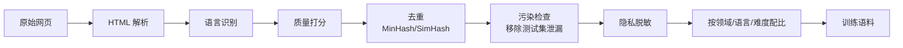
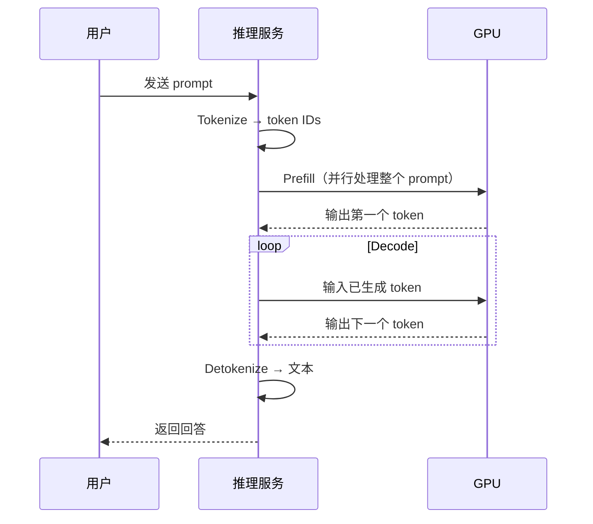

# 大模型从 0 到 1：训练与推理全链路之旅

> 一句话理解：**大模型本质上是一个“互联网语料压缩器”——它读了万亿量级的文本，学会了预测下一个 token，然后在推理时把这份压缩知识一点点解压成人类语言。**

如果你第一次接触大模型，可能会被铺天盖地的术语淹没：Transformer、Attention、预训练、SFT、RLHF、KV Cache、Continuous Batching、PagedAttention、MoE、FP8……它们像一堵墙，把普通人挡在门外。

但这堵墙并不存在。

大模型的全链路，说穿了只回答三个问题：

1. **数据从哪里来？怎么变成模型能“读”的东西？**
2. **模型长什么样？怎么从“什么都不会”变成“能接话”？**
3. **训练好的模型怎么变成你手机/网页里那个秒回的对话框？**

这篇文章会带着你，像一个 token 一样走完整条路：从互联网的原始语料，到 tokenizer 的切分，到 Transformer 的矩阵运算，到千亿参数的预训练，再到 SFT、RL、推理服务、量化加速。每一站都有**真实数字、真实模型案例和工程直觉**。

我们不会把每个公式都推到底，但会告诉你：**这个东西为什么长这样，它在真实系统里怎么跑，以及 2025-2026 年最前沿的模型都在怎么玩。**

准备好了吗？让我们从一个最简单的问题开始。

---

## 0. 开场：当你问 ChatGPT“你好”时，发生了什么？

你输入：

```text
你好
```

模型看到的是什么？

不是“你好”这两个汉字，而是一串整数：

```text
[24368, 104704]
```

这是 tokenizer 的工作成果。每个 token 会变成一个高维向量，比如 4096 维、8192 维，甚至 16384 维。然后这些向量像流水线一样穿过几十层 Transformer，最后模型输出一个概率分布：

```text
P(下一个是“！”) = 0.42
P(下一个是“，”) = 0.21
P(下一个是“呀”) = 0.08
...
```

模型采样出一个 token，把它拼回去，再预测下一个。如此循环，直到生成 `<|endoftext|>` 或达到最大长度。

整个过程可以画成一张地图：


这就是我们要走的路。先从最源头开始。

---

## 1. 数据：从互联网的“原料”到“食谱”

### 1.1 数据是大模型的“燃料”

如果你要训练一个 GPT-4 级别的模型，你需要什么？

不是更巧妙的算法，而是**海量高质量文本**。

2025-2026 年的主流模型训练数据量级如下：

| 模型 | 预训练 token 量 | 数据来源 |
|---|---|---|
| GPT-4（估算） | ~13 万亿 | 未公开 |
| Llama 3.1 405B | 15.6 万亿 | 公开网页、代码、多语言、数学 |
| Kimi K2 | 15.5 万亿 | 网页、代码、长文档、合成数据 |
| Qwen3 | 36 万亿 | 119 种语言网页、代码、STEM |
| DeepSeek-V3 | 14.8 万亿 | 中英文网页、代码、数学 |

这些“万亿”是什么概念？

如果把一个 token 粗略看作 0.75 个英文单词，那么 15 万亿 token 大约相当于 **20 万亿个英文单词**，也就是人类历史上所有出版书籍总字量的几千倍。

### 1.2 数据来源：不只靠爬虫

现代大模型的数据通常来自：

- **Common Crawl**：互联网公开网页快照，量大但脏。
- **GitHub**：代码、注释、issue、文档。
- **书籍与论文**：Project Gutenberg、Wikipedia、arXiv。
- **合成数据**：用更强的模型生成数学、代码、推理数据。
- **用户对话数据**：经过脱敏和授权后的真实交互（闭源模型为主）。

### 1.3 数据清洗： garbage in, garbage out

 raw Common Crawl 不能直接用。里面充斥着：

- 重复内容（同一篇文章被转载一万次）；
- 低质量页面（自动生成的 SEO 垃圾）；
- 个人隐私信息；
- 与测试集重叠的内容（会导致评估作弊）。

所以数据工程师会跑一条流水线：



**去重**通常用 MinHash / SimHash 做近重复检测。如果一段文本在训练集中出现太多次，模型会过度记忆它，影响泛化。

**质量过滤**有几种流派：

| 方法 | 思想 | 代表 |
|---|---|---|
| 启发式 | 字数、标点比例、重复行、停用词密度 | CCNet、C4 |
| 分类器 | 用高质量参考数据训练二分类器 | FineWeb-edu、DCLM |
| LLM-based | 用大模型给文档打分 | 2025 年后兴起 |

2025 年一个有意思的研究趋势是：苹果发表论文质疑“分类器质量过滤”是否真的捕捉到了“质量”。他们发现，分类器在提升下游任务的同时，也可能把真正多样的好数据误杀。这提醒我们：**数据工程不是越干净越好，而是越“有代表性”越好。**

### 1.4 数据配比：不是把所有食材倒进一锅

不同领域的数据对模型能力影响不同：

- 代码数据 → 提升逻辑推理和工具使用；
- 数学数据 → 提升符号运算；
- 对话数据 → 提升对话流畅度；
- 多语言数据 → 提升跨语言能力。

Meta 的 Llama 3、阿里的 Qwen3、月之暗面的 Kimi K2 都会做精细的数据混合实验。一个著名的发现是：**把代码比例从 10% 提高到 20%，模型在推理任务上可能明显提升，但文学创作能力可能下降。**

### 1.5 Scaling Laws：该把钱花在模型上，还是数据上？

2019-2020 年，OpenAI 的 Kaplan 等人提出早期 Scaling Laws：模型越大越好，数据增长可以慢一些。

2022 年，DeepMind 的 **Chinchilla** 论文颠覆了这一点：

> **模型参数 N 和训练数据量 D 应该等比例增长，最优比例大约是 20 个 token 对应 1 个参数。**

也就是说，一个 70B 参数的模型，最好用 1.4 万亿 token 训练。

| 时代 | 核心信念 |
|---|---|
| 2020 | 模型越大越好 |
| 2022 | 模型和数据要一起变大 |
| 2024-2025 | 数据质量比数量更重要 |
| 2025-2026 | 数据、算力、架构、后训练要联合优化 |

到了 2025-2026 年，研究者开始关注**全生命周期成本**：训练一次很贵，但推理每天要跑亿万次。所以有时候**把模型做小一点、数据多一点、推理快一点**，比单纯追求参数量更划算。

---

## 2. Tokenizer：把语言切成数学

### 2.1 为什么需要 tokenizer？

计算机只能处理数字。要让神经网络“读”文本，第一步是把文本变成整数序列。

最朴素的方法是：每个字符一个 ID。

```text
你 → 1
好 → 2
```

但这样序列会太长，而且模型无法学习“词”级别的概念。

另一个极端是：每个单词一个 ID。

```text
hello → 1
world → 2
```

但英语有几十万单词，中文词汇量更是无限，而且遇到新词就傻眼。

所以现代大模型用 **subword tokenizer**：把常见词保持完整，把罕见词拆成片段。

```text
unhappiness → "un", "happiness"
ChatGPT → "Chat", "G", "PT"
```

### 2.2 BPE：最主流的 tokenizer 算法

**Byte Pair Encoding（BPE）** 是 GPT、Llama、Qwen 等多数模型使用的算法。它的核心思想非常简单：

> 从 UTF-8 bytes 开始，反复合并出现频率最高的相邻 token 对，直到达到目标词表大小。

举个例子，假设训练语料里有这些词：

```text
low
lower
lowest
new
newer
newest
```

初始时每个词被拆成字符加 `</w>`（词尾标记）：

```text
low → l o w </w>
lower → l o w e r </w>
```

统计发现 `e r` 出现了很多次（lower, newer, newer），于是合并成 `er`；接着 `es` 也很多，合并成 `es`……

最终得到的词表可能包含：

```text
low, lower, lowest, new, newer, newest, er, est, ...
```

### 2.3 真实 tokenizer 有多大？

| 模型 | 词表大小 |
|---|---|
| GPT-2 | 50,257 |
| GPT-4（估算） | ~100,000 |
| Llama 3 | 128,000 |
| Qwen3 | 151,000+ |
| Kimi K2 | ~128,000 |

中文在这套词表里通常会被切成 1-2 个 token 每个字，常见词可能整个词一个 token。

### 2.4 2025 年的新趋势：SuperBPE

2025 年，华盛顿大学和 AI2 的研究者提出 **SuperBPE**。他们发现传统 BPE 的一个盲点：

> 空格不应该总是分词的边界。

比如 "by the way"、"in the morning" 这些多词表达，语义上是一个整体。SuperBPE 在第二阶段允许跨空格合并，结果比标准 BPE 少了 **33% 的 token**，下游任务提升 4%。

这说明 tokenizer 仍然是活跃的研究领域——**怎么切语言，直接影响模型能学到什么。**

---

## 3. 模型骨架：Transformer 的魔法

### 3.1 一句话理解 Transformer

**Transformer 是一个“ everybody looks at everybody ”的结构。**

它把输入序列里的每个 token 都转换成查询（Query）、键（Key）、值（Value）三个向量，然后用 Query 去“查”所有 Key，得到注意力权重，再用权重对所有 Value 做加权平均。

这样，每个 token 都能“看到”上下文里的其他 token，并决定谁更重要。

### 3.2 一个数值例子：从“我爱”到“你”

让我们用一个极简例子感受 Transformer 的前向过程。这个例子改编自 [llm-inference-walkthrough.pages.dev](https://llm-inference-walkthrough.pages.dev/)，词汇表只有 6 个字：

```text
我、爱、你、他、是、的
```

模型参数极小：embedding 维度 d=2，1 层，1 个 attention head，FFN 维度 4。

输入：

```text
我 爱
```

#### 步骤 1：Tokenize

假设 tokenizer 把每个字映射为 ID：

```text
我 → 0, 爱 → 1
```

#### 步骤 2：Embedding

每个 ID 查表得到一个 2 维向量：

```text
我 → [0.2, 0.5]
爱 → [0.8, 0.1]
```

#### 步骤 3：Self-Attention

把这两个向量分别乘以三个权重矩阵，得到 Q、K、V：

```text
Q_我 = [0.3, 0.4]
K_我 = [0.1, 0.6]
V_我 = [0.5, 0.2]

Q_爱 = [0.7, 0.2]
K_爱 = [0.4, 0.3]
V_爱 = [0.1, 0.9]
```

计算 attention score：

```text
score(爱→我) = Q_爱 · K_我 = 0.7*0.1 + 0.2*0.6 = 0.19
score(爱→爱) = Q_爱 · K_爱 = 0.7*0.4 + 0.2*0.3 = 0.34
```

除以 √d_k 做缩放，然后 softmax：

```text
P(爱→我) = 0.454
P(爱→爱) = 0.546
```

这意味着：在预测“爱”后面的 token 时，模型认为“爱”本身最重要（54.6%），但也参考了“我”（45.4%）。

#### 步骤 4：加权求和

```text
Output_爱 = 0.454 * V_我 + 0.546 * V_爱
          = 0.454 * [0.5, 0.2] + 0.546 * [0.1, 0.9]
          = [0.282, 0.583]
```

#### 步骤 5：FFN + LayerNorm + 输出投影

Output_爱 再经过一个前馈网络（FFN）、残差连接、LayerNorm，最后投影到 6 维 vocab 空间，softmax 得到概率：

```text
P(你) = 0.085
P(他) = 0.12
P(是) = 0.18
P(的) = 0.11
P(我) = 0.15
P(爱) = 0.255  ← 未训练时模型瞎猜
```

未训练时，模型最有可能猜错。但经过训练后，我们希望：

```text
P(你) = 0.915
```

### 3.3 训练时发生了什么？

训练的目标函数是 **交叉熵损失**：

```text
L = -log P(正确答案)
```

如果正确答案是“你”，损失会反向传播，更新所有权重，让“你”对应的 logit 变大，其他变小。

```text
梯度 dL/dlogit_i = P_i - y_i
```

正确 token 的梯度是负的（要增加概率），错误 token 的梯度是正的（要降低概率）。一次 SGD 更新后：

```text
logit(你): -0.700 → -0.517
```

重复万亿次，模型就学会了语言规律。

### 3.4 现代 Transformer 的变体

真实大模型不会用上面那种 2 维、1 层的玩具结构。它们有几十层、几千维、几十甚至上百个 attention head。并且引入了很多工程优化：

| 技术 | 作用 | 代表模型 |
|---|---|---|
| **RoPE** | 旋转位置编码，让模型知道 token 顺序 | Llama、Qwen、DeepSeek |
| **RMSNorm** | 更稳定的归一化 | Llama 系列 |
| **SwiGLU** | 更强的激活函数 | PaLM、Llama、Qwen |
| **GQA** | 分组查询注意力，减少 KV Cache | Llama 2/3、Qwen3 |
| **MLA** | 多头潜在注意力，极致压缩 KV Cache | DeepSeek-V3、Kimi K2 |
| **MoE** | 混合专家，每个 token 只激活部分参数 | DeepSeek-V3、Llama 4、Qwen3-235B |

### 3.5 真实模型长什么样？

| 模型 | 总参数 | 激活参数 | 注意力 | 特色 |
|---|---|---|---|---|
| **Llama 4 Scout** | ~109B | 17B | GQA | 16 专家，10M 上下文 |
| **Llama 4 Maverick** | ~400B | 17B | GQA | 128 专家，原生多模态 |
| **DeepSeek-V3** | 671B | 37B | MLA | FP8 训练，DualPipe |
| **Kimi K2** | ~1T | 32B | MLA | MuonClip 优化器，Agentic RL |
| **Qwen3-235B-A22B** | 235B | 22B | GQA | 128 专家，hybrid thinking |
| **Claude 4 Opus** | 未公开 | 未公开 | 未知 | Dense，hybrid reasoning |

注意：**总参数多不代表推理贵**。MoE 模型的“激活参数”才是关键——每次前向只调用其中一部分专家。

---

## 4. 预训练：让模型“读书破万卷”

### 4.1 预训练在做什么？

预训练就是：

> 拿万亿级文本，让模型反复玩“猜下一个 token”的游戏。

输入：

```text
The capital of France is
```

目标输出：

```text
Paris
```

损失函数：

```text
L = -log P(Paris | The capital of France is)
```

就是这么简单。但重复 15 万亿次，模型就学会了语法、事实、推理模式、世界常识。

### 4.2 训练循环

```python
for batch in dataloader:
    logits = model(batch.input_ids)      # 前向
    loss = cross_entropy(logits, labels) # 算损失
    loss.backward()                       # 反向传播
    optimizer.step()                      # 更新权重
    optimizer.zero_grad()
```

真实训练比这复杂一万倍，但核心逻辑就是这个。

### 4.3 分布式训练：一块 GPU 不够

一个 70B 参数的模型，如果用 FP16 存储参数、梯度、优化器状态，需要多少显存？

```text
参数：70B × 2 bytes = 140 GB
梯度：70B × 2 bytes = 140 GB
优化器状态（Adam）：70B × 8 bytes = 560 GB
激活值：数百 GB
```

单卡 H100 只有 80GB。所以必须用分布式训练。

#### 数据并行（Data Parallel, DP）

把 batch 拆到多张卡，每张卡算自己的梯度，最后做一次 All-Reduce 求平均。

适合：模型能放进单卡。

#### FSDP / ZeRO

把参数、梯度、优化器状态也切分到多张卡。训练时 All-Gather 参数，反向时 Reduce-Scatter 梯度。

适合：模型太大，单卡放不下。

#### 张量并行（Tensor Parallel, TP）

把单层矩阵乘法切分到多张卡。比如一个 8192×8192 的线性层，切成 4 份放在 4 张卡上。

适合：单层太大， intra-node 通信快。

#### 流水线并行（Pipeline Parallel, PP）

把模型按层切成几段，每段放在一张卡上。输入像流水线一样依次流过。

适合：层数很多，模型整体太大。

#### 序列并行 / 上下文并行（SP / CP）

把序列维度切分到多张卡。适合训练超长上下文（128K、1M token）。

#### 专家并行（Expert Parallel, EP）

MoE 模型专用：不同专家放在不同卡上，router 决定每个 token 送到哪张卡。

### 4.4 现代训练 = 多种并行的组合

2025-2026 年的前沿训练，通常是 **4D/5D 并行**：

```text
FSDP2（数据并行）
+ TP/SP（张量/序列并行）
+ PP（流水线并行）
+ CP（上下文并行）
+ EP（专家并行，MoE）
```

DeepSeek-V3 的 **DualPipe** 就是为了在 MoE 场景下 overlap 计算和通信，减少跨节点 all-to-all 的等待。

### 4.5 训练效率：MFU 是硬道理

**MFU（Model FLOPs Utilization）** 衡量训练效率：

```text
MFU = 实际每秒 FLOPs / GPU 理论峰值 FLOPs
```

好的训练任务 MFU 能达到 40%-55%，差的只有 10%-20%。差距主要来自：

- 通信等待（分布式并行没做好）；
- 数据加载瓶颈；
- 激活重计算开销；
- 随机 loss spike 导致回滚。

### 4.6 训练成本：到底多贵？

| 模型 | 预训练 GPU 小时 | 估算成本 |
|---|---|---|
| GPT-4（估算） | — | >1 亿美元 |
| Llama 3.1 405B | 3.93×10⁷ H100 小时 | 数千万美元 |
| DeepSeek-V3 | 2.664M H800 小时 | ~533 万美元 |
| Kimi K2 | 未公开 | 未公开 |
| Qwen3 | 未公开 | 未公开 |

DeepSeek-V3 的 533 万美元训练成本之所以震惊业界，是因为它用算法创新（MLA、FP8、DualPipe）在性能不落后的情况下把成本压到极低。

### 4.7 训练中的工程挑战

- **Loss spike**：loss 突然暴涨，必须回滚到稳定 checkpoint。
- **硬件故障**：万卡集群每天坏几十块 GPU 是常态。
- **数据污染**：训练集里混进了测试集题目，导致 benchmark 虚高。
- **Checkpoint**：每隔一段时间保存状态，TB 级 checkpoint 的读写是工程难题。

---

## 5. 后训练：从“会接话”到“会思考”

预训练完的模型叫 **Base Model**。它会续写文本，但不一定会好好回答问题。

你问它：“法国首都是哪里？”

它可能回答：

```text
法国首都，巴黎，是法国最大城市。巴黎位于……
```

也能用，但不够“助手”。后训练就是把它变成 ChatGPT、Claude 那种对话助手。

### 5.1 SFT：监督微调

收集大量高质量对话数据：

```text
用户：法国首都是哪里？
助手：法国首都是巴黎。
```

用这些（question, answer）对继续训练模型。关键技巧：

- **assistant-only loss**：只让模型对“助手回答”部分算损失，忽略用户问题部分。
- 去重：防止模型过度记忆某些模板。
- 多样性：覆盖指令、代码、数学、安全等场景。

SFT 也可以用 **LoRA / QLora** 做参数高效微调，只训练少量低秩矩阵，适合消费级 GPU。

### 5.2 偏好优化：让模型知道“哪个回答更好”

SFT 之后，模型能生成合理回答，但不同回答之间有优劣。我们收集成对偏好数据：

```text
问题：解释量子纠缠。
回答 A（chosen）：用量子力学术语……
回答 B（rejected）：胡说八道……
```

然后让模型学习“ A 比 B 好”。常见方法：

| 方法 | 思想 |
|---|---|
| **DPO** | 直接优化策略模型，无需单独的 reward model |
| **PPO** | 传统 RLHF，需要 value network |
| **GRPO** | 用组内相对优势代替 critic，省显存 |
| **KTO** | 只需要“好/坏”标签，不需要成对数据 |

DeepSeek-R1 的核心创新之一就是 **GRPO（Group Relative Policy Optimization）**：

> 不需要单独的 critic 模型，而是对同一个问题采样多个回答，用组内平均分作为 baseline，计算优势。

这让 RL 训练更稳定、更省资源。

### 5.3 推理模型：让模型“多想一会儿”

2024-2025 年，OpenAI 的 o1/o3、DeepSeek-R1、Kimi k1.5、Qwen QwQ 展示了 **test-time compute scaling**：

> 让模型在回答前生成很长的内部思考链（Chain-of-Thought），可以显著提升数学、代码、推理能力。

DeepSeek-R1-Zero 甚至证明：**完全不用 SFT，只用纯 RL，模型也能自发学会长思考。**

2025-2026 年的趋势是 **hybrid reasoning**：

- 简单问题：快速回答；
- 复杂问题：自动切换成深度思考模式。

Claude 4、Qwen3、Kimi K2 都支持这种模式。

### 5.4 安全与对齐

后训练还要处理：

- **有害请求拒绝**：不能教用户做炸弹。
- **减少幻觉**：模型不会胡说八道。
- **防止 reward hacking**：模型不能钻奖励函数的空子。
- **红队评估**：让专业团队想尽办法攻击模型，再修复。

Anthropic 的 **Constitutional AI** 让模型根据一组原则自我批评和修正，减少对大量人类标注的依赖。

---

## 6. 推理：把模型变成服务

### 6.1 一次推理的完整生命周期

当用户发送请求：

```text
法国首都是哪里？
```

系统会经历：



### 6.2 Prefill vs Decode

**Prefill**（也叫 prompt processing）是并行的：把所有输入 token 一起过模型，计算它们的 KV Cache。

**Decode** 是串行的：每次只生成一个 token，然后把新 token 的 KV 加到缓存里，再预测下一个。

| 阶段 | 瓶颈 | 特点 |
|---|---|---|
| Prefill | 计算密集 | 一次性算很多 token |
| Decode | 内存带宽密集 | 每次只算一个 token，但 KV Cache 越来越大 |

长上下文下，Decode 阶段 KV Cache 占用大量显存，这就是为什么长文本推理更贵。

### 6.3 KV Cache：推理的“记忆”

Transformer 生成第 n 个 token 时，需要知道前面所有 token 的 Key 和 Value。如果每次都重新计算，浪费巨大。

所以推理时会缓存前面算好的 K 和 V：

```text
KV Cache = [K_1, K_2, ..., K_n]
           [V_1, V_2, ..., V_n]
```

缓存大小：

```text
2 × 层数 × 头数 × 每头维度 × 序列长度 × batch_size × 精度字节数
```

对于一个 70B 模型，batch=1，序列长度 32K，FP16，KV Cache 可能达到 **几十 GB**。

### 6.4 推理引擎

| 引擎 | 特点 | 适用场景 |
|---|---|---|
| **vLLM** | PagedAttention，高并发，生态最广 | 生产 GPU 服务 |
| **SGLang** | RadixAttention，prefix-heavy 场景强 | Agent、RAG、多轮对话 |
| **TensorRT-LLM** | NVIDIA 原生优化，吞吐量最高 | NVIDIA 数据中心 |
| **llama.cpp** | 跨平台，CPU/GPU/Apple Silicon | 本地、边缘 |

---

## 7. 优化：让推理更快更便宜

### 7.1 Continuous Batching

静态 batching 要等待 batch 装满才一起推理，导致 GPU 空闲。

**Continuous Batching** 动态把新请求插入正在运行的 batch，当一个请求完成立刻释放资源。vLLM 等引擎靠它实现 **比静态 batching 高 10-20 倍吞吐**。

### 7.2 PagedAttention

KV Cache 传统实现像连续内存分配，容易产生碎片。

vLLM 的 **PagedAttention** 把 KV Cache 分成固定大小的 block（类似操作系统虚拟内存），按需分配，显著减少碎片。

效果：把 KV Cache 浪费从 60-80% 降到 4% 以下。

### 7.3 Prefix Caching / RadixAttention

多轮对话、Agent、RAG 场景中，系统提示词（system prompt）每次都要重新算，很浪费。

SGLang 的 **RadixAttention** 用 radix tree 缓存前缀 KV，实现 **6.4 倍吞吐提升**。

Anthropic 的 prompt caching 甚至把缓存输入的价格降低了 90%。

### 7.4 Speculative Decoding

大模型生成每个 token 都很贵。能不能先让一个小模型（draft model）快速生成一串候选 token，再让大模型一次性验证？

这就是 **Speculative Decoding**。如果 draft 模型质量高，整体速度可以提升 2-6 倍。

2025-2026 年的新方法是 **EAGLE-3**：不再用独立 draft model，而是在目标模型上加一个轻量预测头，直接预测未来 token。

### 7.5 Prefill-Decode Disaggregation

Prefill 是计算密集，Decode 是带宽密集。把它们放在同一台机器上，资源利用率不均衡。

**PD 分离**：用一组 GPU 专门做 Prefill，另一组专门做 Decode。SGLang 在 DeepSeek-V3/R1 上实现了 **3.8 倍吞吐提升** 和 **3.5 倍 TTFT 降低**。

### 7.6 量化

量化是把模型权重从高精度（FP16/BF16）降到低精度（FP8/INT8/INT4），减少显存占用和提升速度。

| 格式 | 精度损失 | 速度/显存收益 | 适用 |
|---|---|---|---|
| FP8 | 极小 | 2× 显存，~1.3× 速度 | H100/H200 生产默认 |
| AWQ | 很小 | 4× 显存 | 质量敏感场景 |
| GPTQ | 小 | 4× 显存 | 最大吞吐 |
| GGUF | 可调 | 2-4× 显存 | 本地/CPU |
| FP4（Blackwell）| 中等 | 4× 吞吐 | B200 推理 |

2025-2026 年，**FP8 已成为生产 GPU 推理的默认选择**，Blackwell 还带来了原生 FP4 支持。

### 7.7 模型蒸馏 + 量化

DeepSeek-R1 蒸馏出 1.5B-70B 的小模型，让学生模型学习老师的推理轨迹。再叠加 AWQ/GPTQ 量化，可以在消费级显卡上跑推理模型。

---

## 8. 2025-2026 前沿剪影

### 8.1 模型：MoE、长上下文、多模态、推理

| 模型 | 时间 | 亮点 |
|---|---|---|
| **DeepSeek-V3** | 2024.12 | 671B MoE，37B 激活，MLA，FP8，533 万美元训练 |
| **DeepSeek-R1** | 2025.01 | 纯 RL 涌现长思考，GRPO，开源 |
| **Llama 4** | 2025.04 | 17B 激活，128 专家，10M 上下文，原生多模态 |
| **Kimi K2** | 2025.07 | 1T 总参，32B 激活，MuonClip，Agentic RL |
| **Claude 4** | 2025.05 | Hybrid reasoning，工具使用，长上下文 |
| **Qwen3** | 2025.04 | 235B MoE，hybrid thinking，36T token |

### 8.2 训练：从“堆卡”到“堆算法”

- **FP8 大规模训练验证**：DeepSeek-V3 证明了 FP8 可以在千亿 MoE 上稳定训练。
- **DualPipe / 通信-计算 overlap**：让分布式训练不再被通信拖后腿。
- **合成数据与课程学习**：用强模型生成高质量训练数据。
- **数据质量反思**：分类器过滤是否真的是“质量”？研究在重新审视。

### 8.3 推理：从“能跑”到“好跑”

- **PD 分离**：生产级部署开始普及。
- **KV Cache 复用**：RadixAttention、LMCache、KVFlow 让多轮对话成本大降。
- **边缘推理**：小模型（<9B）在手机上跑得有模有样。
- **推理 Scaling**：让模型“多想一会儿”比单纯扩大模型更划算。

### 8.4 硬件：Blackwell 与后 Blackwell

| GPU | FP8 算力 | 显存 | 定位 |
|---|---|---|---|
| H100 SXM | 3,958 TFLOPS | 80 GB | 训练主力 |
| H200 SXM | 3,958 TFLOPS | 141 GB | 长上下文推理 |
| B200 | ~9,000 TFLOPS | 180-192 GB | 下一代训练/推理 |
| GB200 NVL72 | 72 GPU 全互联 | — | 万亿参数模型 |

Blackwell 带来的不只是算力翻倍，还有 **FP4 原生支持** 和 **Transformer Engine v2**，让推理吞吐再上一个台阶。

---

## 9. 写在最后：从 0 到 1 之后

走到这里，你应该已经理解：

- 大模型不是魔法，而是**数据 + 算力 + 算法 + 工程**的乘积。
- **Tokenizer** 把语言切成数学，**Transformer** 在向量空间里找规律，**预训练** 让模型博览群书，**后训练** 让它学会对话和推理，**推理服务** 把它塞进你的产品，**优化技术** 让它快得起、用得起。
- 2025-2026 年的前沿，不再是单纯比参数量，而是比 **效率、推理成本、长上下文、Agent 能力、推理深度**。

但这只是开始。

如果你继续深入，手册的后续章节会带你走进：

- [GPU 架构与 CUDA 基础](/01-foundation/gpu-cuda/)：理解 Transformer 矩阵运算在 GPU 上如何被加速；
- [vLLM](/04-llmops/vllm/)：推理引擎的内存管理与调度细节；
- [SGLang](/04-llmops/sglang/)：RadixAttention 与结构化生成；
- [TensorRT-LLM](/04-llmops/tensorrt-llm/)：NVIDIA 编译型推理优化；
- [KServe](/03-ai-platform/kserve/)：把模型服务化、规模化；
- [Ray](/03-ai-platform/ray/)：分布式训练与推理平台；
- [AI SRE](/07-ai-sre/)：让大模型服务稳定可观测。

大模型从 0 到 1 的旅程，本质上是一部**把人类知识压缩进矩阵，再把它解压回语言**的工程史。希望这篇文章，能成为你理解这部历史的第一块拼图。

---

## 参考与延伸阅读

- [The Llama 4 Herd: Architecture, Training, Evaluation, and Deployment Notes](https://arxiv.org/abs/2601.11659)
- [DeepSeek-V3 Technical Report](https://arxiv.org/abs/2412.19437)
- [DeepSeek-R1: Incentivizing Reasoning Capability in LLMs via Reinforcement Learning](https://arxiv.org/abs/2501.12948)
- [Kimi K2: Open Agentic Intelligence](https://arxiv.org/abs/2507.20534)
- [Qwen3 Technical Report](https://qwenlm.github.io/blog/qwen3/)
- [Training a Helpful and Harmless Assistant with Reinforcement Learning from Human Feedback (Anthropic)](https://arxiv.org/abs/2204.05862)
- [Constitutional AI: Harmlessness from AI Feedback](https://arxiv.org/abs/2212.08073)
- [Chinchilla: Training Compute-Optimal Large Language Models](https://arxiv.org/abs/2203.15556)
- [vLLM: Efficient Memory Management for Large Language Model Serving with PagedAttention](https://arxiv.org/abs/2309.06180)
- [SGLang: Efficient Execution of Structured Language Model Programs](https://arxiv.org/abs/2312.07104)
- [EAGLE-3: Scaling up Inference Acceleration of Large Language Models via Training-Time Construction](https://arxiv.org/abs/2503.01840)
- [LLM底层计算原理可视化（数值示例）](https://llm-inference-walkthrough.pages.dev/)
- [大模型从 0 到 1 工程指南](https://ai-infra-guide-20260513.pages.dev/)
- [NVIDIA Blackwell Architecture](https://www.nvidia.com/en-us/data-center/blackwell-architecture/)
- `docs/01-foundation/llm-from-zero/mini-demo/` — 亲手训练一个微型大模型（BPE + Tiny GPT）
