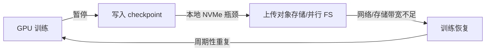
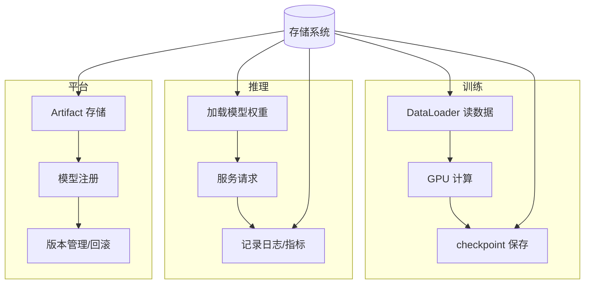

# 1. 背景：为什么 AI Infra 工程师必须懂存储

AI 系统的核心资产是数据与模型。无论训练还是推理，最终都绕不开一个问题：**数据在哪里、怎么读、怎么写、怎么保证不丢、怎么省钱。** 存储系统就是解决这些问题的底座。

## 1.1 几个真实的 AI 存储痛点

### 痛点 1：checkpoint 保存拖慢训练

训练一个大模型时，每隔一段时间就要保存一次 checkpoint。一次 checkpoint 可能包含数 TB 的权重和优化器状态。如果存储写入带宽不足，整个训练集群会停下来等保存完成。



### 痛点 2：模型服务冷启动慢

推理服务启动时需要从存储加载模型权重。如果权重文件在对象存储里，每次 Pod 启动都要下载几十 GB，冷启动时间会直接影响弹性扩缩速度。

### 痛点 3：Kubernetes 卷挂载失败

```text
MountVolume.SetUp failed for volume "pvc-xxx" : rpc error: code = DeadlineExceeded
```

这种错误在生产中很常见，可能的原因包括：CSI driver 未启动、StorageClass 配置错误、后端存储容量不足、网络分区导致 attach 超时等。

### 痛点 4：对象存储成本失控

AI 流水线会产生大量日志、指标、中间 artifact、旧版本模型。如果没有生命周期管理、分层存储和对象合并策略，对象存储账单会快速增长。

## 1.2 AI 工作负载的存储特征

| 特征 | 说明 | 对存储系统的要求 |
|---|---|---|
| 突发大写 | checkpoint 一次性写入数 TB | 高顺序写带宽、低延迟完成、不阻塞训练 |
| TB 级顺序文件 | 单个大文件包含权重/优化器状态 | 大文件优化、高效分块、快速恢复 |
| 海量小对象 | 数据集、日志、artifact 可能由大量小文件组成 | 元数据性能、合并策略、生命周期 |
| 共享命名空间 | 多节点需要同时读取训练数据/模型 | POSIX 语义或 S3 API、强一致性 |
| 强一致性需求 | checkpoint 必须可恢复、artifact 不可丢 | 数据校验、复制/纠删码、原子写入 |
| 热/温/冷分层 | 最新 checkpoint 最热，旧数据可转冷 | 自动分层、成本优化 |

## 1.3 存储问题在 AI 系统的位置



## 1.4 本章要回答的问题

- 块、文件、对象存储分别适合什么场景？
- 为什么 AI 训练 checkpoint 通常先写本地 NVMe，再异步上传到对象存储？
- 对象存储的“最终一致性”会带来什么问题？
- 复制和纠删码怎么保证数据不丢？各自的代价是什么？
- Kubernetes 的 PV/PVC/StorageClass/CSI 是怎么把存储挂到 Pod 里的？
- 如何设计一个支持 AI 训练/推理/平台的存储架构？

下一章从核心思想开始，建立存储系统的概念框架。
