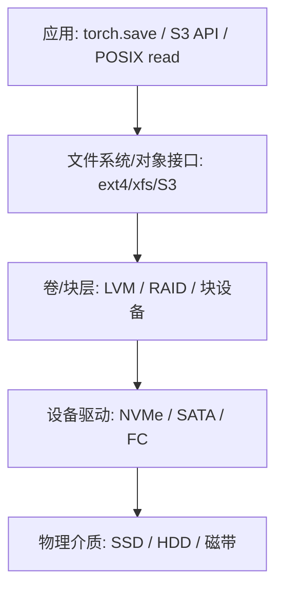
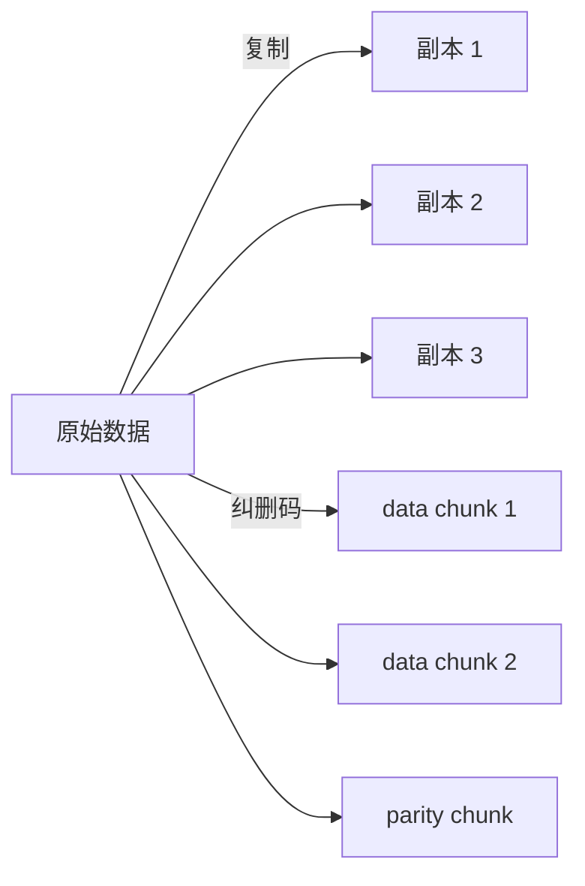
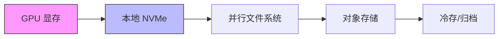

# 2. 核心思想

存储系统的核心问题可以概括为一句话：**把数据可靠地放下去，并在需要的时候高效地取出来。** 围绕这句话，衍生出一整套概念、协议和工程 trade-off。

## 2.1 存储抽象栈

从应用到物理设备，存储通常被组织成多层抽象：



每一层都向上层屏蔽下层的复杂性，同时也带来自己的开销和限制。

## 2.2 三种核心存储语义

| 语义 | 接口 | 典型系统 | 适用场景 |
|---|---|---|---|
| 块（Block） | 固定大小的块地址读写 | SAN、EBS、本地磁盘 | 数据库、文件系统底层、裸设备 |
| 文件（File） | 路径 + POSIX API | ext4、xfs、NFS、Lustre | 通用应用、训练数据、源代码 |
| 对象（Object） | bucket + key + 元数据 | S3、GCS、MinIO、Ceph | 模型权重、artifact、日志、备份 |

```mermaid
flowchart LR
    subgraph Block["块存储"]
        B1[block 0] --- B2[block 1] --- B3[block 2]
    end
    subgraph File["文件存储"]
        F1[/home/data/train.parquet]
    end
    subgraph Object["对象存储"]
        O1[bucket: models] --> O2[key: llama-3/weights.bin]
    end
```

## 2.3 POSIX vs S3 API

| 维度 | POSIX | S3 API |
|---|---|---|
| 命名 | 层级目录树 | 扁平 bucket + key |
| 一致性 | 强一致（本地 FS） | 最终一致（早期），现在多为强一致 |
| 原子性 | rename 原子 | 无原生 rename，需 copy+delete |
| 语义 | 支持追加、随机写 | 整体覆盖写，无追加 |
| 扩展 | 传统文件系统 | HTTP/REST，易扩展 |

AI 平台中，训练数据和代码通常走 POSIX（并行文件系统），模型 artifact 和 checkpoint 通常走 S3 API。

## 2.4 一致性模型

一致性描述的是写入操作完成后，其他读者何时能看到新数据。

| 模型 | 含义 | 例子 |
|---|---|---|
| 强一致 | 写入完成后，所有后续读取都返回最新值 | 本地文件系统、多数现代对象存储 |
| 读写一致 | 自己写入的数据，自己一定能读到 | S3 默认行为 |
| 最终一致 | 一段时间后所有读取都返回最新值 | 早期 S3、部分跨地域复制 |

对于 checkpoint 保存，**强一致**是刚需；否则训练恢复时可能读到旧版本，导致从头训练。

## 2.5 耐久性：复制 vs 纠删码

为了保证数据不因为硬件故障而丢失，存储系统通常采用两种机制：

### 复制（Replication）

同一份数据保存多个副本，通常是 3 副本。

- 优点：简单、读取快、恢复简单。
- 缺点：存储利用率低（3 副本只有 33% 有效数据）。

### 纠删码（Erasure Coding）

把数据切成 k 个数据块，生成 m 个校验块，任意 k 个块即可恢复完整数据。例如 RS(10,4) 表示 10 个数据块 + 4 个校验块。

- 优点：存储利用率高（10/14 ≈ 71%）。
- 缺点：写入时需要计算校验块，恢复时需要大量计算和网络带宽。



## 2.6 延迟、吞吐与 IOPS

| 指标 | 含义 | AI 场景关注点 |
|---|---|---|
| 延迟（Latency） | 单次 I/O 的响应时间 | checkpoint 保存完成时间、模型加载 TTFB |
| 吞吐（Throughput） | 单位时间传输的数据量 | 大文件顺序读写、数据集加载 |
| IOPS | 每秒 I/O 操作数 | 海量小文件元数据操作、随机读 |

AI 训练通常追求**高吞吐的顺序读写**，而模型服务更关注**低延迟加载**。

## 2.7 数据局部性、缓存与分层

数据局部性原则：**把经常访问的数据放在离计算更近、更快的地方。**



- **热层**：GPU 显存、本地 NVMe，容量小、速度快、贵；
- **温层**：并行文件系统、对象存储，容量大、速度中等；
- **冷层**：归档存储（Glacier、OSS 归档），容量极大、速度慢、便宜。

## 2.8 快照、克隆与瘦置备

| 技术 | 作用 | AI 场景 |
|---|---|---|
| 快照（Snapshot） | 某一时刻的数据只读副本 | 保存训练中间状态 |
| 克隆（Clone） | 快照的可写副本 | 快速复制环境做实验 |
| 瘦置备（Thin Provisioning） | 按需分配物理空间 | 避免预分配大量未使用空间 |

## 2.9 CAP 在存储中的体现

存储系统同样受 CAP 定理约束：

- **C（Consistency）**：多个副本之间的数据一致性；
- **A（Availability）**：系统在部分故障时仍能响应；
- **P（Partition Tolerance）**：网络分区时仍能运行。

分布式存储通常需要在 C 和 A 之间做选择。AI 训练 checkpoint 通常优先保证 **CP**（一致性和分区容忍），因为读到错误数据比短暂不可用危害更大。

## 2.10 一句话总结

**存储系统的所有设计，都是在成本、性能、可靠性和一致性之间做 trade-off；理解这些 trade-off，是做出正确选型的前提。**
