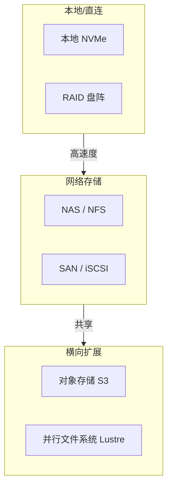
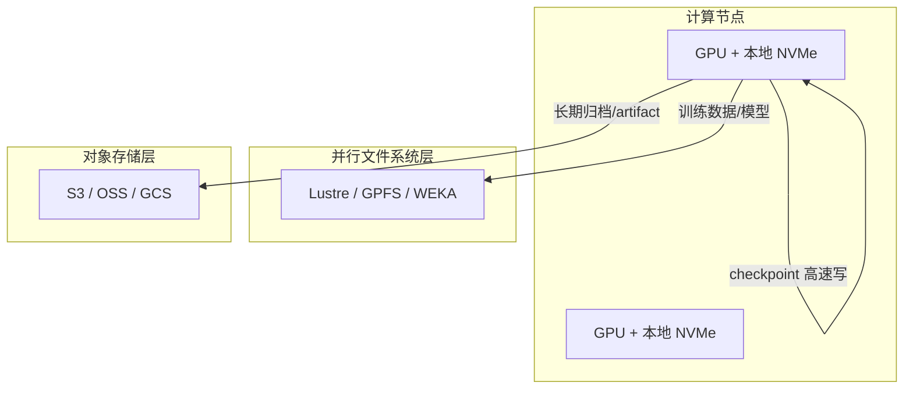
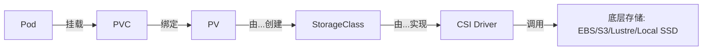

# 3. 架构设计

AI 集群的存储架构通常不是单一系统，而是**多种存储形态的组合**，分别服务于训练、推理、平台和归档等不同场景。

## 3.1 存储系统分类

| 类型 | 英文 | 特点 | 典型协议/产品 |
|---|---|---|---|---|
| 直连存储 | DAS | 直接挂在服务器上，延迟最低 | 本地 NVMe/SATA SSD |
| 网络附加存储 | NAS | 通过 NFS/SMB 共享文件 | NFS、SMB |
| 存储区域网络 | SAN | 通过专用网络提供块设备 | iSCSI、Fibre Channel |
| 对象存储 | Object Storage | 扁平命名空间，HTTP API，海量扩展 | S3、GCS、MinIO、Ceph |
| 并行文件系统 | Parallel FS | 高并发共享文件访问 | Lustre、GPFS、BeeGFS、WEKA |

## 3.2 AI 集群典型存储架构

一个中等规模的 AI 训练集群通常采用三层存储：

| 层级 | 用途 | 典型产品 |
|---|---|---|
| 本地 NVMe | 临时 checkpoint、缓存、swap | Intel P5800X、Samsung PM1735 |
| 并行文件系统 | 共享训练数据集、模型仓库 | Lustre、Spectrum Scale、WEKA |
| 对象存储 | 长期保存 checkpoint、artifact、日志 | S3、GCS、MinIO、Ceph |

## 3.3 云端存储服务

云厂商提供了丰富的托管存储选项：

| 服务 | 类型 | 特点 |
|---|---|---|
| AWS EBS | 块存储 | 挂载到单个 EC2，低延迟 |
| AWS EFS | 文件存储（NFS） | 多可用区共享，弹性容量 |
| AWS FSx for Lustre | 并行文件系统 | 与 S3 集成，适合 HPC/AI |
| AWS S3 | 对象存储 | 海量、便宜、生命周期管理 |
| GCS / Azure Blob | 对象存储 | 类似 S3，各有定价和一致性模型 |

选型时要考虑：延迟、吞吐、IOPS、容量、成本、可用区、与计算资源的网络距离。

## 3.4 Kubernetes 存储架构

Kubernetes 通过 PV/PVC/StorageClass/CSI 把存储抽象成可声明的资源：

### 关键概念

| 概念 | 作用 |
|---|---|
| PV（PersistentVolume） | 集群中的一块实际存储 |
| PVC（PersistentVolumeClaim） | 用户/应用对存储的请求 |
| StorageClass | 定义存储“模板”和 provisioner |
| CSI（Container Storage Interface） | 容器与存储系统之间的标准接口 |
| VolumeBindingMode | `Immediate` 或 `WaitForFirstConsumer`，影响调度 |
| AccessMode | `ReadWriteOnce`、`ReadOnlyMany`、`ReadWriteMany` |

## 3.5 控制面与数据面

存储系统通常分为控制面和数据面：

| 面 | 职责 | 例子 |
|---|---|---|
| 控制面 | 元数据管理、容量分配、策略执行 | S3 bucket 元数据、K8s PV controller、Lustre MDS |
| 数据面 | 实际数据传输 | S3 GET/PUT、NVMe 读写、Lustre OSS |

控制面决定了“数据在哪里、怎么访问”，数据面决定了“能跑多快”。AI 集群中，**数据面带宽往往是瓶颈**。

## 3.6 本地存储 vs 网络存储 vs 对象存储

| 维度 | 本地 NVMe | 并行文件系统 | 对象存储 |
|---|---|---|---|
| 延迟 | 最低（μs 级） | 较低（ms 级） | 较高（ms~百 ms） |
| 吞吐 | 高 | 高 | 高（并发时） |
| 共享 | 不共享 | 多机共享 | 多机共享 |
| 容量 | 小 | 中-大 | 极大 |
| 成本/GB | 高 | 中 | 低 |
| 适用 | checkpoint 缓存 | 训练数据集 | 长期归档/artifact |

## 3.7 AI 场景下的存储选型示例

| 场景 | 推荐存储 | 原因 |
|---|---|---|
| 分布式训练 checkpoint | 本地 NVMe + 异步上传对象存储/并行 FS | 高吞吐写入 + 可靠持久化 |
| 训练数据集 | 并行文件系统（Lustre/WEKA）或对象存储 + 本地缓存 | 多机共享、高吞吐顺序读 |
| 模型服务加载 | 对象存储 + 本地缓存/Init Container | 弹性扩缩、快速分发 |
| 训练日志/指标 | 对象存储 + 生命周期 | 海量小对象、低成本 |
| Artifact/模型注册 | 对象存储 + 版本控制 | 不可变、可追溯 |

## 3.8 一句话总结

**AI 集群的存储架构是“本地高速 + 并行共享 + 对象归档”的分层组合；没有一种存储能满足所有需求，关键是让数据在正确的时间出现在正确的层级。**
