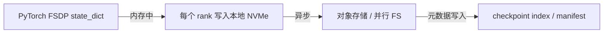
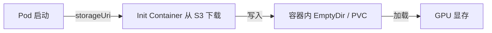
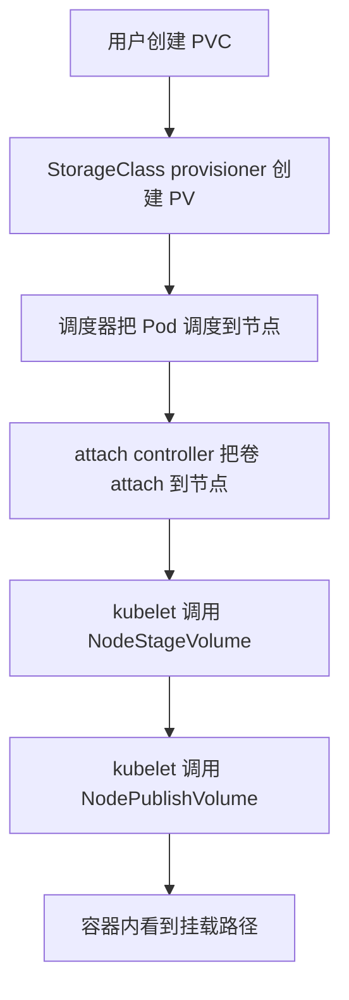

# 4. 存储数据流

理解存储系统最好的方式，是跟踪一个真实数据包的完整旅程。本章分析三条 AI 场景中最常见的链路。

## 4.1 链路一：训练 checkpoint 保存

分布式训练中，所有 rank 需要协同保存 checkpoint。典型路径如下：

### 为什么先写本地 NVMe？

1. **高吞吐**：本地 NVMe 可提供数 GB/s 的顺序写带宽；
2. **低阻塞**：保存到本地后训练可以更快恢复；
3. **容错**：本地文件作为缓冲区，后续异步上传到持久存储。

### 异步上传的注意事项

- 需要保证上传完成前，不能删除本地 checkpoint；
- 需要记录 manifest，说明哪些文件属于同一个 checkpoint；
- 上传到对象存储时，通常使用 multipart 上传以提高大文件吞吐。

## 4.2 链路二：模型服务加载权重

推理服务启动时，通常需要从存储加载模型权重：

### 优化点

| 优化 | 作用 |
|---|---|
| 本地缓存 | 同一节点上的 Pod 复用已下载权重 |
| 镜像预热 | 把常用模型打包进节点镜像或容器镜像层 |
| 并行下载 | 使用 multipart 或多线程提高带宽利用率 |
| 共享 PVC | 多副本 Pod 挂载同一个只读 PVC |

## 4.3 链路三：Kubernetes CSI 卷挂载

Kubernetes 通过 CSI 把外部存储挂载到 Pod。完整流程包括：

### CSI 主要 RPC

| RPC | 阶段 | 作用 |
|---|---|---|
| CreateVolume | Provision | 在存储后端创建卷 |
| ControllerPublishVolume | Attach | 把卷 attach 到目标节点 |
| NodeStageVolume | Stage | 在节点上格式化/挂载到全局目录 |
| NodePublishVolume | Publish | 把全局目录 bind mount 到容器路径 |

任何一个阶段失败，Pod 都会卡在 `ContainerCreating`。

## 4.4 三条链路的共性

| 链路 | 核心关注点 |
|---|---|
| checkpoint 保存 | 写入带宽、一致性、manifest 管理、异步上传 |
| 模型加载 | 读取带宽、本地缓存、冷启动时间、并发下载 |
| CSI 挂卷 | 控制面延迟、attach/stage/publish 成功率、多节点共享 |

## 4.5 一句话总结

**存储数据流的关键不是“数据存在哪里”，而是“数据在什么时候以什么带宽、经过哪些控制面、到达哪里”。**
