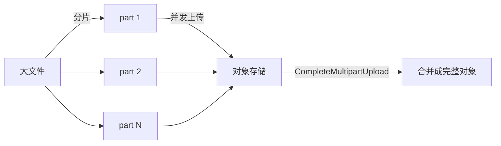
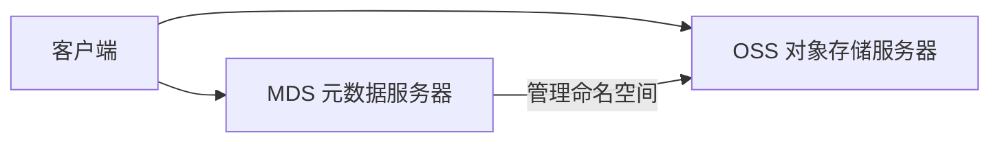

# 5. 核心模块

存储系统由多个功能模块组成。本章从本地存储、网络存储、对象存储、并行文件系统、K8s 存储、缓存分层、数据管理和可观测工具八个维度展开。

## 5.1 本地存储

### HDD / SSD / NVMe

| 介质 | 延迟 | 吞吐 | 寿命/耐久性 | 适用 |
|---|---|---|---|---|
| HDD | 数 ms | 100-200 MB/s | 高（大容量） | 冷存、归档 |
| SATA SSD | 百 μs | 500 MB/s | 中 | 普通应用 |
| NVMe SSD | 十 μs | 数 GB/s | 中-高 | checkpoint、缓存 |

### RAID

RAID 通过多块磁盘组合提高性能或可靠性：

| RAID 级别 | 特点 | 存储效率 | AI 场景 |
|---|---|---|---|
| RAID 0 | 条带化，性能最高 | 100% | 临时数据，不关键 |
| RAID 1 | 镜像，可靠性高 | 50% | 小规模关键元数据 |
| RAID 5/6 | 条带 + 校验 | 67-80% | 通用文件服务器 |
| RAID 10 | 镜像 + 条带 | 50% | 高并发读写 |

### 文件系统选型

| 文件系统 | 特点 | AI 场景 |
|---|---|---|
| ext4 | 稳定、通用 | 根分区、普通数据 |
| xfs | 大文件、高并发 I/O 性能好 | 大数据集、checkpoint |
| btrfs | 快照、压缩、校验和 | 实验环境 |
| ZFS | 高级数据保护、压缩、去重 | 小型 NAS/工作站 |

## 5.2 网络存储

### NFS

- 协议简单，易于共享；
- 单点性能受限，元数据操作可能成为瓶颈；
- 适合小团队共享数据集，不适合大规模训练。

### iSCSI / SAN

- 提供块设备，适合数据库等需要裸设备的应用；
- 需要专用网络或 VLAN 隔离；
- AI 训练中较少直接使用。

## 5.3 对象存储

### S3 API 核心操作

```text
PUT    /bucket/key       # 上传对象
GET    /bucket/key       # 下载对象
DELETE /bucket/key       # 删除对象
LIST   /bucket?prefix=   # 列出对象
HEAD   /bucket/key       # 获取元数据
```

### multipart 上传

大文件拆分成多个 part 并发上传，最后合并：



### 生命周期管理

| 策略 | 作用 |
|---|---|
| 转换存储类型 | 30 天后转 IA，90 天后转归档 |
| 过期删除 | 旧 checkpoint 自动清理 |
| 版本控制 | 保留历史版本，支持回滚 |

### 常见产品

- **AWS S3 / GCS / Azure Blob**：托管对象存储；
- **MinIO**：兼容 S3 的开源对象存储；
- **Ceph RADOS**：分布式对象存储，支持块/文件/对象；
- **S3 Express / Express One Zone**：低延迟对象存储，适合高吞吐 AI 工作负载。

## 5.4 并行文件系统

并行文件系统允许多个客户端同时访问同一命名空间，适合多机训练。

| 产品 | 特点 | 适用 |
|---|---|---|
| Lustre | 开源、HPC 生态成熟、高吞吐 | 大规模训练 |
| GPFS / Spectrum Scale | IBM 商用，强一致性 | 企业级 |
| BeeGFS | 开源、易部署 | 中小型集群 |
| WEKA | 高性能 NVMe 原生 | 低延迟 AI 工作负载 |

### 关键组件



- **MDS（Metadata Server）**：管理文件元数据；
- **OSS（Object Storage Server）**：管理实际数据块。

## 5.5 Kubernetes 存储

### PV / PVC / StorageClass

| 资源 | 角色 |
|---|---|
| StorageClass | 存储模板，定义 provisioner、参数、回收策略 |
| PVC | 应用对存储的请求（大小、访问模式） |
| PV | 实际分配的存储卷 |

### CSI driver 示例

- AWS EBS CSI driver
- Ceph RBD CSI driver
- Lustre CSI driver
- NFS CSI driver
- Local PV static provisioner

### K8s 存储选型

| 场景 | 推荐 |
|---|---|
| 训练 checkpoint | Local SSD + CSI，或并行 FS PVC |
| 模型权重 | S3 + storage-initializer，或 ReadOnlyMany PVC |
| 数据库/状态服务 | EBS/RBD PVC + StatefulSet |
| 共享数据集 | NFS/EFS/并行 FS PVC |

## 5.6 缓存与分层

### 典型缓存层

| 层 | 速度 | 容量 | 例子 |
|---|---|---|---|
| GPU 显存 | 最快 | 最小 | HBM |
| 本地 NVMe | 快 | 小 | 节点本地 SSD |
| 并行文件系统 | 中 | 中 | Lustre/WEKA |
| 对象存储 | 慢 | 极大 | S3/GCS |

### 缓存策略

| 策略 | 说明 |
|---|---|
| Read-through | 读取未命中时自动从下层加载 |
| Write-through | 写入时同时写缓存和下层 |
| Write-back | 写入时只写缓存，异步回写下层 |
| LRU | 最近最少使用淘汰 |

### 常见缓存产品

- **Alluxio**：内存/SSD 缓存层，挂载在对象存储之上；
- **JuiceFS**：基于对象存储的 POSIX 文件系统，带本地缓存；
- **FUSE**：用户态文件系统，常用于把对象存储挂载为本地路径。

## 5.7 数据管理

| 功能 | 作用 | AI 场景 |
|---|---|---|
| 快照 | 某一时刻的只读副本 | 保存训练中间状态 |
| 备份 | 跨地域/跨介质复制 | 灾难恢复 |
| 迁移 | 数据在不同存储间移动 | 冷热分层 |
| 校验和 | 检测数据损坏 | checkpoint 完整性 |

## 5.8 可观测工具

| 工具 | 用途 |
|---|---|
| `iostat` | 磁盘 I/O 利用率、IOPS、吞吐 |
| `fio` | 存储性能基准测试 |
| `dd` | 简单顺序读写测试 |
| `s3cmd` / `aws s3` | 对象存储操作与统计 |
| `lustre stats` / `weka fs` | 并行文件系统监控 |
| Prometheus + Grafana | 持续监控存储指标 |

## 5.9 一句话总结

**存储系统的模块选择，本质上是根据 AI 工作负载的访问模式（读/写、顺序/随机、大/小文件、共享/独占）匹配最合适的介质和协议。**
