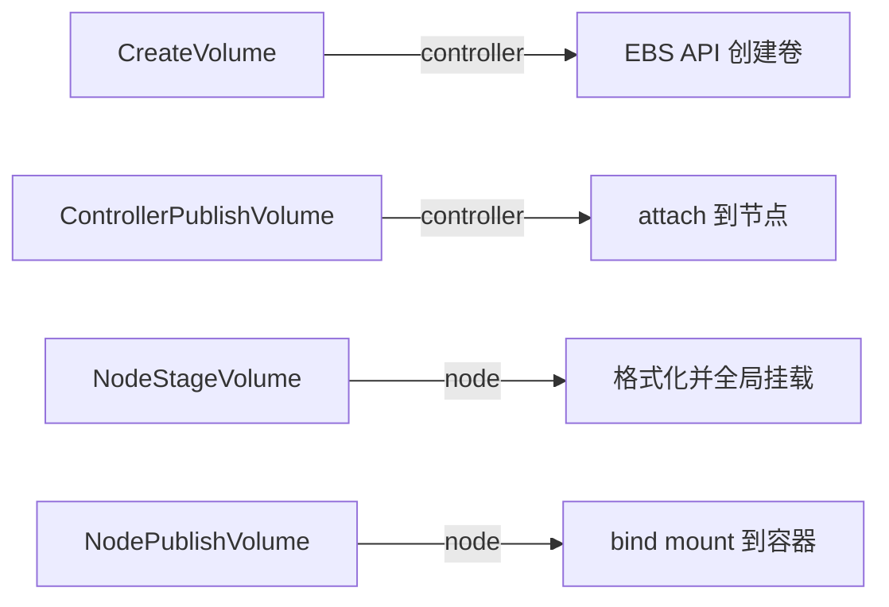

# 6. 源码分析

存储源码很多，但不需要全读完。本节聚焦一个对 AI 训练 checkpoint 至关重要的机制：**PyTorch Distributed Checkpoint (DCP)**。

## 6.1 为什么选 DCP

PyTorch 传统 `torch.save` 在分布式训练中有明显缺陷：

- 所有 rank 都把状态写到同一个文件，单机多卡时争用严重；
- 大模型 checkpoint 可能达到数 TB，单文件写入容易成为瓶颈；
- 恢复时需要所有 rank 都从同一个文件读取，灵活性差。

DCP 的设计目标是：

- 每个 rank 只保存自己负责的部分状态；
- 支持分片、异步保存、不同并行策略下的灵活加载；
- 使用 `fsspec` 等存储后端，统一本地文件系统、S3、GCS 等。

## 6.2 DCP 核心抽象


| 组件 | 作用 |
|---|---|
| `Planner` | 决定每个 rank 保存/加载哪些状态 |
| `SavePlan` / `LoadPlan` | 保存/加载计划，包含 tensor 的 shard 信息 |
| `StorageWriter` | 把计划写入存储后端 |
| `StorageReader` | 从存储后端读取计划 |
| `fsspec` | 统一文件系统抽象 |

## 6.3 保存流程源码概览

```python
# torch.distributed.checkpoint
from torch.distributed.checkpoint import save_state_dict

save_state_dict(
    state_dict=state_dict,
    storage_writer=FileSystemWriter("/path/to/checkpoint"),
    planner=DefaultSavePlanner(),
)
```

### DefaultSavePlanner

`DefaultSavePlanner` 会遍历 state_dict 中的每个 tensor，根据 tensor 的 `__dcp_storage_info__` 或 sharding 信息决定如何分片。

### FileSystemWriter

`FileSystemWriter` 使用 `fsspec` 把每个 shard 写成独立文件，同时写入一个 `.metadata` 文件记录所有 shard 的映射关系。

```text
checkpoint/
├── .metadata          # 全局元数据：每个 tensor 的 shard 位置
├── rank_0/            # rank 0 负责的状态
│   ├── model.layers.0.weight
│   └── optimizer.param_groups
├── rank_1/
│   └── model.layers.1.weight
```

## 6.4 加载流程源码概览

```python
from torch.distributed.checkpoint import load_state_dict

load_state_dict(
    state_dict=state_dict,
    storage_reader=FileSystemReader("/path/to/checkpoint"),
    planner=DefaultLoadPlanner(),
)
```

`DefaultLoadPlanner` 根据当前并行策略和 checkpoint 的 `.metadata`，决定每个 rank 需要读取哪些 shard。这样即使保存和加载时的并行度不同，也能正确恢复。

## 6.5 关键设计思想

| 设计 | 收益 |
|---|---|
| 每个 rank 写独立 shard | 消除单文件锁竞争 |
| `.metadata` 统一索引 | 加载时不需要所有 rank 读取完整文件 |
| 与并行策略解耦 | FSDP/TP/PP 变化后仍能加载 |
| fsspec 后端 | 本地 NVMe、S3、GCS 统一接口 |

## 6.6 备选：EBS CSI driver

如果想深入 K8s 存储，可以研究 AWS EBS CSI driver 的 gRPC 调用链：



这套调用链是理解 `PVC → PV → attach → mount` 的绝佳入口。

## 6.7 一句话总结

**PyTorch DCP 把 checkpoint 从“单文件、全 rank 竞争”变成“分片、独立写入、元数据驱动加载”，是支撑大模型分布式训练的关键存储优化。**
