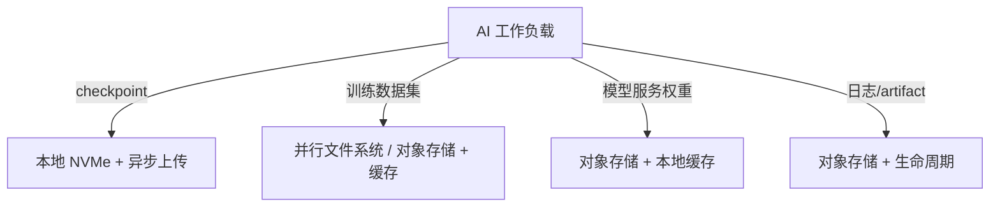

# 8. 企业生产实践

AI 集群的存储生产实践，核心是**在性能、成本、可靠性和运维复杂度之间找到可运营的平衡点**。本章从选型、checkpoint 策略、K8s 存储、模型服务加载和成本治理五个维度展开。

## 8.1 存储选型决策树



## 8.2 checkpoint 策略

### 8.2.1 同步 vs 异步 checkpoint

| 方式 | 优点 | 缺点 |
|---|---|---|
| 同步 | 简单、强一致 | 训练阻塞时间长 |
| 异步 | 训练几乎不阻塞 | 需要额外内存/显存缓冲区，恢复逻辑复杂 |

大规模训练通常采用**异步 checkpoint**：在 GPU 上保留一份状态副本，后台线程把副本写入存储。

### 8.2.2 checkpoint 频率

| 频率 | 故障回滚损失 | 写入开销 | 适用 |
|---|---|---|---|
| 高（1-5 分钟） | 小 | 高 | 万卡集群、硬件故障率高 |
| 中（15-30 分钟） | 中 | 中 | 中小规模训练 |
| 低（数小时） | 大 | 低 | 稳定环境、可接受重跑 |

Meta/Google 的经验：在高故障率环境下，checkpoint 间隔越短，有效训练时间越高，前提是存储写入带宽足够。

### 8.2.3 checkpoint 清理

- 保留最近 N 个 checkpoint；
- 旧的自动转对象存储归档；
- 删除前确认新 checkpoint 可加载。

## 8.3 Kubernetes 存储生产实践

### 8.3.1 StorageClass 设计

```yaml
apiVersion: storage.k8s.io/v1
kind: StorageClass
metadata:
  name: fast-local-ssd
provisioner: kubernetes.io/no-provisioner
volumeBindingMode: WaitForFirstConsumer
reclaimPolicy: Retain
```

- `WaitForFirstConsumer` 让调度器先选节点再绑定卷，避免 Pod 调度到没有本地盘的节点；
- `Retain` 防止 PVC 删除时数据被误删。

### 8.3.2 CSI driver 选择

| 场景 | 推荐 CSI |
|---|---|
| 本地 NVMe checkpoint | local-static-provisioner / LVM CSI |
| 共享数据集 | NFS CSI / Lustre CSI |
| 块存储 | EBS CSI / RBD CSI |
| 对象存储 | COSI（未来标准）或 sidecar |

### 8.3.3 常见排障

| 现象 | 可能原因 | 排查 |
|---|---|---|
| Pod 卡在 ContainerCreating | CSI driver 未启动、attach 失败、网络分区 | `kubectl describe pod`、CSI pod 日志 |
| checkpoint 写入慢 | 本地盘带宽不足、对象存储并发低 | `iostat -x 1`、对象存储监控 |
| 模型加载超时 | 对象存储下载慢、缓存未命中 | 检查 storage-initializer 日志 |

## 8.4 模型服务权重加载优化

### 8.4.1 Init Container 下载

```yaml
initContainers:
- name: storage-initializer
  image: kserve/storage-initializer
  args: ["s3://models/llama-3", "/mnt/models"]
```

### 8.4.2 本地缓存策略

- 同一节点上的多个 Pod 共享一个 hostPath/PVC 缓存；
- 使用 JuiceFS/Alluxio 把对象存储挂载为带缓存的文件系统；
- 热门模型预加载到节点镜像中。

## 8.5 成本治理

### 8.5.1 对象存储成本优化

| 策略 | 效果 |
|---|---|
| 生命周期规则 | 自动转 IA/归档 |
| 合并小对象 | 减少 LIST/HEAD 开销 |
| 删除过期 artifact | 避免无限增长 |
| 跨区域复制按需开启 | 避免不必要流量 |

### 8.5.2 存储容量规划

- checkpoint 数量 × 单次大小 × 保留周期；
- 训练数据集原始大小 + 解压后大小；
- artifact 增长速度；
- 预留 20-30% 缓冲空间。

## 8.6 一句话总结

**生产环境的存储优化不能靠单点配置，而要靠“选型正确 + 异步写入 + 本地缓存 + 生命周期管理”的组合拳。**
