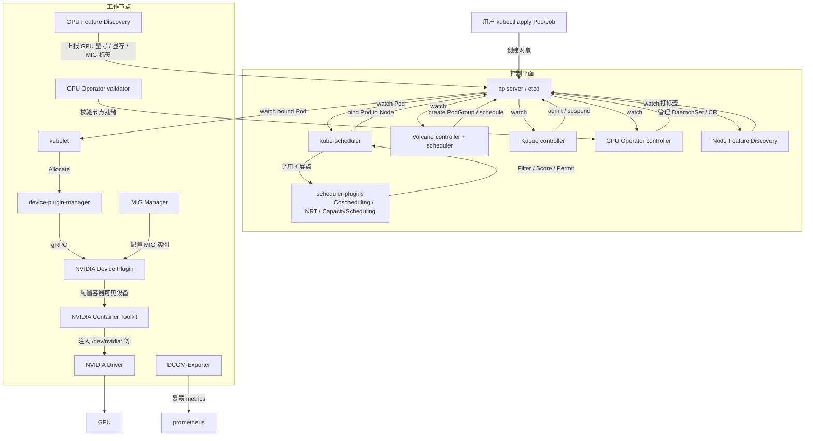

# 3. 架构设计

> 一句话理解：**GPU 调度的架构是“设备发现层 + 调度决策层 + 节点执行层 + 集群治理层”的四层协作**——NVIDIA Device Plugin 和 GPU Operator 解决“节点有什么卡、能不能用”，scheduler-plugins/Volcano/Kueue 解决“把 Pod 放到哪、按什么规则排队”，kubelet device-manager 解决“启动容器时把卡绑定进去”，DCGM-Exporter/GFD 解决“卡的健康与拓扑该让谁看见”。

## 3.1 全景架构



这张图覆盖了 GPU 调度的四层：

| 层级 | 职责 | 代表组件 |
|---|---|---|
| 设备发现层 | 发现 GPU 硬件、健康、拓扑、MIG 状态 | Device Plugin、GFD、NFD、DCGM-Exporter |
| 调度决策层 | 按 Gang/拓扑/公平规则选节点 | kube-scheduler、scheduler-plugins、Volcano、Kueue |
| 节点执行层 | 把 GPU 绑定到容器 | kubelet device-manager、Device Plugin、Container Toolkit |
| 集群治理层 | 自动化节点组件、监控、多租户 | GPU Operator、Prometheus、队列策略 |

## 3.2 kubelet device-manager 与 Device Plugin

kubelet 内部有一个 **device-plugin-manager**，负责与所有 Device Plugin 交互：

```text
kubelet
├── device-plugin-manager
│   ├── plugin注册表：resourceName → socket 路径
│   ├── 健康检查：监听 ListAndWatch 流
│   └── Allocate 调用：在容器创建前分配设备
├── TopologyManager
│   └── 节点级 NUMA/PCIe 对齐
└── pod-workers
    └── syncPod → 创建容器 → 调用 Allocate
```

### 注册流程

```text
NVIDIA Device Plugin Pod 启动
   │
   ▼
在 /var/lib/kubelet/device-plugins/nvidia-gpu.sock 监听
   │
   ▼
调用 kubelet Registration.Register
   { version="v1beta1", endpoint="nvidia-gpu.sock", resource_name="nvidia.com/gpu" }
   │
   ▼
kubelet 连接 socket 验证 ListAndWatch
   │
   ▼
更新 node.status.allocatable.nvidia.com/gpu
```

### 分配流程

```text
容器启动
   │
   ▼
kubelet 根据 Pod requests 找到 resourceName=nvidia.com/gpu
   │
   ▼
device-plugin-manager 选择 healthy 设备
   │
   ▼
调用 DevicePlugin.Allocate(devicesIDs=["GPU-xxx", "GPU-yyy"])
   │
   ▼
Device Plugin 返回 env / mounts / devices
   │
   ▼
CRI 根据返回构造 OCI runtime spec
   │
   ▼
容器启动后看到 NVIDIA_VISIBLE_DEVICES 与 /dev/nvidia*
```

## 3.3 Scheduler Framework 扩展点

Kubernetes 调度框架定义了 12 个扩展点。GPU 相关插件主要使用其中 5 个：

```text
调度周期
   │
   ├─ QueueSort        决定 Pod 在调度队列中的顺序
   ├─ PreFilter        预处理 Pod/Node 信息
   ├─ Filter           节点是否满足硬性约束
   │      └─ NodeResourceTopology 检查 NUMA/PCIe
   ├─ PostFilter       Filter 全失败后做抢占分析
   ├─ PreScore         准备评分数据
   ├─ Score            给节点打分
   │      └─ NodeResourceTopology 优先拓扑最优
   │
   ▼
绑定周期
   │
   ├─ Reserve          在假定调度后预留资源
   │      └─ Coscheduling 预留 PodGroup 资源
   ├─ Permit           允许/等待/拒绝绑定
   │      └─ Coscheduling 等待 PodGroup 全部到达
   ├─ WaitOnPermit     在 Permit 状态等待
   ├─ PreBind          绑定前准备
   ├─ Bind             执行绑定
   └─ PostBind         绑定后清理
```

### Filter：硬约束

- `NodeResourcesFit`：检查 `nvidia.com/gpu` 是否足够。
- `NodeResourceTopology`：检查 GPU 是否在同一 NUMA/NVSwitch。
- `PodTopologySpread`：控制 Pod 在拓扑域上的分布。

### Score：软偏好

- `NodeResourcesFit`（MostAllocated / LeastAllocated）：决定是把卡用满还是留余量。
- `NodeResourceTopology`：优先选择拓扑最紧凑的节点。

### Reserve / Permit：Gang 语义

`Coscheduling` 插件在 `Reserve` 阶段为 PodGroup 的每个 Pod 预留资源；在 `Permit` 阶段，只有当 PodGroup 的 `minMember` 全部到达并预留成功，才放行；否则进入等待状态，直到超时或条件满足。

## 3.4 GPU Operator 组件编排

NVIDIA GPU Operator 用 `ClusterPolicy` CR 声明节点上需要哪些 GPU 组件，然后自动管理一组 DaemonSet/Deployment：

```yaml
apiVersion: nvidia.com/v1
kind: ClusterPolicy
metadata:
  name: cluster-policy
spec:
  driver:
    enabled: true
  toolkit:
    enabled: true
  devicePlugin:
    enabled: true
    config:
      name: device-plugin-config
  dcgmExporter:
    enabled: true
  gfd:
    enabled: true
  migManager:
    enabled: true
  nodeStatusExporter:
    enabled: true
  validator:
    enabled: true
```

### 组件清单

| 组件 | 形态 | 作用 |
|---|---|---|
| NVIDIA Driver | DaemonSet | 为节点安装/管理内核驱动（可选，若宿主机已装则禁用） |
| NVIDIA Container Toolkit | DaemonSet | 让 container runtime 能识别 `NVIDIA_VISIBLE_DEVICES` 并注入 GPU |
| NVIDIA Device Plugin | DaemonSet | 向 kubelet 注册 `nvidia.com/gpu`，实现 ListAndWatch/Allocate |
| DCGM-Exporter | DaemonSet | 暴露 GPU 利用率、显存、温度、功耗、Xid 错误等指标 |
| GPU Feature Discovery | DaemonSet | 为节点打 GPU 相关标签（型号、显存、MIG、产品品牌） |
| MIG Manager | DaemonSet | 按 ConfigMap 自动配置 GPU MIG 实例 |
| Node Status Exporter | DaemonSet | 把节点 GPU 状态写回 CR 或 metrics |
| Validator | DaemonSet/Job | 校验各组件是否就绪，供 Operator 汇总状态 |

### 状态机

GPU Operator 控制器维护每个节点的状态：

```text
NotReady
   │
   ▼
Driver Installing → Driver Ready
   │
   ▼
Toolkit Installing → Toolkit Ready
   │
   ▼
Device Plugin Installing → Device Plugin Ready
   │
   ▼
MIG Configuring → MIG Ready
   │
   ▼
Monitoring Installing → Ready
```

节点只有到达 `Ready` 后，scheduler 才会把 GPU Pod 调度上去。这也是为什么新加入的 GPU 节点常常需要几分钟才能接受 Pod。

## 3.5 Volcano、Kueue、scheduler-plugins 的位置

| 方案 | 所处位置 | 调度器 | 核心对象 | 最适合场景 |
|---|---|---|---|---|
| **scheduler-plugins** | 默认调度器的插件 | kube-scheduler | PodGroup、ElasticQuota、NRT | 在现有 K8s 集群上补充 Gang/拓扑/弹性配额 |
| **Volcano** | 独立调度器 + CRD | volcano-scheduler | Job、PodGroup、Queue | 纯 AI/HPC 批处理集群，需要作业级语义 |
| **Kueue** | 独立 controller + 准入 | kube-scheduler | ClusterQueue、LocalQueue、Workload | 多租户 AI 平台，需要队列/公平共享/抢占 |

### 何时用 scheduler-plugins

- 你不想换调度器，只想给默认调度器加 Gang 或拓扑能力。
- 你的集群同时跑微服务和 GPU Job，希望共用一个 scheduler。

### 何时用 Volcano

- 你的集群主要跑训练/批处理作业。
- 需要 `Job` 级抽象、队列、抢占、作业依赖（DAG）、MPI/PyTorch/TF 集成。

### 何时用 Kueue

- 你需要多租户资源配额与公平共享。
- 你希望与原生 Job/Deployment/StatefulSet 集成，而不是引入新的 CRD 描述作业。
- 你想在控制平面做准入，而不是替换调度器。

实际生产中可以组合使用：例如 Kueue 做队列与配额，scheduler-plugins NodeResourceTopology 做拓扑，Device Plugin 做设备分配。

## 3.6 拓扑与可观测的数据流

### GPU Feature Discovery 标签

GFD 启动后会为节点打上类似标签：

```text
nvidia.com/gpu.product=A100-SXM4-80GB
nvidia.com/gpu.memory=81920
nvidia.com/gpu.count=8
nvidia.com/gpu.machine=DXG-H100
nvidia.com/mig.capable=true
feature.node.kubernetes.io/pci-10de.present=true
```

用户可以用 `nodeSelector` 或 `nodeAffinity` 把 Pod 绑定到特定 GPU 型号。

### NodeResourceTopology CR

topology-exporter（如 NFD 的 topology-updater 或专门 exporter）生成：

```yaml
apiVersion: topology.node.k8s.io/v1alpha2
kind: NodeResourceTopology
metadata:
  name: node-1
topologyPolicies: ["SingleNUMANodeContainerLevel"]
zones:
  - name: numa-0
    type: NUMA
    resources:
      nvidia.com/gpu: "4"
      nvidia.com/netdevice: "2"
  - name: numa-1
    type: NUMA
    resources:
      nvidia.com/gpu: "4"
      nvidia.com/netdevice: "2"
```

`NodeResourceTopology` 插件在 Filter 阶段会检查 Pod 请求的 GPU 是否能在某个 zone 内满足。

### DCGM-Exporter 指标

DCGM-Exporter 把 NVIDIA DCGM 的指标转成 Prometheus 格式，常见指标：

| 指标 | 含义 |
|---|---|
| `DCGM_FI_DEV_GPU_UTIL` | GPU 利用率 |
| `DCGM_FI_DEV_FB_USED` | 显存已用 |
| `DCGM_FI_DEV_FB_FREE` | 显存空闲 |
| `DCGM_FI_DEV_XID_ERRORS` | Xid 错误码 |
| `DCGM_FI_DEV_TEMP` | 温度 |
| `DCGM_FI_DEV_POWER_USAGE` | 功耗 |

这些指标不仅用于监控，也可以被自定义调度器或 autoscaler 消费。

## 3.7 本章小结

| 层级 | 关键问题 | 关键组件 |
|---|---|---|
| 设备发现层 | 节点有哪些 GPU、健康吗、能切分吗 | Device Plugin、GFD、NFD、MIG Manager |
| 调度决策层 | Pod 应该落在哪个节点、满足 Gang/拓扑/公平吗 | kube-scheduler、scheduler-plugins、Volcano、Kueue |
| 节点执行层 | 怎么把 GPU 注入容器 | kubelet device-manager、Container Toolkit、Device Plugin Allocate |
| 集群治理层 | 节点组件自动化、监控、多租户 | GPU Operator、DCGM-Exporter、队列策略 |

架构上，GPU 调度不是单一组件的胜利，而是**“发现 → 决策 → 执行 → 治理”全链路**的协同。下一章我们将把架构落地成完整的调度工作流程。
