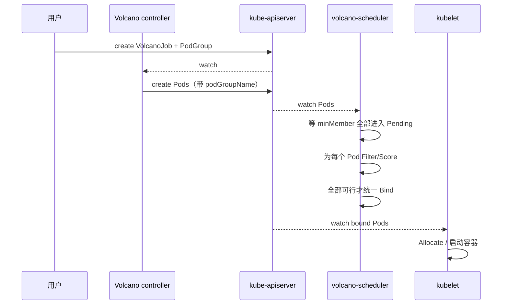
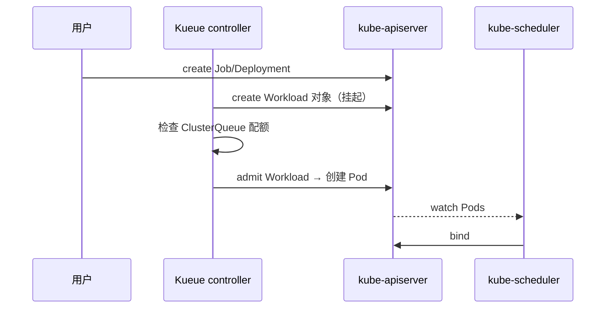

# 4. 调度工作流程

> 一句话理解：**一个 GPU Pod 从 `kubectl apply` 到容器里看见 `/dev/nvidia*`，要经过“控制平面调度决策”和“节点平面设备分配”两个半场**——调度器决定 Pod 落在哪个节点的哪几张卡上，kubelet + Device Plugin 决定怎么把卡塞进容器。

## 4.1 完整旅程概览

```mermaid
sequenceDiagram
    participant U as 用户
    participant API as kube-apiserver
    participant S as kube-scheduler
    participant PL as scheduler-plugins
    participant K as kubelet
    participant DP as NVIDIA Device Plugin
    participant CRI as container runtime
    participant GPU as 物理 GPU

    U->>API: apply Pod (requests.nvidia.com/gpu: 4)
    API-->>S: watch: 新增待调度 Pod
    S->>S: PreFilter / Filter<br/>NodeResourcesFit / NodeResourceTopology
    S->>PL: 调用 Coscheduling / NRT 插件
    PL-->>S: Filter / Score / Permit 结果
    S->>S: Score（拓扑 + binpack）
    S->>API: bind Pod → Node
    API-->>K: watch: bound Pod
    K->>K: syncPod：解析容器资源请求
    K->>DP: Allocate(deviceIDs)
    DP-->>K: envs / mounts / devices
    K->>CRI: CreateContainer(NVIDIA_VISIBLE_DEVICES=...)
    CRI->>GPU: 挂载 /dev/nvidia* / 设置 cgroup device
    GPU-->>CRI: 设备就绪
    CRI-->>K: 容器 Running
    K->>API: update Pod.status.phase = Running

    Note over S,PL: 控制平面：决定 Pod 落在哪
    Note over K,DP,CRI: 节点平面：把 GPU 绑定进容器
```

这个流程可以拆成两个阶段：

| 阶段 | 关键组件 | 核心问题 |
|---|---|---|
| **调度决策** | kube-scheduler、scheduler-plugins、Volcano、Kueue | Pod 能不能调度？能的话哪个节点/哪几张卡最优？ |
| **节点执行** | kubelet、Device Plugin、Container Toolkit、runtime | 怎么把选定的 GPU 注入容器并保证隔离？ |

## 4.2 控制平面：从 Pod 创建到 Bind

### Step 1：Pod 进入调度队列

用户提交一个请求 4 张 GPU 的 Pod：

```yaml
apiVersion: v1
kind: Pod
metadata:
  name: llm-train-worker-0
spec:
  containers:
    - name: train
      image: nvcr.io/nvidia/pytorch:24.05-py3
      resources:
        requests:
          nvidia.com/gpu: "4"
        limits:
          nvidia.com/gpu: "4"
```

apiserver 保存 Pod 后，scheduler 通过 watch 收到 ADDED 事件，把 Pod 加入内部调度队列。

### Step 2：Filter（硬性过滤）

scheduler 对每个 Node 运行 Filter 扩展点，GPU 相关插件主要做三件事：

| 插件 | 检查内容 |
|---|---|
| `NodeResourcesFit` | 节点 `allocatable.nvidia.com/gpu` 是否 ≥ Pod 请求 |
| `NodeResourceTopology` | 请求的 N 张卡是否能在同一 NUMA / NVSwitch 域内满足 |
| `PodTopologySpread` | 同组 Pod 在拓扑域上的分布是否满足 `maxSkew` |

如果 Filter 全部失败，Pod 进入 `PostFilter` 做抢占分析（抢占是高级语义，本主题不展开）。

### Step 3：Score（软性打分）

对 Filter 通过的节点，scheduler 运行 Score 扩展点。GPU 场景下常用的打分逻辑：

```text
score = 基础分
      + 拓扑亲和分（同 NUMA / PCIe / NVSwitch 加分）
      + binpack 分（倾向把节点用满，减少碎片）
      - 负载惩罚分（Trimaran 等 load-aware 插件）
```

| 策略 | 适用场景 |
|---|---|
| **拓扑优先** | 分布式训练，NCCL 性能敏感 |
| **binpack** | 推理/开发集群，希望减少节点碎片化 |
| **spread** | 高可用推理，希望副本分散在不同节点 |

### Step 4：Reserve / Permit（Gang 语义）

如果启用了 Coscheduling / Volcano，调度器不会立刻 Bind，而是先进入 Reserve/Permit：

```text
Reserve: 为 PodGroup 的每个 Pod 在假定节点上预留资源
   │
   ▼
Permit: 等待 PodGroup.minMember 全部到达
   │
   ├─ 全部到达 → 放行，进入 Bind
   └─ 超时/未到达 → 拒绝，释放预留
```

这一步是避免“部分 Pod 占用了卡、剩余 Pod 永远等不到卡”的死锁。

### Step 5：Bind

scheduler 调用 Bind 扩展点，把 `pod.spec.nodeName` 写入 apiserver。此时 Pod 状态仍是 Pending，但已经“名花有主”。

## 4.3 节点平面：从 kubelet 到容器

### Step 6：kubelet 发现 bound Pod

kubelet 通过 watch 看到 Pod 被绑定到本节点，启动 `syncPod`：

```text
syncPod
├── 解析 container.resources.requests
├── 发现 nvidia.com/gpu: 4
├── 检查 device-plugin-manager 中是否已注册该资源
└── 调用对应 DevicePlugin.Allocate(deviceIDs)
```

### Step 7：Device Plugin Allocate

NVIDIA Device Plugin 收到 Allocate 请求后：

1. 检查设备是否 healthy。
2. 确认设备未被重复分配。
3. 返回 `AllocateResponse`，包含：
   - `envs`: `NVIDIA_VISIBLE_DEVICES=GPU-xxx,GPU-yyy,...`
   - `mounts`: 驱动库挂载点（如 `/usr/lib/x86_64-linux-gnu/libcuda.so`）
   - `devices`: `/dev/nvidia*` 设备节点

### Step 8：CRI 创建容器

container runtime 根据 kubelet 传来的 OCI runtime spec 创建容器：

```json
{
  "process": { "env": ["NVIDIA_VISIBLE_DEVICES=GPU-0000,..."] },
  "linux": {
    "devices": [
      { "path": "/dev/nvidia0", "type": "c", "major": 195, "minor": 0 },
      ...
    ]
  }
}
```

容器启动后，`nvidia-smi` 只能看到 Allocate 返回的那些 GPU。

### Step 9：健康检查与状态上报

Device Plugin 持续 ListAndWatch 设备健康状态。如果某张卡出现 Xid 错误或掉卡，Device Plugin 会把它标记为 `Unhealthy`，kubelet 随后：

- 不再把该卡分配给新 Pod。
- 已运行的 Pod 通常不会主动驱逐（取决于集群策略），但新调度会避开该设备。

## 4.4 Pod 删除与资源回收

当用户删除 Pod 时，kubelet 执行逆序清理：

```text
1. CRI 停止并删除容器
2. kubelet 调用 DevicePlugin 释放设备
3. device-plugin-manager 把设备索引从 _allocated 中移除
4. kubelet 更新 Pod 状态为 Succeeded/Failed
5. scheduler 后续调度时再次看到这些 GPU 可用
```

在 Gang 调度场景下，如果 PodGroup 被删除或失败，Volcano/Kueue 会级联删除组内所有 Pod，触发上述回收流程。

## 4.5 不同调度器的流程差异

| 调度器 | 关键差异 |
|---|---|
| **原生 kube-scheduler** | 单个 Pod 逐个调度，无 Gang 语义 |
| **scheduler-plugins Coscheduling** | 通过 Reserve/Permit 实现 PodGroup all-or-nothing |
| **Volcano** | 在独立调度器里维护 Job/PodGroup/Queue，调度循环内原生支持 Gang |
| **Kueue** | 在控制平面先做 Workload 准入（admit），再放行 Pod 进入调度器 |

### Volcano 的 Gang 流程



### Kueue 的队列流程



## 4.6 状态机视角

一个 GPU Pod 在调度与执行阶段的状态转换：

```text
Pending
  │
  ▼
Scheduling（在 scheduler 队列中）
  │
  ├─ Filter 失败 ──▶ Unschedulable
  │
  ▼
Assumed（Reserve 成功，等待 Bind）
  │
  ▼
Bound（spec.nodeName 已写入）
  │
  ▼
ContainerCreating（kubelet 调用 Allocate）
  │
  ▼
Running
  │
  ▼
Succeeded / Failed / Deleted
```

## 4.7 与 Mini Demo 的对应

`gpu_scheduling_mini` 把上述流程压缩成几个可直接运行的函数：

| 真实步骤 | Mini Demo 函数 | 文件 |
|---|---|---|
| 用户提交 Pod | `api.create(make_pod(...))` | `demo.py` |
| scheduler Filter/Score | `scheduler.find_best_node()` | `scheduler.py` |
| Bind | `scheduler.assign()` | `scheduler.py` |
| kubelet Allocate | `kubelet.sync_pod()` | `kubelet.py` |
| Device Plugin 注册 | `plugin.register(kubelet)` | `device_plugin.py` |
| Gang all-or-nothing | `gang.schedule_group()` | `gang.py` |
| 拓扑感知 | `TopologyScorer.best_indices()` | `topology.py` |

## 4.8 本章小结

| 阶段 | 谁负责 | 关键输出 |
|---|---|---|
| 调度决策 | kube-scheduler + 插件 | `pod.spec.nodeName` |
| Gang 协调 | Volcano / Coscheduling | PodGroup 全部 Pod 同时 bind |
| 队列准入 | Kueue | Workload admit / suspend |
| 设备分配 | kubelet + Device Plugin | `NVIDIA_VISIBLE_DEVICES`、/dev/nvidia* |
| 容器创建 | container runtime | 带 GPU 设备的容器进程 |
| 回收 | kubelet + Device Plugin | 设备索引回到可用池 |

理解这个流程是排查 GPU Pod Pending、UnexpectedAdmissionError、NCCL 性能差等问题的前提。下一章我们把流程中的每个关键组件拆开，看它们内部是怎么工作的。
