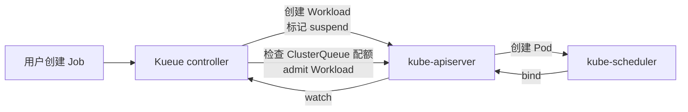

# 5. 核心模块

> 一句话理解：**GPU 调度不是“一个调度器”的事，而是 Device Plugin、GPU Operator、scheduler-plugins/Volcano/Kueue、拓扑发现、可观测五大模块的协奏曲**——每个模块解决一个特定子问题，拼在一起才构成生产级 GPU 集群。

## 5.1 NVIDIA Device Plugin

NVIDIA Device Plugin 是 K8s 与 GPU 之间的“翻译器”：它把物理 GPU 翻译成 `nvidia.com/gpu` 这种 K8s 能理解的扩展资源。

### gRPC 接口

Device Plugin 需要实现 K8s 定义的 `DevicePlugin` gRPC 服务：

| 方法 | 调用方 | 作用 |
|---|---|---|
| `GetDevicePluginOptions` | kubelet | 返回设备插件选项（如是否支持预启动） |
| `ListAndWatch` | kubelet | 流式返回所有设备及其健康状态 |
| `Allocate` | kubelet | Pod 绑定到节点后，为容器分配具体设备 |
| `PreStartContainer` | kubelet | 容器启动前做最后配置（如设置 CUDA 可见性） |
| `GetPreferredAllocation` | kubelet | 让插件参与设备选择决策（可选） |

### 注册流程

```text
Device Plugin Pod 启动
   │
   ▼
监听 /var/lib/kubelet/device-plugins/nvidia-gpu.sock
   │
   ▼
调用 kubelet Registration service
   { endpoint="nvidia-gpu.sock", resource_name="nvidia.com/gpu" }
   │
   ▼
kubelet 连接 socket，验证 ListAndWatch 返回的设备列表
   │
   ▼
更新 node.status.allocatable.nvidia.com/gpu
```

### 共享 GPU 配置

Device Plugin 通过 ConfigMap 开启 MPS 或 time-slicing：

```yaml
apiVersion: v1
kind: ConfigMap
metadata:
  name: device-plugin-config
data:
  config: |
    {
      "sharing": {
        "timeSlicing": {
          "renameByDefault": false,
          "failRequestsGreaterThanOne": false,
          "resources": [
            {"name": "nvidia.com/gpu", "replicas": 4}
          ]
        }
      }
    }
```

开启后，一张物理卡会被重命名为 `nvidia.com/gpu` 的 4 个“副本”，多个 Pod 可以请求这些副本并分时复用同一张卡。

## 5.2 NVIDIA GPU Operator

GPU Operator 把节点上所有 GPU 相关组件打包成 Operator，自动化安装、升级、验证。

### ClusterPolicy CR

```yaml
apiVersion: nvidia.com/v1
kind: ClusterPolicy
metadata:
  name: cluster-policy
spec:
  driver:
    enabled: true
  toolkit:
    enabled: true
  devicePlugin:
    enabled: true
    config:
      name: device-plugin-config
  dcgmExporter:
    enabled: true
  gfd:
    enabled: true
  migManager:
    enabled: true
  nodeStatusExporter:
    enabled: true
  validator:
    enabled: true
```

### 组件清单

| 组件 | 形态 | 关键职责 |
|---|---|---|
| NVIDIA Driver DaemonSet | DaemonSet | 编译/加载内核驱动 |
| NVIDIA Container Toolkit | DaemonSet | 让 runtime 识别 `NVIDIA_VISIBLE_DEVICES` |
| NVIDIA Device Plugin | DaemonSet | 上报 `nvidia.com/gpu`，处理 Allocate |
| DCGM-Exporter | DaemonSet | 暴露 GPU 利用率、显存、温度、Xid 等指标 |
| GPU Feature Discovery | DaemonSet | 给节点打 GPU 型号/显存/MIG 标签 |
| MIG Manager | DaemonSet | 按 ConfigMap 自动切分/重置 MIG profile |
| Node Status Exporter | DaemonSet | 把节点 GPU 状态写回 CR 或 metrics |
| Validator | DaemonSet/Job | 校验各组件就绪状态 |

### 节点就绪状态机

```text
NotReady
   │
   ▼
DriverInstalling → DriverReady
   │
   ▼
ToolkitInstalling → ToolkitReady
   │
   ▼
DevicePluginInstalling → DevicePluginReady
   │
   ▼
MIGConfiguring → MIGReady
   │
   ▼
DCGMInstalling → Ready
```

只有状态变为 `Ready` 后，scheduler 才会把 GPU Pod 调度到该节点。新 GPU 节点加入集群后通常需要几分钟完成这个流水线。

## 5.3 scheduler-plugins

scheduler-plugins 是一组运行在 kube-scheduler 内部的扩展插件，适合“不想换调度器，只想补能力”的集群。

### Coscheduling（Gang 调度）

核心对象：`PodGroup`。

```yaml
apiVersion: scheduling.x-k8s.io/v1alpha1
kind: PodGroup
metadata:
  name: train-pg
spec:
  scheduleTimeoutSeconds: 120
  minMember: 4
```

Pod 通过 `scheduling.x-k8s.io/pod-group` annotation 加入组：

```yaml
metadata:
  annotations:
    scheduling.x-k8s.io/pod-group: |
      {"name": "train-pg", "minMember": 4}
```

实现要点：

- `QueueSort`：按 PodGroup 创建时间排序。
- `PreFilter`：检查 PodGroup 是否已超时。
- `Reserve`：为 Pod 在假定节点上预留资源。
- `Permit`：等待组内所有成员都完成 Reserve；若到齐则放行，否则进入等待状态。

### NodeResourceTopology（拓扑感知）

读取 `NodeResourceTopology` CR：

```yaml
apiVersion: topology.node.k8s.io/v1alpha2
kind: NodeResourceTopology
metadata:
  name: node-1
zones:
  - name: numa-0
    type: NUMA
    resources:
      nvidia.com/gpu: "4"
  - name: numa-1
    type: NUMA
    resources:
      nvidia.com/gpu: "4"
```

- `Filter`：检查 Pod 请求的 GPU 是否能在某个 zone 内满足。
- `Score`：优先选择拓扑紧凑的节点。

### CapacityScheduling（弹性配额）

引入 `ElasticQuota` CR，允许队列在空闲时借用其他队列的配额。

## 5.4 Volcano

Volcano 是一个面向 AI/HPC 批处理场景的独立调度器，提供 Job 级抽象。

### 核心对象

| 对象 | 作用 |
|---|---|
| `Job` | 描述一组任务及其依赖（DAG） |
| `PodGroup` | 同一 Job 的 Pod 集合，声明 minMember |
| `Queue` | 多租户队列，带权重与容量 |
| `Scheduler` | volcano-scheduler，独立替换 kube-scheduler |

### 调度流程

```text
用户提交 VolcanoJob
   │
   ▼
vc-job controller 创建 PodGroup + Pods
   │
   ▼
volcano-scheduler 维护 Session
   │
   ▼
按 Queue 权重选择队列 → 按 Job/Pod 优先级选择 Pod
   │
   ▼
Predicate（过滤） → NodeOrder（打分） → Gang 检查
   │
   ▼
统一 Allocate / Bind
```

### 与原生 K8s 的对比

| 维度 | kube-scheduler + Coscheduling | Volcano |
|---|---|---|
| 调度器 | 原生 | 独立 |
| 作业抽象 | Pod + PodGroup | Job + PodGroup + Queue |
| Gang | 插件实现 | 原生 |
| 队列公平 | 弱 | 强 |
| MPI/TF/PyTorch | 需自己封装 | 内置集成 |
| 适用场景 | 混合负载 | 纯训练/批处理 |

## 5.5 Kueue

Kueue 是 Kubernetes SIG-scheduling 子项目，专注于“队列、配额、公平共享”。

### 核心对象

| 对象 | 作用 |
|---|---|
| `ClusterQueue` | 集群级资源池，声明总配额与权重 |
| `LocalQueue` | 命名空间级队列，指向某个 ClusterQueue |
| `Workload` | Kueue 对 Job/Deployment/StatefulSet 的抽象 |
| `ResourceFlavor` | 定义不同硬件 flavor（如 A100、H100、spot） |

### 工作流程



### 多租户配额示例

```yaml
apiVersion: kueue.x-k8s.io/v1beta1
kind: ClusterQueue
metadata:
  name: cq-train
spec:
  namespaceSelector: {}
  resourceGroups:
    - coveredResources: ["nvidia.com/gpu"]
      flavors:
        - name: a100
          resources:
            - name: "nvidia.com/gpu"
              nominalQuota: "32"
              borrowingLimit: "8"
---
apiVersion: kueue.x-k8s.io/v1beta1
kind: LocalQueue
metadata:
  name: team-a-train
  namespace: team-a
spec:
  clusterQueue: cq-train
```

## 5.6 拓扑发现与可观测模块

### GPU Feature Discovery（GFD）

GFD 读取 `nvidia-smi` 输出，为节点打上标签：

```text
nvidia.com/gpu.product=A100-SXM4-80GB
nvidia.com/gpu.memory=81920
nvidia.com/gpu.count=8
nvidia.com/mig.capable=true
nvidia.com/gpu.machine=DGX-A100
```

用户可以用 `nodeSelector` / `nodeAffinity` 把特定负载绑定到特定 GPU 型号。

### Node Feature Discovery（NFD）

NFD 给节点打通用硬件标签，GPU 相关标签如：

```text
feature.node.kubernetes.io/pci-10de.present=true
feature.node.kubernetes.io/cpu-cpuid.AVX512F=true
```

### DCGM-Exporter

把 DCGM 指标暴露为 Prometheus 格式：

| 指标 | 含义 |
|---|---|
| `DCGM_FI_DEV_GPU_UTIL` | GPU 利用率 |
| `DCGM_FI_DEV_FB_USED` | 显存已用 |
| `DCGM_FI_DEV_FB_FREE` | 显存空闲 |
| `DCGM_FI_DEV_XID_ERRORS` | Xid 错误码 |
| `DCGM_FI_DEV_TEMP` | GPU 温度 |
| `DCGM_FI_DEV_POWER_USAGE` | 功耗 |

这些指标不仅可以监控，也可以被自定义调度器或 autoscaler 消费。

## 5.7 多租户治理拼图

生产 GPU 集群通常把以下 K8s 原生对象与调度器组合使用：

| 对象 | 解决的问题 |
|---|---|
| `ResourceQuota` | 命名空间级 GPU 上限 |
| `LimitRange` | 默认/最大 GPU 请求 |
| `PriorityClass` | 训练/推理/调试优先级 |
| `PodGroup` | Gang all-or-nothing |
| `Queue` / `ClusterQueue` | 队列、公平共享、抢占 |
| `NetworkPolicy` | 多租户网络隔离 |
| `PodSecurity` | 容器安全基线 |

## 5.8 模块选型参考

| 需求 | 推荐组合 |
|---|---|
| 只想让 GPU 可被调度 | GPU Operator + Device Plugin |
| 需要 Gang 调度，不想换调度器 | GPU Operator + scheduler-plugins Coscheduling |
| 需要 Gang + 拓扑 + 弹性配额 | GPU Operator + scheduler-plugins Coscheduling + NRT + CapacityScheduling |
| 纯训练/批处理集群 | GPU Operator + Volcano |
| 多租户 AI 平台 | GPU Operator + Kueue + scheduler-plugins NRT |
| 需要显存感知调度 | 自定义调度器 / 第三方方案（如 Run:AI、焱融、阿里 GPU 共享调度器） |

## 5.9 本章小结

| 模块 | 核心职责 | 源码入口（下一章展开） |
|---|---|---|
| NVIDIA Device Plugin | 把 GPU 暴露为 `nvidia.com/gpu` | `NVIDIA/k8s-device-plugin` |
| NVIDIA GPU Operator | 自动化节点 GPU 组件生命周期 | `NVIDIA/gpu-operator` |
| scheduler-plugins | 在原生调度器内扩展 Gang/拓扑/弹性配额 | `kubernetes-sigs/scheduler-plugins` |
| Volcano | 独立批处理调度器 | `volcano-sh/volcano` |
| Kueue | 队列与公平共享准入 | `kubernetes-sigs/kueue` |
| GFD / NFD / DCGM | 拓扑发现、标签、可观测 | 对应 DaemonSet 与 exporter |

下一章我们进入源码，看这些模块的调用链是如何串起来的。
