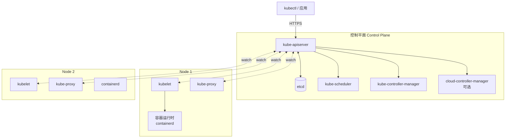
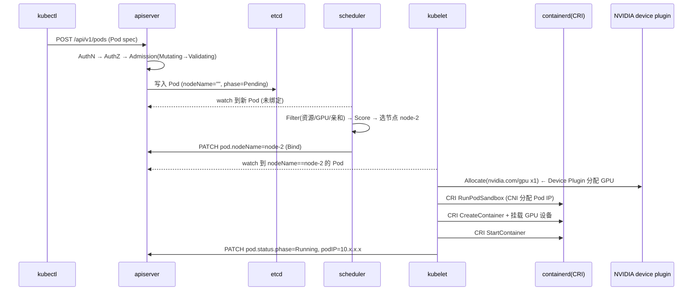
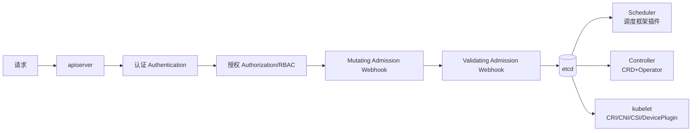

# 3. 架构设计

> 一句话理解：Kubernetes 是一组**解耦组件 + 一个共享真相源（etcd）**的架构——apiserver 是唯一入口，etcd 是唯一真相，scheduler / controller / kubelet 都是 apiserver 的客户端，彼此通过 watch 事件协作，互不直接调用。

## 3.1 总体架构：控制平面 + 节点

一个 K8s 集群由**控制平面（Control Plane）**和若干**工作节点（Worker Node）**组成：



> 官方 components 文档明确：控制平面包含 kube-apiserver、etcd、kube-scheduler、kube-controller-manager，以及**可选**的 cloud-controller-manager（仅云厂商集成时需要）。

## 3.2 控制平面组件

### kube-apiserver

- 集群的**唯一入口**：所有组件（kubectl、scheduler、controller、kubelet）都通过它读写状态。
- 无状态、可水平扩展（多副本 + 前置负载均衡）。
- 负责：**认证（Authentication）→ 授权（Authorization/RBAC）→ 准入（Admission: Mutating + Validating）→ schema 校验 → 写 etcd**。
- 暴露 RESTful HTTP API（`/api`、`/apis`）和 watch 长连接。

### etcd

- 集群的**唯一真相源（single source of truth）**：所有资源对象（Pod/Service/Deployment/Secret…）都存这里。
- 一个**强一致、高可用的键值存储**（基于 Raft 共识协议）。
- 通常 3 或 5 副本，多数派写成功才返回。
- 性能敏感：集群规模、对象数量、watch 带宽都受 etcd 制约。生产建议 SSD、独立磁盘、定期 defrag。

> **不要把 etcd 当通用数据库**。它专为 K8s 的"小对象、高频 watch、强一致"负载优化，单 key 不应超过 ~1.5MB，对象总数建议控制在数十万以内。

### kube-scheduler

- 决定**每个 Pod 落在哪个节点**。
- watch 还没绑定节点（`nodeName == ""`）的 Pod，跑调度框架流水线（Filter → Score → Reserve → Bind），把 `nodeName` 写回 apiserver。
- 详见 [第 5 章](05-core-modules)。

### kube-controller-manager

- 跑一堆内置控制器的二进制（Deployment/ReplicaSet/Node/Job/Endpoint…）。
- 每个控制器是独立的 reconcile loop，通过 informer watch 自己关心的资源。

### cloud-controller-manager（可选）

- 把"与云厂商交互"的逻辑（创建 LoadBalancer、路由表、Volume）从核心剥离，让 K8s 核心不依赖特定云。

## 3.3 节点组件

每个工作节点上跑：

### kubelet

- 节点的"代理"：与 apiserver 通信，**接收分配到本节点的 Pod，调用 CRI 真正启动容器**。
- 周期性上报节点状态（容量、已用、Condition）和 Pod 状态（`PodStatus`）。
- 执行探针（liveness/readiness/startup probe）、资源限制、卷挂载。
- 核心循环叫 **PLEG（Pod Lifecycle Event Generator）**：周期性列出本节点所有容器，对比缓存，产生 Pod 生命周期事件。

### kube-proxy

- 在每个节点维护**服务网络（Service VIP）到 Pod IP**的转发规则（iptables 或 IPVS）。
- 让任意节点/ Pod 访问 `ServiceIP:port` 时，流量被负载均衡到后端某个 Pod。
- watch Service 和 EndpointSlice，动态更新规则。

### 容器运行时（CRI）

- 真正"跑容器"的进程：containerd、CRI-O。
- kubelet 通过 **CRI（gRPC 接口）** 调用它：`RunPodSandbox`、`CreateContainer`、`StartContainer`、`StopContainer`。
- 自 v1.26 起 kubelet 硬性要求运行时实现 CRI。

### 其他常驻 Pod

- **CNI 插件 agent**（如 calico-node、cilium）：配置 Pod 网络与网络策略。
- **CSI 插件**：响应卷的 attach/mount。
- **Device Plugin**（如 NVIDIA Device Plugin）：上报 `nvidia.com/gpu` 资源。
- **kube-proxy / CoreDNS**：网络与 DNS。

## 3.4 一个 Pod 的完整生命周期

以"用户 `kubectl apply` 一个带 GPU 的 Pod"为例，完整链路：



阶段说明：

1. **提交**：kubectl 把 YAML 转 JSON POST 给 apiserver。
2. **准入链**：apiserver 依次跑认证、授权、**Mutating Admission**（可改对象，如注入 sidecar）、**Validating Admission**（校验合法性）、schema 校验，全部通过才写 etcd。此时 Pod `nodeName` 为空、`phase=Pending`。
3. **调度**：scheduler watch 到未绑定 Pod，跑调度框架选节点，把 `nodeName` 写回。
4. **执行**：目标节点的 kubelet watch 到分配给自己的 Pod：
   - 通过 **Device Plugin** 分配 GPU（设置 `NVIDIA_VISIBLE_DEVICES` 等环境变量与设备挂载）。
   - 调 **CRI** 创建 Pod sandbox（**CNI** 在此分配 Pod IP、配置虚拟网卡）。
   - 调 **CSI** 把声明的卷 attach + mount 到容器。
   - 创建并启动业务容器。
5. **上报**：kubelet 周期性把 Pod 状态（`Running`、PodIP、容器状态、探针结果）回写到 apiserver → etcd。

> 这条链路解释了"为什么 Pod 会卡在某个状态"：
> - 卡 `Pending` → scheduler 没找到合适节点（资源不够/GPU 不够/亲和不满足/污点不容忍）。`kubectl describe pod` 看 Events。
> - 卡 `ContainerCreating` → kubelet 在执行，但卡住了，最常见是 **CNI 没装/装错**、镜像拉不下来、CSI 卷 attach 失败。
> - `CrashLoopBackOff` → 容器启动后立即崩溃，kubelet 指数退避重启，通常是应用本身错误。

## 3.5 控制平面与数据面的解耦

K8s 的一个核心架构选择是：**控制平面组件之间不直接调用彼此**，而是都通过 apiserver + watch 协作。

| 协作 | 怎么做 | 好处 |
|---|---|---|
| scheduler → kubelet | scheduler 写 `nodeName`，kubelet watch 到后行动 | 解耦；任一方重启不影响另一方 |
| controller → kubelet | controller 创建 Pod，kubelet watch 到 | 同上 |
| apiserver ↔ etcd | apiserver 是 etcd 的唯一客户端 | etcd 不暴露，安全且简单 |
| kubelet → apiserver | kubelet 既是 server（/metrics、CRI）也是 client（上报） | 节点可不主动入站连接 |

这种"通过共享状态 + 事件协作"的架构，让组件可以独立部署、独立扩缩、独立升级——这正是微服务思想在"集群操作系统"内部的应用。

## 3.6 多副本与高可用

控制平面要做到高可用（HA）：

- **apiserver**：无状态，多副本 + 外部 LB（keepalived/云 LB）。
- **etcd**：Raft 多数派，3 或 5 节点；写需多数派确认。
- **scheduler / controller-manager**：多副本但**同一时刻只允许一个活跃**（通过 Leader Election，对 etcd 里的 lease 抢锁）。
- **kubelet / kube-proxy**：每节点一个，无 HA 需求（节点宕则其上 Pod 被重调度）。

```text
                ┌──────── 负载均衡 ────────┐
            apiserver-1   apiserver-2   apiserver-3
                  │             │             │
                  └────── 共享 ────── etcd 集群 (Raft) ──────┘
                              (3/5 节点)
        scheduler / controller-manager: leader-elect (同时仅 1 活跃)
```

## 3.7 控制平面 vs 数据面

K8s 自己也分**控制面**（apiserver/etcd/scheduler/controller-manager，决策"应该是什么"）和**数据面/执行面**（kubelet/kube-proxy/容器运行时，执行"让它变成现实"）。这与 SDN、Ray（控制节点 vs worker）的概念同构。

| | 控制平面 | 数据面（节点） |
|---|---|---|
| 决策 | Pod 该跑在哪、副本数该是多少 | 真正启动/停止容器、转发流量 |
| 组件 | apiserver/etcd/scheduler/CM | kubelet/kube-proxy/CRI |
| 数量 | 少（3~5） | 多（成百上千） |
| 故障影响 | 全局（影响调度/自愈） | 局部（仅该节点 Pod） |

## 3.8 扩展点全景

K8s 的可扩展性是分层的，几乎每个环节都能插入自定义逻辑：



- **API 层**：CRD（新增资源类型）、Aggregated API Server（接入自定义 API）。
- **准入层**：Admission Webhook（Mutating 改、Validating 校验）——这是注入 sidecar、强制镜像来源、强制资源声明、合规检查的切入点。
- **调度层**：调度框架插件（Filter/Score/PostFilter…）。
- **执行层**：CRI（运行时）、CNI（网络）、CSI（存储）、Device Plugin（硬件资源）。

> 这套分层扩展能力是 K8s 能成为"平台之平台"的根本。AI 平台的所有高级能力（GPU 调度、Gang 调度、训练 Operator、推理 Gateway）都落在这四层之一。

## 本章小结

Kubernetes 的架构可以浓缩为：**一个真相源（etcd）+ 一个入口（apiserver）+ 一组通过 watch 协作的解耦控制器（scheduler / controller-manager / kubelet）**。控制平面决定"应该是什么"，节点执行"让它成真"。一个 Pod 从 YAML 到 Running，要经过准入链、调度框架、kubelet 对 CRI/CNI/CSI/DevicePlugin 的协调调用。理解这条链路，就理解了 K8s 排障的起点（`describe pod` 看 Events、看卡在哪个阶段），也理解了 K8s 扩展性的四个层次（API / 准入 / 调度 / 执行）。

**参考来源**

- [Kubernetes Components（控制平面与节点组件）](https://kubernetes.io/docs/concepts/overview/components/)
- [kube-apiserver / etcd 架构](https://kubernetes.io/docs/concepts/overview/components/#control-plane-components)
- [Compute, Storage, and Networking Extensions](https://kubernetes.io/docs/concepts/extend-kubernetes/compute-storage-net/)
- [Pod 生命周期](https://kubernetes.io/docs/concepts/workloads/pods/pod-lifecycle/)
- [Dynamic Admission Control（Webhook）](https://kubernetes.io/docs/reference/access-authn-authz/extensible-admission-controllers/)
