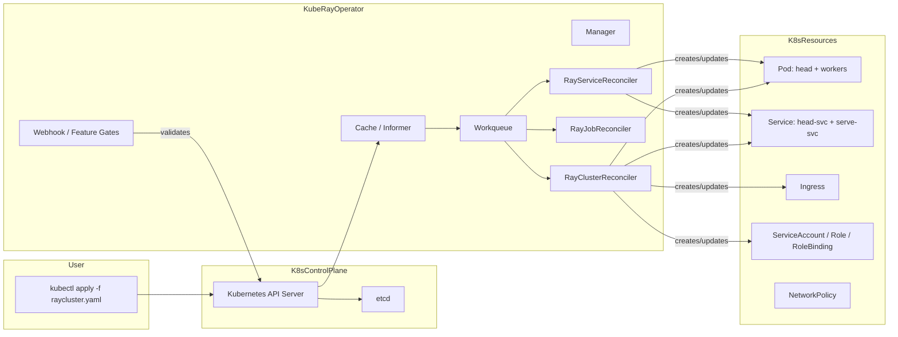
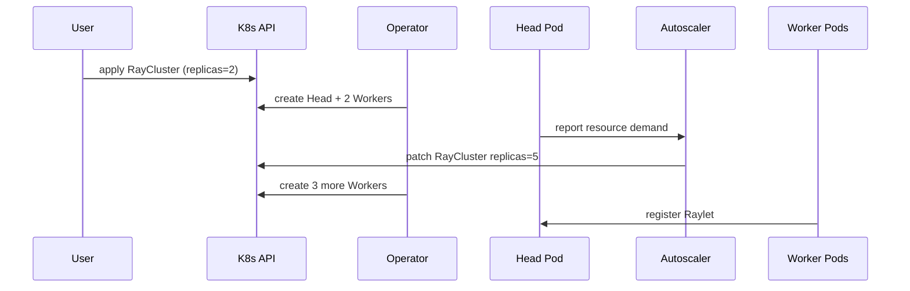

# 3. 架构设计：Operator、CRD 与 controller-runtime

> 一句话理解：KubeRay Operator 是一个标准的 controller-runtime 应用，通过监听 `RayCluster`/`RayJob`/`RayService` 等 CRD，把用户的声明式意图调和成 Head Pod、Worker Pod、Service、RBAC 和 Autoscaler sidecar。

## 3.1 整体分层架构

## 3.2 CRD 层

KubeRay 在 K8s 中注册以下 CRD（`ray.io/v1`）：

| CRD | 作用 |
|---|---|
| `RayCluster` | 长期运行的 Ray 集群 |
| `RayJob` | 一次性或周期性 Ray 作业 |
| `RayService` | 长期运行的 Ray Serve 服务 |
| `RayCronJob` | 周期性调度 RayJob（Alpha） |

CRD 定义位于：`ray-operator/apis/ray/v1/`。

## 3.3 Operator 内部组件

### Manager

基于 `controller-runtime` 的 `Manager`：

- 初始化 Scheme（注册 CRD types）。
- 创建 Cache 与 Informer，监听相关资源。
- 配置 Leader Election（`ray-operator-leader`）。
- 暴露 metrics 与 health probe。
- 注册 Reconciler。

### Cache / Informer

监听以下资源：

- `RayCluster`、`RayJob`、`RayService`、`RayCronJob`
- `Pod`、`Service`、`Ingress`、`Event`
- `ServiceAccount`、`Role`、`RoleBinding`
- `NetworkPolicy`（可选）

Cache selector 可配置为只监听特定 namespace，提升扩展性。

### Work Queue

level-based 调和：当资源发生变更时，对象的 namespace/name 被加入队列，Reconciler 从队列取出并重新调和整个状态。

### Reconcilers

| Reconciler | 负责资源 |
|---|---|
| `RayClusterReconciler` | RayCluster 生命周期、Pod、Service、Ingress、RBAC |
| `RayJobReconciler` | RayJob 状态机、集群创建/选择、提交器、清理 |
| `RayServiceReconciler` | RayService、active/pending 集群、Serve 部署、升级 |
| `RayCronJobReconciler` | 周期性创建 RayJob |
| `NetworkPolicyController` | 网络隔离（Alpha） |

## 3.4 辅助组件

### kuberay-apiserver（可选）

- 提供 REST/gRPC 接口，简化配置与查询。
- V1 已废弃，V2 Alpha 兼容 K8s OpenAPI。
- 不替代 Operator，只是代理层。

### kubectl ray 插件

- `kubectl ray get cluster`
- `kubectl ray get job`
- `kubectl ray get service`
- 方便命令行调试。

### KubeRay Dashboard（Experimental）

- v1.4+ 引入的 Web UI。
- 可视化 RayCluster、RayJob、RayService 状态。

### Ray History Server（Alpha）

- v1.6+ 引入。
- 聚合已销毁集群的历史事件，便于调试。

## 3.5 资源创建顺序

RayClusterReconciler 在一次 Reconcile 中按顺序创建/更新：

1. Autoscaler ServiceAccount
2. Autoscaler Role
3. Autoscaler RoleBinding
4. Ingress / OpenShift Route
5. Auth Secret（如启用 token 认证）
6. Head Service（`<name>-head-svc`）
7. Headless Service（多主机场景）
8. Serve Service
9. Head Pod
10. Worker Pods（按 group 顺序）
11. NetworkPolicy（可选）

创建完成后，计算 `ReadyWorkerReplicas`、`AvailableWorkerReplicas`、`DesiredWorkerReplicas` 等状态并更新 CR status。

## 3.6 与 K8s Scheduler 的关系

KubeRay 本身不做调度，它只创建 Pod。Pod 的调度由 K8s Scheduler 完成：

- CPU/内存通过 `resources` 声明。
- GPU 通过 `nvidia.com/gpu` 等扩展资源声明。
- 批调度器（Volcano/YuniKorn/scheduler-plugins/kai-scheduler）可通过 `batchscheduler` 集成实现 Gang Scheduling。

## 3.7 与 Autoscaler 的协作

## 3.8 Feature Gates

v1.6 中的部分特性门：

| Feature Gate | 默认 | 阶段 |
|---|---|---|
| `RayClusterStatusConditions` | true | Beta |
| `RayJobDeletionPolicy` | true | Beta |
| `RayMultiHostIndexing` | true | Beta |
| `RayServiceIncrementalUpgrade` | false | Alpha |
| `RayCronJob` | false | Alpha |
| `RayClusterNetworkIsolation` | false | Alpha |

## 本章小结

- KubeRay Operator 是标准 controller-runtime 应用，包含 Manager、Cache、Informer、Workqueue、Reconciler。
- 核心 CRD 为 RayCluster、RayJob、RayService。
- Reconciler 按固定顺序创建 Service、RBAC、Pod 等资源。
- Autoscaler sidecar 通过修改 CR 的 `replicas` 触发 Operator 扩缩容。
- 可选组件：APIServer、kubectl plugin、Dashboard、History Server。

**参考来源**

- [ray-operator/main.go](https://github.com/ray-project/kuberay/blob/master/ray-operator/main.go)
- [controllers/ray 目录](https://github.com/ray-project/kuberay/tree/master/ray-operator/controllers/ray)
- [APIServer README](https://github.com/ray-project/kuberay/blob/master/apiserver/README.md)
- [pkg/features/features.go](https://github.com/ray-project/kuberay/blob/master/ray-operator/pkg/features/features.go)
- [KubeRay Dashboard](https://docs.ray.io/en/latest/cluster/kubernetes/user-guides/kuberay-dashboard.html)
