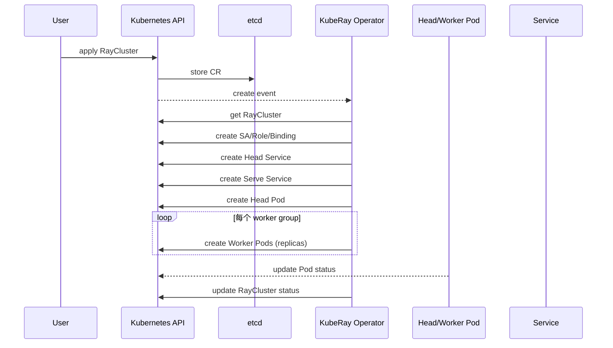
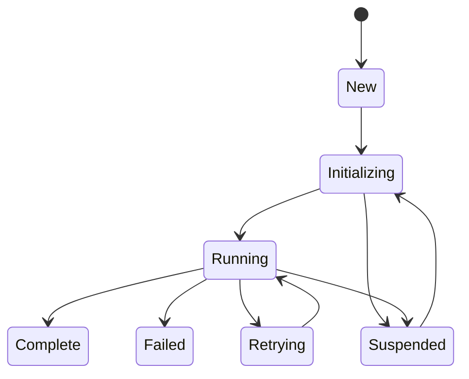
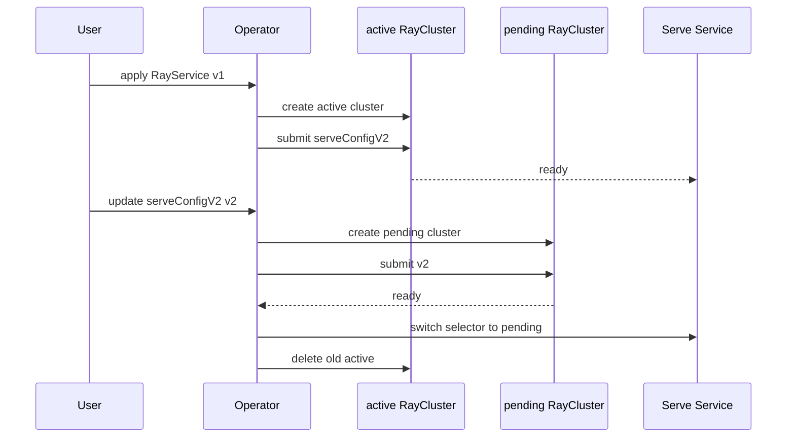

# 4. Runtime 工作流程：Cluster / Job / Service 生命周期

> 一句话理解：KubeRay 的运行时工作流可以概括为 **“用户写 YAML → API Server 存储 → Informer 通知 → Reconciler 调和 → 子资源创建 → 状态回写”**，三种 CRD 在此基础上各自扩展状态机。

## 4.1 RayCluster 生命周期

### 时序图



### 状态字段

```yaml
status:
  state: ready
  readyWorkerReplicas: 4
  availableWorkerReplicas: 4
  desiredWorkerReplicas: 4
  observedGeneration: 1
```

- `state`：`ready` / `failed` / `suspended` / `unknown`
- `readyWorkerReplicas`：已就绪 worker 数量。
- `availableWorkerReplicas`：可用 worker 数量。
- `desiredWorkerReplicas`：期望 worker 数量（含 autoscaler 调整）。

## 4.2 Worker 扩缩容流程

1. Ray 应用创建 actor/task，资源需求增加。
2. Autoscaler sidecar 检测到需求。
3. Autoscaler 调用 K8s API 修改对应 worker group 的 `replicas`。
4. Operator Watch 到 CR 变更，触发 Reconcile。
5. Reconciler 创建/删除 Pod，使实际副本数等于 `replicas`。
6. 新 Pod 启动后 Raylet 注册到 GCS，可用资源增加。
7. 空闲 worker 超过 `idleTimeoutSeconds` 后被删除。

### 缩容策略

```yaml
workerGroupSpecs:
  - groupName: cpu-workers
    replicas: 5
    scaleStrategy:
      workersToDelete:
        - example-cluster-worker-cpu-workers-abc12
```

`workersToDelete` 显式指定先删除哪些 Pod。

## 4.3 RayJob 生命周期

### 状态机



### 各阶段详解

#### 1. Initializing

- 若未指定 `clusterSelector`，按 `rayClusterSpec` 创建临时 RayCluster。
- 获取 Dashboard URL。
- 根据 `submissionMode` 创建提交器：
  - **K8sJobMode**：创建 K8s Job，在 Job 中通过 `ray job submit` 提交。
  - **HTTPMode**：Operator 直接通过 HTTP 向 Dashboard 提交。
  - **InteractiveMode**：不自动提交，等待用户手动提交。
  - **SidecarMode**：在 head Pod 中注入 submitter sidecar 提交。

#### 2. Running

- Operator 通过 Dashboard client 轮询 job 状态。
- 状态同步到 RayJob status。

#### 3. Complete / Failed

- 根据 `shutdownAfterJobFinishes` 决定是否删除 RayCluster。
- 根据 `ttlSecondsAfterFinished` 保留一定时间后清理。
- 根据 `deletionStrategy` 决定删除策略。

### 提交模式对比

| 模式 | 适用场景 | 特点 |
|---|---|---|
| K8sJobMode | 默认 | 隔离性好，提交器作为 K8s Job |
| HTTPMode | Operator 能直连 Dashboard | 无额外 Pod，依赖网络 |
| InteractiveMode | 调试 | 不自动提交 |
| SidecarMode | v1.5+ | submitter 与 head 同生命周期 |

## 4.4 RayService 生命周期

### active / pending 双集群



### 升级策略

| 策略 | 流程 | 停机 |
|---|---|---|
| NewCluster | 新建 pending，就绪后切 Service selector，删除旧 active | 无 |
| NewClusterWithIncrementalUpgrade | 基于 Gateway API / HTTPRoute 渐进式迁移流量 | 无，可回滚 |
| None | 原地更新 RayCluster spec | 有 |

### 高可用

- 启用 GCS FT：head 重启后从 Redis 恢复状态。
- `serveService` 指向健康的 serve proxy。
- `excludeHeadPodFromServeSvc: true` 让 serve 流量只走 worker，避免 head 成为瓶颈。

## 4.5 失败恢复

### Head Pod 失败

| 场景 | 行为 |
|---|---|
| 未启用 GCS FT | Head 重启后新集群，worker 无法重连，需删除重建 |
| 启用 GCS FT | 新 Head 从 Redis 恢复 GCS 状态，worker 自动重连 |

### Worker Pod 失败

- K8s 自动重启或删除重建。
- 若由 Autoscaler 触发缩容，则不再创建。

### Operator 自身失败

- 多副本部署时通过 Leader Election 切换。
- 新 Leader 从 Informer Cache 重新调和所有 CR。

## 4.6 资源依赖图

一个 RayService 实际会创建：

```text
RayService
├── RayCluster (active)
│   ├── Head Pod
│   ├── Worker Pods
│   ├── Head Service
│   ├── Serve Service
│   ├── Autoscaler SA/Role/Binding
│   └── Ingress / NetworkPolicy
└── RayCluster (pending, during upgrade)
```

## 本章小结

- RayCluster 生命周期：CR → Reconcile → 子资源创建 → status 更新。
- 扩缩容由 Autoscaler 修改 CR，Operator 创建/删除 Pod 实现。
- RayJob 有完整状态机，支持多种提交模式。
- RayService 通过 active/pending 双集群实现零停机升级。
- GCS FT 是生产高可用的关键。

**参考来源**

- [raycluster_controller.go](https://github.com/ray-project/kuberay/blob/master/ray-operator/controllers/ray/raycluster_controller.go)
- [rayjob_controller.go](https://github.com/ray-project/kuberay/blob/master/ray-operator/controllers/ray/rayjob_controller.go)
- [rayservice_controller.go](https://github.com/ray-project/kuberay/blob/master/ray-operator/controllers/ray/rayservice_controller.go)
- [Configuring Autoscaling](https://docs.ray.io/en/latest/cluster/kubernetes/user-guides/configuring-autoscaling.html)
- [RayService HA Guide](https://docs.ray.io/en/latest/cluster/kubernetes/user-guides/rayservice-high-availability.html)
- [RayService Incremental Upgrade](https://docs.ray.io/en/latest/cluster/kubernetes/user-guides/rayservice-incremental-upgrade.html)
