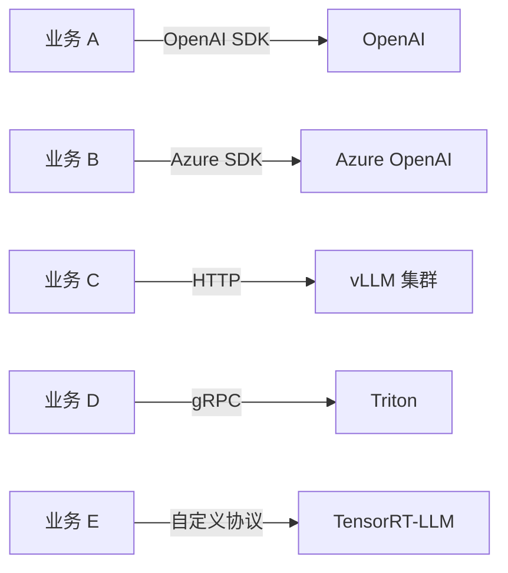
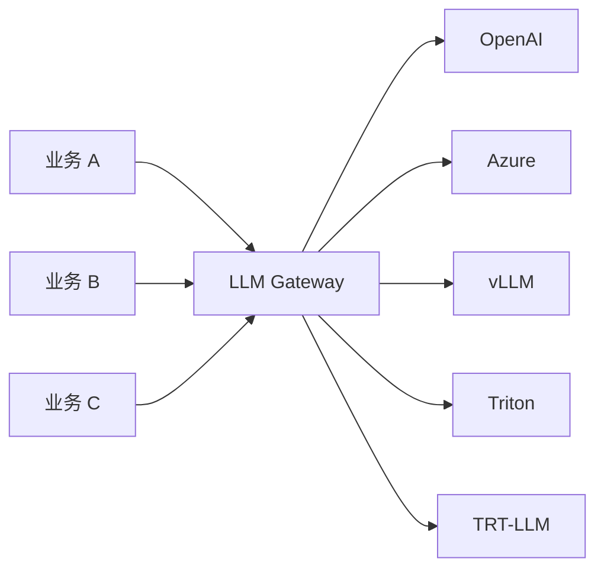

# 1. 背景

## 为什么需要 LLM Gateway？

在 [vLLM](/04-llmops/vllm/)、[SGLang](/04-llmops/sglang/)、[TensorRT-LLM](/04-llmops/tensorrt-llm/)、[Triton Inference Server](/04-llmops/triton/) 解决完“单个模型如何跑得快”之后，生产环境真正要面对的是：

> **企业里同时存在多家供应商、多个自研引擎、多种协议，业务方却只想用一个统一入口调用模型。**

典型场景包括：

1. **多云/多供应商**：OpenAI GPT-4o、Azure OpenAI、Anthropic Claude、Google Gemini、AWS Bedrock、阿里云百炼、百度千帆等混用。
2. **多自研引擎**：vLLM 跑开源模型、TensorRT-LLM 跑 NVIDIA 优化模型、Triton 跑多框架模型、SGLang 跑结构化生成。
3. **多业务方/多租户**：不同团队、不同应用共享同一套模型资源，需要按租户隔离配额与成本。
4. **横切能力重复建设**：认证、限流、重试、降级、日志、成本追踪每家业务都自己写一遍。

如果没有网关，架构会变成这样：



每个业务都要处理：不同 SDK、不同鉴权、不同重试策略、不同错误码、不同成本核算口径。运维也痛苦：无法统一限流，无法快速切换供应商，无法统一监控。

引入 LLM Gateway 后，架构收敛为：



## LLM Gateway 从 API 代理演进到 AI 控制面

早期的 API 代理只解决两个问题：

- 把请求转发到后端。
- 加一层鉴权或缓存。

但在 LLM 场景下，仅做转发远远不够，因为：

- **模型选择是动态的**：同一个 `gpt-4o` 可能对应 OpenAI、Azure、自研 vLLM 三个上游，需要根据成本、延迟、可用性实时选择。
- **失败模式复杂**：LLM 调用可能因内容审查、速率限制、模型过载、长上下文导致超时，需要重试、降级、熔断。
- **成本敏感**：输入/输出 token 价格差异大，需要按用户/应用追踪用量与费用。
- **安全与合规**：需要过滤 PII、敏感词、越狱提示，需要审计日志。

因此，现代 LLM Gateway 已经从“代理”演进到“AI 控制面”：

```text
API Proxy -> API Gateway -> AI Gateway -> LLM Control Plane
```

它不仅要转发，还要做**智能决策**。

## 没有 LLM Gateway 会怎样？

| 问题 | 没有 Gateway 的表现 | 有 Gateway 的解法 |
|---|---|---|
| 供应商切换 | 业务代码里硬编码 OpenAI SDK，切换要改代码 | Gateway 层改 model alias 映射，业务无感知 |
| 限流 | 单点限流靠业务自己，容易击穿 | 按 api_key / model / tenant 统一 Token Bucket |
| 失败降级 | 主供应商 429 时业务直接报错 | Gateway 自动重试并切换到备用 provider |
| 成本控制 | 月底看账单才发现某应用烧钱 | 实时记录 token 用量，按应用/用户/模型聚合 |
| 可观测 | 各 SDK 日志格式不同，难以统一 | Gateway 统一输出请求数、延迟、状态码、token 数 |
| 安全合规 | 每个业务自己实现内容过滤 | Gateway 统一做 PII/敏感词/越狱检测 |

## LLM Gateway 与相关方案的对比

| 方案 | 定位 | 优点 | 缺点 |
|---|---|---|---|
| **裸 SDK 直连** | 业务直接调用 OpenAI/Azure SDK | 简单、延迟最低 | 无统一治理、重复建设 |
| **传统 API Gateway（Kong/NGINX）** | 通用七层网关 | 成熟、插件丰富 | 对 LLM 语义（model、token、retry、fallback）理解不足 |
| **Service Mesh（Istio/Linkerd）** | 服务间流量治理 | 透明、可观测强 | 通常作用于微服务间，对 LLM 语义路由需额外扩展 |
| **Triton Inference Server** | 多框架推理服务入口 | 强 GPU 调度、backend 抽象 | 主要面向自托管模型，多云供应商接入需额外封装 |
| **KServe** | Kubernetes 上的模型服务框架 | 自动扩缩、蓝绿发布 | 以 Kubernetes 为中心，对供应商 API 的抽象较弱 |
| **LiteLLM Proxy** | 专门面向 LLM 的统一网关 | 100+ provider 抽象、OpenAI-compatible、成本低 | 开源版高可用/多集群需要自行设计 |
| **Envoy AI Gateway** | 基于 Envoy 的 AI 网关 | 与 Kubernetes Gateway API 集成、可扩展 | 部署相对复杂，需要 Envoy 经验 |
| **Cloudflare AI Gateway** | 边缘 AI 网关 | 零部署、缓存、分析 | 供应商锁定、自定义能力有限 |

> 一句话：如果你需要把“多家供应商 + 多个自研引擎 + 多个业务方”统一管起来，LLM Gateway 是最合适的抽象层。

## 本章小结

LLM Gateway 的产生不是技术炫技，而是生产环境多供应商、多引擎、多租户治理的必然结果。它把认证、路由、限流、重试、降级、成本、可观测这些横切问题从业务代码中抽离，形成一个可演进、可审计、可治理的 AI 控制面。

**参考来源**

- [OpenAI API Reference](https://platform.openai.com/docs/api-reference)
- [LiteLLM Documentation](https://docs.litellm.ai)
- [Envoy AI Gateway](https://aigateway.envoyproxy.io)
- [Kong AI Gateway](https://docs.konghq.com/gateway/latest/ai-gateway/)
- [NGINX AI Gateway](https://www.nginx.com/solutions/ai-gateway/)
