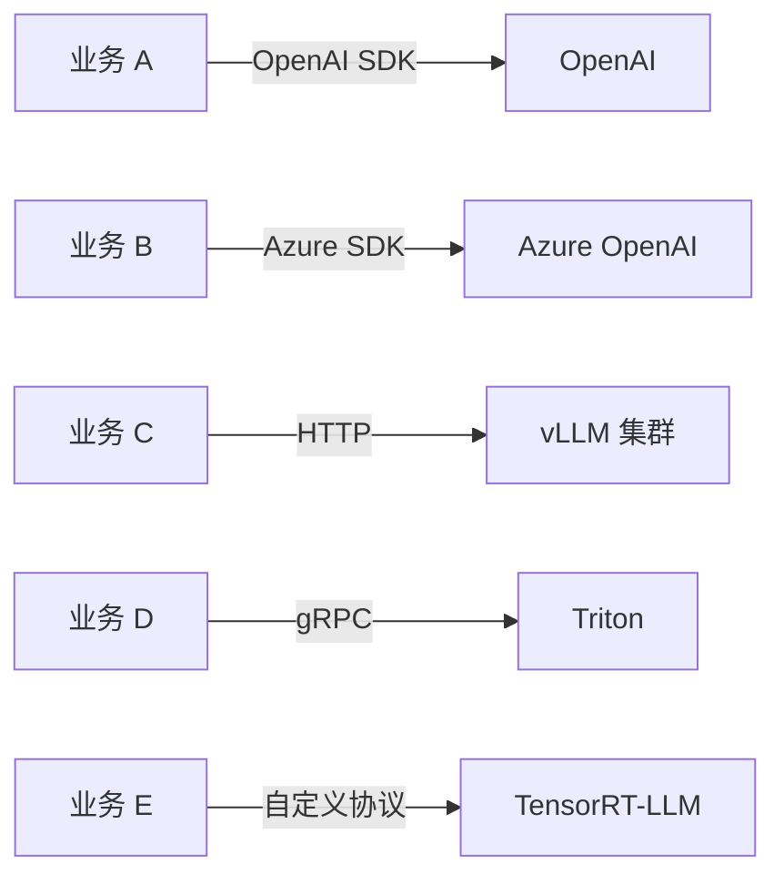
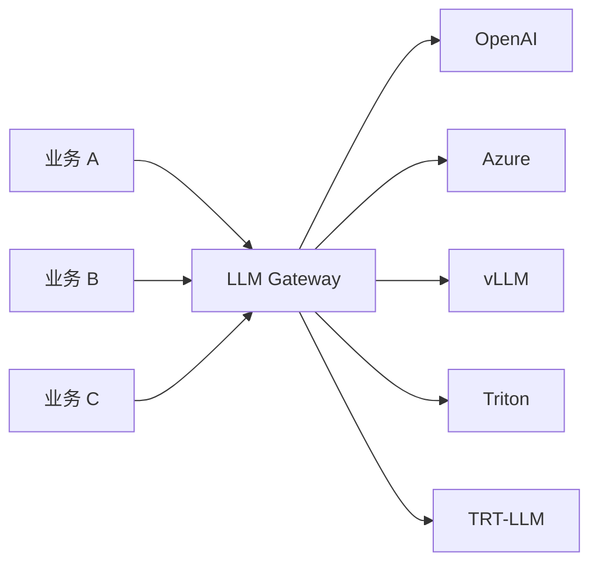
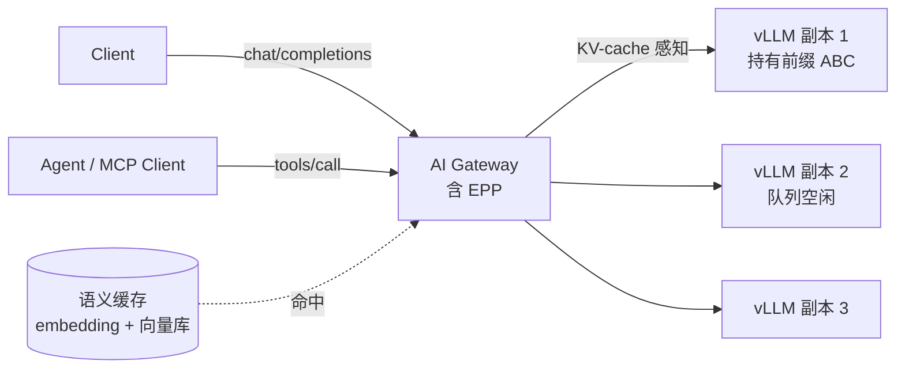

# 1. 背景

## 为什么需要 LLM Gateway？

在 [vLLM](/04-llmops/vllm/)、[SGLang](/04-llmops/sglang/)、[TensorRT-LLM](/04-llmops/tensorrt-llm/)、[Triton Inference Server](/04-llmops/triton/) 解决完“单个模型如何跑得快”之后，生产环境真正要面对的是：

> **企业里同时存在多家供应商、多个自研引擎、多种协议，业务方却只想用一个统一入口调用模型。**

典型场景包括：

1. **多云/多供应商**：OpenAI GPT-4o、Azure OpenAI、Anthropic Claude、Google Gemini、AWS Bedrock、阿里云百炼、百度千帆等混用。
2. **多自研引擎**：vLLM 跑开源模型、TensorRT-LLM 跑 NVIDIA 优化模型、Triton 跑多框架模型、SGLang 跑结构化生成。
3. **多业务方/多租户**：不同团队、不同应用共享同一套模型资源，需要按租户隔离配额与成本。
4. **横切能力重复建设**：认证、限流、重试、降级、日志、成本追踪每家业务都自己写一遍。

如果没有网关，架构会变成这样：


```mermaid
flowchart LR
    A[业务 A] -->|OpenAI SDK| OAI[OpenAI]
    B[业务 B] -->|Azure SDK| AZ[Azure OpenAI]
    C[业务 C] -->|HTTP| vLLM[vLLM 集群]
    D[业务 D] -->|gRPC| Triton[Triton]
    E[业务 E] -->|自定义协议| TRT[TensorRT-LLM]
```

每个业务都要处理：不同 SDK、不同鉴权、不同重试策略、不同错误码、不同成本核算口径。运维也痛苦：无法统一限流，无法快速切换供应商，无法统一监控。

引入 LLM Gateway 后，架构收敛为：


```mermaid
flowchart LR
    A[业务 A] --> GW
    B[业务 B] --> GW
    C[业务 C] --> GW[LLM Gateway]
    GW --> OAI[OpenAI]
    GW --> AZ[Azure]
    GW --> vLLM[vLLM]
    GW --> Triton[Triton]
    GW --> TRT[TRT-LLM]
```

## LLM Gateway 从 API 代理演进到 AI 控制面

早期的 API 代理只解决两个问题：

- 把请求转发到后端。
- 加一层鉴权或缓存。

但在 LLM 场景下，仅做转发远远不够，因为：

- **模型选择是动态的**：同一个 `gpt-4o` 可能对应 OpenAI、Azure、自研 vLLM 三个上游，需要根据成本、延迟、可用性实时选择。
- **失败模式复杂**：LLM 调用可能因内容审查、速率限制、模型过载、长上下文导致超时，需要重试、降级、熔断。
- **成本敏感**：输入/输出 token 价格差异大，需要按用户/应用追踪用量与费用。
- **安全与合规**：需要过滤 PII、敏感词、越狱提示，需要审计日志。

因此，现代 LLM Gateway 已经从“代理”演进到“AI 控制面”：

```text
API Proxy -> API Gateway -> AI Gateway -> LLM Control Plane
```

它不仅要转发，还要做**智能决策**。

## 没有 LLM Gateway 会怎样？

| 问题 | 没有 Gateway 的表现 | 有 Gateway 的解法 |
|---|---|---|
| 供应商切换 | 业务代码里硬编码 OpenAI SDK，切换要改代码 | Gateway 层改 model alias 映射，业务无感知 |
| 限流 | 单点限流靠业务自己，容易击穿 | 按 api_key / model / tenant 统一 Token Bucket |
| 失败降级 | 主供应商 429 时业务直接报错 | Gateway 自动重试并切换到备用 provider |
| 成本控制 | 月底看账单才发现某应用烧钱 | 实时记录 token 用量，按应用/用户/模型聚合 |
| 可观测 | 各 SDK 日志格式不同，难以统一 | Gateway 统一输出请求数、延迟、状态码、token 数 |
| 安全合规 | 每个业务自己实现内容过滤 | Gateway 统一做 PII/敏感词/越狱检测 |

## LLM Gateway 与相关方案的对比

| 方案 | 定位 | 优点 | 缺点 |
|---|---|---|---|
| **裸 SDK 直连** | 业务直接调用 OpenAI/Azure SDK | 简单、延迟最低 | 无统一治理、重复建设 |
| **传统 API Gateway（Kong/NGINX）** | 通用七层网关 | 成熟、插件丰富 | 对 LLM 语义（model、token、retry、fallback）理解不足 |
| **Service Mesh（Istio/Linkerd）** | 服务间流量治理 | 透明、可观测强 | 通常作用于微服务间，对 LLM 语义路由需额外扩展 |
| **Triton Inference Server** | 多框架推理服务入口 | 强 GPU 调度、backend 抽象 | 主要面向自托管模型，多云供应商接入需额外封装 |
| **KServe** | Kubernetes 上的模型服务框架 | 自动扩缩、蓝绿发布 | 以 Kubernetes 为中心，对供应商 API 的抽象较弱 |
| **LiteLLM Proxy** | 专门面向 LLM 的统一网关 | 100+ provider 抽象、OpenAI-compatible、内置 MCP Gateway 与 Guardrails；2026 年 10 月 v1.105 起提供 Auto Router（Fuse/Capability 自动路由）、Decisions API 与 `litellm.agent()` | 开源版高可用/多集群需要自行设计；迭代极快，需及时跟进安全补丁 |
| **Agent Router**（原 Envoy AI Gateway） | 基于 Envoy 的 AI 网关 | 2026 年 6 月 v1.0 GA（6 个 CRD 稳定），10 月 v1.2 起更名 Agent Router 并强化 MCP 安全（策略合并、调用方凭证透传）；与 Kubernetes Gateway API 深度集成、BackendSecurityPolicy 统一管密钥 | 语义缓存等高级能力需外部 ext_proc 扩展；部署相对复杂 |
| **Higress** | 云原生 AI 网关（CNCF Sandbox） | 基于 Envoy + Wasm 插件，率先支持 MCP 网关（REST API 零代码转 MCP Server、MCP Marketplace），2026 年 10 月 v2.2.5 实现 2026-07-28 MCP 协议标准；Gateway API 推理扩展（AdaptiveScore 负载均衡） | 社区生态以中文为主 |
| **Apache APISIX** | 通用 API 网关的 AI 插件集 | ai-proxy / ai-proxy-multi / ai-prompt-guard / ai-cache（支持语义缓存）全开源，etcd 驱动的热更新 | 通用网关基因，LLM 语义能力以插件形式提供 |
| **Kong AI Gateway** | 企业级 AI 网关 | 2025 年发布 ai-semantic-cache（语义缓存）；2026 年拆分为独立 AI Gateway 2.x，9 月 2.2 GA：MCP Server Bundling（多 MCP Server 聚合单路由）、MCP ACL（未授权工具在发现阶段即隐藏）、身份感知 AI 策略与分模态成本管理 | 语义缓存、Guardrails、MCP 代理等高级插件多为 Enterprise 档位 |
| **AWS Bedrock AgentCore Gateway** | 全托管 Agentic 网关 | 2025 年 10 月随 AgentCore GA：自动把 REST API / Lambda / OpenAPI / Smithy 转为 MCP 工具，Cedar 默认拒绝策略，网关侧 Guardrails（2026 年 6 月 GA）与双向入出站认证；免运维 | 绑定 AWS 生态；按调用量计费（约 $0.005/千次），大规模成本需测算 |
| **Portkey** | 开源 AI Gateway（MIT）+ 商业平台 | TypeScript 实现、轻量易嵌入，内置简单/语义双模缓存与 50+ Guardrails | 深度治理能力依赖商业平台；2026 年被 Palo Alto Networks 收购 |
| **OpenRouter** | 托管多模型聚合 API | 一个 OpenAI-compatible 端点接入 400+ 模型、按 provider 透传计价，代表“模型市场型网关” | 公有云托管，无私有部署；加价随规模累积，无内置语义缓存 |
| **Cloudflare AI Gateway** | 边缘 AI 网关 | 零部署、缓存、分析 | 供应商锁定、自定义能力有限 |

> 选型速记：快速落地选 LiteLLM；已有 Envoy/Kubernetes Gateway API 体系选 Agent Router（原 Envoy AI Gateway）；国内 MCP 场景选 Higress；已有 Kong 基础设施选 Kong；深度 AWS 生态选 Bedrock AgentCore Gateway；轻量嵌入应用选 Portkey；不想运维选 Cloudflare / OpenRouter。

> 一句话：如果你需要把“多家供应商 + 多个自研引擎 + 多个业务方”统一管起来，LLM Gateway 是最合适的抽象层。

## 2025-2026：从 LLM Gateway 演进到 MCP / Agent Gateway

2025 年下半年以来，网关的治理对象从“chat completions 请求”扩展到了“Agent 的工具调用”，行业出现了三条清晰的新脉络：

### 1. 语义缓存（Semantic Caching）成为标配能力

精确缓存（prompt 哈希完全一致才命中）之外，主流网关陆续内置**语义缓存**：把 prompt 用 embedding 模型向量化，存入向量库，新请求按余弦相似度命中相似 prompt 的缓存结果。典型落地：

- **Kong Gateway 3.8**（2025 年）发布 `ai-semantic-cache` 插件，embedding + 向量存储 + 相似度阈值，命中时官方称延迟可降低 3~10 倍。
- **Apache APISIX** 的 `ai-cache` 插件支持精确、语义、流式三种缓存模式，全部开源。
- **Portkey** 提供 simple（精确）+ semantic（语义）双模级联缓存，RAG 场景命中率可达 18~60%。
- **LiteLLM** 内置 Redis 精确缓存，并在 2026 年版本中加入语义级缓存与语义 MCP 工具检索（v1.101 起，按 embedding 相似度在上百个工具中检索，缩小 Agent 提示体积）。

> 注意：Agent Router（原 Envoy AI Gateway）截至 v1.2 仍未内置语义缓存，需要通过 `ext_proc` 外接处理器 + 向量库实现。

### 2. MCP Gateway：治理对象从“模型”变成“工具”

MCP（Model Context Protocol）成为 Agent 访问工具的事实标准后，网关需要理解 MCP 的 `tools/list`、`tools/call` 语义，在工具粒度上做鉴权、限流、审计：

- **LiteLLM**：内置 MCP Gateway，支持把多个上游 MCP Server 聚合为一个端点，提供按 deny-by-default 的工具白名单、按虚拟 key 的工具级访问控制、MCP spec 版本固定等治理能力；2026 年 10 月 v1.104 起强制 master key 校验、stdio MCP 默认关闭，MCP 端点安全显著收紧。
- **Higress**：国内率先提供 MCP 网关能力，支持存量 REST API “零代码”转化为 MCP Server、MCP Marketplace，并在 2026 年 7 月 MCP 新协议修订（无状态 HTTP Tools 基线）发布不到三周内首个支持，可把 MCP 方法与工具名放入 HTTP Header 做路由、鉴权、限流与计量；v2.2.4（2026 年 8 月）实现 2026-07-28 MCP 协议标准，v2.2.5（2026 年 10 月）持续增强。
- **Agent Router**（原 Envoy AI Gateway）v1.0（2026 年 6 月 GA）把 `MCPRoute` / `MCPRouteSecurityPolicy` 做成稳定 CRD，支持基于 CEL 表达式的工具级细粒度鉴权（按 JWT claims 过滤工具）；v1.2（2026 年 10 月）进一步强化 MCP 安全：`MCPRoute` 支持策略合并（policy merging）、调用方凭证透传（caller-supplied credentials）与裸工具名（bare tool names）。
- **Kong AI Gateway 2.2**（2026 年 9 月 30 日 GA）加入 MCP 工具治理：MCP Server Bundling 把多个上游 MCP Server 聚合到单一路由，MCP ACL 插件让未授权工具在 `tools/list` 发现阶段即被隐藏（而不只是执行阶段拦截），并引入基于 Kong Identity 的身份感知 AI 策略与文本/音频/图像/视频分模态成本管理。
- **AWS Bedrock AgentCore Gateway**（2025 年 10 月随 AgentCore GA）代表云厂商托管路线：自动把 REST API / Lambda / OpenAPI / Smithy 转换为 MCP 工具，用 Cedar 策略做默认拒绝（default-deny）的工具级访问控制，并在网关边界集成 Bedrock Guardrails（2026 年 6 月 GA）与时间维度策略、限流（2026 年 8 月），同时提供入站与出站双向认证。

### 3. 与推理引擎深度集成：KV-Cache 感知路由

自托管 vLLM/SGLang 集群的网关不再满足于 round-robin。通过 Kubernetes **Gateway API Inference Extension**（GIE），网关侧的 Endpoint Picker（EPP）读取各副本的 KV cache 前缀命中情况与队列深度，把请求路由到“缓存命中最多 + 最空闲”的副本：

- GKE Inference Gateway（2025 年 Cloud Next 发布）与 **llm-d**（Red Hat 主导，Apache 2.0）是代表实现，llm-d 报告 KV 命中率约 87%、热命中 TTFT 降低约 88%。
- **NVIDIA Dynamo** 提供兼容 GIE 的 EPP，支持 prefill/decode 分离调度；阿里云“推理扩展网关”提供估计模式与精确模式两档前缀缓存感知路由。


```mermaid
flowchart LR
    Client -->|chat/completions| GW[AI Gateway<br/>含 EPP]
    GW -->|"KV-cache 感知"| V1[vLLM 副本 1<br/>持有前缀 ABC]
    GW --> V2[vLLM 副本 2<br/>队列空闲]
    GW --> V3[vLLM 副本 3]
    MCP[Agent / MCP Client] -->|"tools/call"| GW
    Cache[(语义缓存<br/>embedding + 向量库)] -.命中.-> GW
```

此外，eBPF 开始在网关数据面底层承担 L3/L4 快速路径与可观测（Cilium + per-node Envoy 的无 sidecar 模式在 2026 年成为主流），但 LLM 语义决策（路由、限流、工具鉴权）仍运行在用户态——“eBPF 做转发、用户态做决策”是当前务实形态。

### 4. 模型降价与缓存计费精细化：成本治理成为网关主战场

2026 年模型 API 价格持续下探，且计费维度明显变细，网关成本层的职责从“月底算账”升级为“实时分档计量 + 路由策略优化”：

- **缓存读取折扣常态化**：主流厂商对 cached input 的折扣普遍达到约 90%（DeepSeek 约 98%），缓存命中与否直接决定账单；同时引入缓存写入费（如 1.25×）与长上下文附加费，计费从“input/output 两档”变成“input / cached input / cache write / output / reasoning”多档。网关必须按档计量并暴露对应指标。
- **旗舰与走量分层加剧**：据第三方比价报道，OpenAI 于 2026 年 7 月大幅下调 GPT-5.6 系列价格（Luna 降约 80%，主流档位输入价探至约 $0.20/M）；Anthropic 于 2026 年 9-10 月把 Fable 5.1、Sonnet 5.5 的缓存读取价分别下调 75% 与 50%。网关的价格表需要像 LiteLLM 那样随版本持续跟进（v1.96 内置价格表即跟进了 GPT-5.6 降价）。
- **前缀稳定性的经济学被量化**：2026 年 1 月的论文《An Evaluation of Prompt Caching for Long-Horizon Agentic Tasks》(arXiv:2601.06007) 报告，缓存命中可把 agentic 工作负载成本降低 41~80%、TTFT 改善 13~31%——这正是 KV-cache 感知路由与语义缓存共同的经济学基础。

## 本章小结

LLM Gateway 的产生不是技术炫技，而是生产环境多供应商、多引擎、多租户治理的必然结果。它把认证、路由、限流、重试、降级、成本、可观测这些横切问题从业务代码中抽离，形成一个可演进、可审计、可治理的 AI 控制面。2025-2026 年，这一层又长出四个新枝干：**语义缓存降本、MCP/Agent 工具治理、与推理引擎的 KV-cache 感知协同，以及随模型降价与缓存计费细化而升级的成本治理**。

**参考来源**

- [OpenAI API Reference](https://platform.openai.com/docs/api-reference)
- [LiteLLM Documentation](https://docs.litellm.ai)
- [LiteLLM Release Notes](https://docs.litellm.ai/release_notes/)
- [Agent Router（原 Envoy AI Gateway）Release Notes](https://theagentrouter.ai/release-notes/)
- [Kong AI Gateway 2.2 GA（PR Newswire）](https://www.prnewswire.com/news-releases/kong-ai-gateway-expands-with-new-capabilities-bringing-enterprise-governance-to-the-agentic-ai-era-302894215.html)
- [AWS Bedrock AgentCore Gateway 文档](https://docs.aws.amazon.com/bedrock-agentcore/latest/devguide/gateway.html)
- [Kong AI Gateway 3.8：Semantic Caching](https://konghq.com/blog/product-releases/ai-gateway-3-8)
- [Higress 官网](https://higress.ai/)
- [Higress Releases（GitHub）](https://github.com/alibaba/higress/releases)
- [Higress v2.2.4 支持新版 MCP 基线](https://higress.ai/blog/higress-mmse_awbbpb_qwo0xq9sf9bc9i21/)
- [Portkey Semantic Cache 文档](https://docs.portkey.ai/docs/product/ai-gateway/cache-simple-and-semantic)
- [OpenRouter Models 文档](https://openrouter.ai/docs/guides/overview/models)
- [Kong AI Gateway with Redis（语义缓存）](https://redis.io/blog/kong-ai-gateway-and-redis/)
- [NGINX AI Gateway](https://www.nginx.com/solutions/ai-gateway/)
- [Prompt Caching for Long-Horizon Agentic Tasks（arXiv:2601.06007）](https://arxiv.org/abs/2601.06007)
- [LLM API Pricing Comparison 2026（CloudZero，第三方比价）](https://www.cloudzero.com/blog/llm-api-pricing-comparison/)
