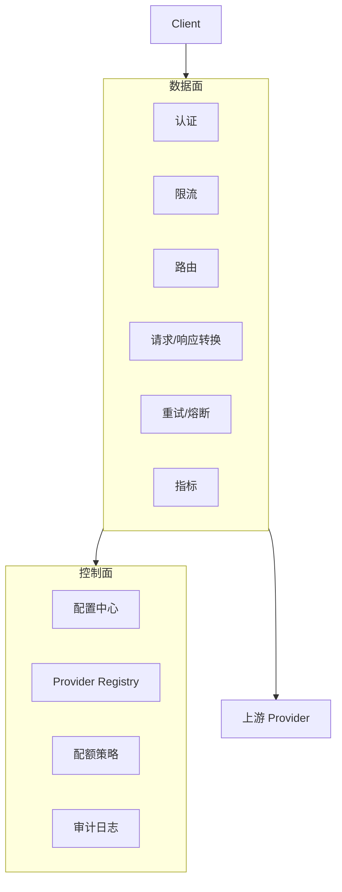

# 2. 核心思想

> 一句话理解：LLM Gateway 的核心思想是**用一层统一的抽象，把“模型在哪里、用哪家供应商、失败怎么办、成本怎么算”从业务代码里拿出来，交给平台集中决策**。

## 8 大横切能力

### 1. Provider 抽象

业务方不直接调用 OpenAI、Azure、vLLM、Triton，而是调用 Gateway 暴露的统一模型别名，例如 `gpt-4o`。Gateway 负责把别名解析成真正的上游 endpoint。

```text
业务请求 model=gpt-4o
        ↓
Gateway 解析：gpt-4o → [OpenAI, Azure, vLLM]
        ↓
按策略选一个 provider 调用
```

Provider 抽象带来几个好处：

- **供应商无关**：切换 provider 不用改业务代码。
- **多版本共存**：同一个模型可以同时挂载正式版和实验版。
- **灰度发布**：新 provider 先给 5% 流量，观察后再全量。

### 2. 统一 OpenAI-compatible API

OpenAI 的 API 设计已经成为事实标准。大多数 LLM Gateway 都向上暴露 `/v1/models`、`/v1/chat/completions`、`/v1/embeddings`、`/v1/completions` 等端点，让业务方可以直接用 OpenAI SDK 调用任何后端。

vLLM、Triton、LiteLLM、SGLang 都支持 OpenAI-compatible 接口，这进一步降低了网关层的标准化成本。

### 3. 路由（Routing）

路由决定“一个请求应该去哪个 provider”。常见策略：

| 策略 | 说明 | 适用场景 |
|---|---|---|
| **Round-robin** | 轮流选择候选 provider | 上游同质、成本相近 |
| **Weighted** | 按权重分配 | 控制不同供应商/集群流量比例 |
| **Least-latency** | 选最近 N 次平均延迟最低的 | 对延迟敏感 |
| **Priority** | 主备模式，主失败才切备 | 成本优先，备用更贵 |
| **Cost-based** | 选当前 cheapest 的 | 成本优先 |
| **Content-based** | 按 prompt 长度/语言/安全等级路由 | 长文走低价、敏感走合规供应商 |

### 4. 负载均衡（Load Balancing）

路由是“选哪一家”，负载均衡是“选哪一台/哪个实例”。在自托管 vLLM/Triton 集群中，Gateway 需要维护上游实例列表，并按连接数、GPU 显存、队列长度做更细粒度的分发。

### 5. 限流（Rate Limiting）

LLM 调用成本高昂，限流是生产刚需。限流维度包括：

- **全局限流**：保护整个网关不被打爆。
- **按 api_key / tenant**：每个租户有独立配额。
- **按 model**：限制某个昂贵模型的总调用量。
- **按用户**：同一租户内不同用户再细分。

常用算法：

- **Token Bucket**：允许突发，平滑限流，最常用。
- **Fixed Window**：简单，但窗口边界容易突发。
- **Sliding Window Log**：精确，但内存开销大。
- **Leaky Bucket**：强制匀速，适合严格 QoS。

### 6. 重试、降级与熔断

LLM 调用失败场景比其他 HTTP 服务多得多：

- `429`：速率限制，通常带 `Retry-After`。
- `500/502/503`：上游临时不可用。
- 超时：长上下文或高负载导致。
- 内容审查：模型拒绝生成。

Gateway 需要：

- **重试**：指数退避，只针对可重试错误。
- **降级**：主 provider 失败时切到备用 provider 或更便宜模型。
- **熔断**：连续失败超过阈值后快速失败，避免拖垮上游和自身。

### 7. 认证与授权

Gateway 是入口，天然适合做：

- **API Key 校验**：把用户 key 映射到 tenant / quota。
- **Token 校验**：OAuth / JWT，适合企业内应用。
- **请求签名**：防止请求被篡改或重放。
- **权限控制**：哪些 tenant 能调哪些 model。

> 生产注意：不要在 Gateway 里明文存 key，应接入 Vault、AWS Secrets Manager、Azure Key Vault 等。

### 8. 可观测与成本追踪

Gateway 是统一观测点，必须输出：

- **延迟**：首 token 延迟（TTFT）、完整响应延迟、每输出 token 延迟。
- **吞吐量**：QPS、并发数。
- **Token 用量**：input tokens、output tokens、total tokens。
- **成本**：按 provider/model 实时估算。
- **成功率/错误码**：2xx/4xx/5xx 分布。
- **缓存命中率**：如果实现了 prompt 缓存。

这些指标通常以 Prometheus 格式暴露，再由 Grafana 做大盘。

## 控制面 vs 数据面

现代 LLM Gateway 通常拆成两个面：

- **控制面（Control Plane）**：配置管理、provider 注册、路由规则、配额策略、密钥管理、审计日志。
- **数据面（Data Plane）**：接收请求、执行认证、限流、路由、转换、调用上游、记录指标。



控制面可以独立部署、热更新；数据面需要无状态、可水平扩展。

## 本章小结

LLM Gateway 的 8 大能力——Provider 抽象、统一 API、路由、负载均衡、限流、重试降级、认证、可观测——共同构成了 AI 控制面的最小可行集合。理解它们之间的边界与组合方式，是后续学习架构与源码的基础。

**参考来源**

- [OpenAI API Reference](https://platform.openai.com/docs/api-reference)
- [LiteLLM Proxy — Rate Limits](https://docs.litellm.ai/docs/proxy/rate_limiting)
- [Envoy AI Gateway Concepts](https://aigateway.envoyproxy.io/docs/concepts/)
- [Kong AI Gateway Overview](https://docs.konghq.com/gateway/latest/ai-gateway/)
