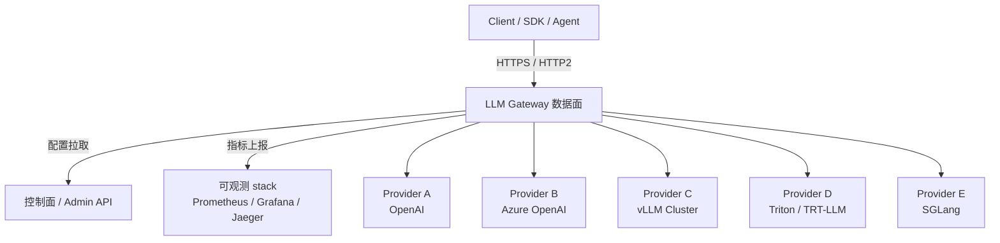

# 3. 架构设计

> 一句话理解：LLM Gateway 的架构可以概括为“**南北向收敛、东西向解耦、控制面与数据面分离**”——所有客户端走一个统一入口，后端可以任意扩展，策略由控制面集中管理。

## 整体架构



## 分层职责

| 层级 | 职责 | 典型组件/能力 |
|---|---|---|
| **接入层（Ingress）** | TLS 终止、HTTP/2、负载均衡、WAF | Nginx、Envoy、Cloudflare、AWS ALB |
| **网关数据面** | 认证、限流、路由、转换、重试、指标 | LiteLLM Proxy、Envoy AI Gateway、Kong AI Gateway、自研 |
| **网关控制面** | 配置、provider 注册、配额、审计 | Postgres/Redis、Admin API、Vault |
| **上游 Provider** | 实际模型推理 | OpenAI、Azure、vLLM、Triton、SGLang |
| **可观测层** | 日志、指标、追踪、成本分析 | Prometheus、Grafana、OpenTelemetry、Langfuse |

## 数据面内部模块

```mermaid
flowchart LR
    Req[HTTP Request]
    Auth[Auth Middleware]
    RL[Rate Limiter]
    Router[Router]
    LB[Load Balancer]
    Transform[Transformer]
    Retry[Retry / Fallback / CB]
    Provider[Provider Client]
    Metrics[Metrics]

    Req --> Auth --> RL --> Router --> LB --> Transform --> Retry --> Provider
    Provider --> Transform2[响应转换] --> Metrics --> Resp[HTTP Response]
```



### 接入顺序的考量

1. **Auth 放在第一位**：没权限的请求尽早拒绝，避免后续资源浪费。
2. **Rate Limiter 放在 Auth 之后**：只有知道是谁，才能按租户限流。
3. **Router 在限流之后**：确定能放行，再决定去哪。
4. **Transformer 在路由之后**：不同 provider 可能需要不同的请求体格式。
5. **Retry / Fallback 紧贴上游调用**：把失败封装在 provider client 内部。
6. **Metrics 贯穿全程**：记录每个阶段的延迟与结果。

## 控制面设计

控制面通常包含：

### 配置中心

- Provider 定义：endpoint、model alias、权重、优先级、超时、重试次数。
- 路由规则：按 model / tenant / prompt 特征匹配。
- 限流策略：token bucket 容量、 refill rate。
- 密钥映射：api_key → tenant / quota / allowed_models。

### Provider Registry

- 动态注册/下线 provider。
- 健康检查与权重调整。
- 支持 canary 发布：新 provider 先给少量流量。

### 配额与审计

- 实时用量：按 api_key、tenant、model、user 聚合。
- 审计日志：记录谁、何时、调用了什么模型、消耗多少 token。
- 成本分摊：把账单拆分到应用/团队。

### Secret 管理

- 上游 provider 的 API key 应存储在 Vault / KMS / 云 Secret Manager。
- Gateway 只保存引用或短期 token，不持久化明文。

## 部署形态

### 形态 1：独立服务

```text
Client -> DNS/ALB -> LLM Gateway (容器/VM) -> Providers
```

优点：集中管理、易于扩展、适合多业务方。
缺点：多一跳网络延迟，需要保证自身高可用。

### 形态 2：Sidecar

```text
App Pod [App Container + Gateway Sidecar] -> Providers
```

优点：低延迟、按应用隔离、无共享网关瓶颈。
缺点：配置分散、运维复杂、资源碎片。

### 形态 3：边缘网关

```text
Client -> CDN/Edge -> LLM Gateway -> Origin Providers
```

Cloudflare AI Gateway 是典型代表，适合缓存、全球加速、边缘安全。

### 形态 4：Service Mesh 扩展

Envoy AI Gateway 通过 Envoy filter + Gateway API 实现，适合已经使用 Istio/Envoy 的团队。

## 与 Service Mesh 的关系

| 维度 | Service Mesh | LLM Gateway |
|---|---|---|
| 关注点 | 服务间通信安全、流量、可观测 | 客户端到 LLM provider 的统一接入与治理 |
| 路由粒度 | 服务 / 版本 / header | model / tenant / cost / latency / content |
| 失败处理 | 通用重试、超时、熔断 | LLM 语义重试、fallback、内容审查 |
| 位置 | 通常作为 sidecar 或 shared proxy | 独立服务或边缘节点 |

两者不冲突：Service Mesh 管东西向，LLM Gateway 管南北向；也可以让 LLM Gateway 本身作为 Mesh 的一个 workload。

## 数据面状态设计

理想的数据面是**无状态**的，这样可以直接水平扩展：

```text
                 ┌─ Gateway Pod 1
Client -> LB ────┼─ Gateway Pod 2
                 └─ Gateway Pod 3
```

但限流、熔断、会话上下文会引入状态：

- **限流**：Token bucket 状态可放在 Redis，保证跨实例一致。
- **熔断**：Circuit breaker 状态可放在 Redis 或 gossip 同步。
- **会话**：多轮对话的 session affinity 可通过 sticky header 或外部 cache 解决。

## 本章小结

LLM Gateway 架构的核心是“统一入口 + 数据面快速决策 + 控制面集中治理”。无论是独立服务、Sidecar 还是边缘部署，都需要把认证、限流、路由、转换、重试、指标这些能力模块化、可配置化。

**参考来源**

- [LiteLLM Architecture](https://docs.litellm.ai/docs/proxy/architecture)
- [Envoy AI Gateway Architecture](https://aigateway.envoyproxy.io/docs/)
- [Kong AI Gateway Plugin](https://docs.konghq.com/hub/kong-inc/ai-proxy/)
