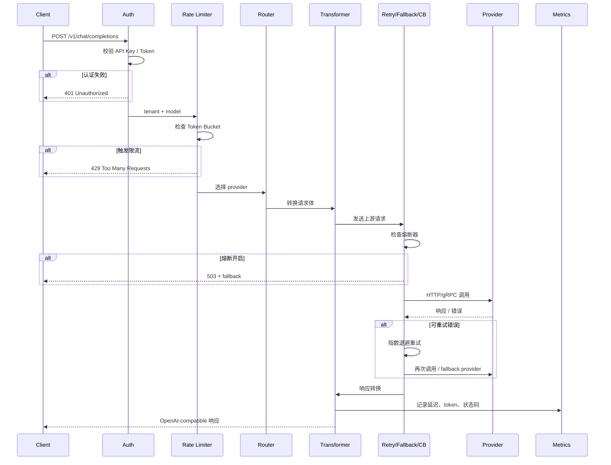

# 4. Runtime 工作流程

> 一句话理解：**一个 LLM 请求进入 Gateway 后，会依次经过认证、限流、路由、转换、重试/调用、响应转换、指标记录，最终返回给客户端**。

## 完整生命周期



## 阶段详解

### 1. 请求接入

客户端发送标准 OpenAI 请求：

```json
POST /v1/chat/completions
Authorization: Bearer sk-gateway-xxx
Content-Type: application/json

{
  "model": "gpt-4o",
  "messages": [
    {"role": "user", "content": "你好"}
  ],
  "temperature": 0.7
}
```

Gateway 的 HTTP server 解析出：

- `model`：模型别名，决定路由。
- `Authorization`：api_key，决定租户与权限。
- 请求体：需要转发或转换的内容。

### 2. 认证（Authentication）

Gateway 维护一个 key 映射表：

```yaml
keys:
  sk-gateway-xxx:
    tenant: team-a
    allowed_models: ["gpt-4o", "gpt-4o-mini"]
    rate_limit: 100/min
```

校验失败直接返回 `401`；成功则把 `tenant` 注入请求上下文。

### 3. 限流（Rate Limiting）

限流键通常组合多个维度：

```text
key = tenant:team-a:model:gpt-4o
```

算法使用 Token Bucket：

- bucket 容量 = burst。
- refill rate = 每秒允许通过的请求数。
- 每次请求取 1 个 token；取不到则 `429`。

如果限流，Gateway 可以在响应头里带上：

```http
X-RateLimit-Limit: 100
X-RateLimit-Remaining: 0
Retry-After: 3
```

### 4. 路由（Routing）

Gateway 查询 model alias 对应的候选 provider 列表：

```yaml
models:
  gpt-4o:
    providers:
      - name: openai-primary
        weight: 70
      - name: azure-backup
        weight: 30
```

按 weighted random 选择后，还要经过负载均衡选出具体实例。

### 5. 请求转换（Request Transformation）

如果上游是 OpenAI-compatible（如 vLLM、LiteLLM），通常直接透传。

如果是非标准协议（如 Triton gRPC、自定义 embedding 服务），需要转换：

- 把 `messages` 拼接成 prompt。
- 把 `stream=true` 映射到 SSE 格式。
- 把 temperature/top_p 等参数做适配。

### 6. 上游调用与重试

Gateway 调用选中的 provider：

- 设置连接超时、读超时。
- 流式响应需要边读边转发，不能等完整响应。

失败处理策略：

| 错误 | 处理方式 |
|---|---|
| `429` | 按 `Retry-After` 或指数退避重试 |
| `5xx` | 重试，超过阈值 fallback |
| 超时 | 重试，必要时 fallback |
| 内容审查 | 不可重试，直接透传或返回友好错误 |

重试时要避免：

- 对非幂等操作无限制重试。
- 重试风暴拖垮备用 provider。
- 流式响应已经发送部分数据后无法重试。

### 7. 熔断（Circuit Breaker）

连续失败 N 次或失败率超过阈值后，熔断器打开：

```text
CLOSED -> OPEN -> HALF-OPEN -> CLOSED
```

- `CLOSED`：正常调用。
- `OPEN`：直接返回错误 / fallback，不再调用上游。
- `HALF-OPEN`：经过冷却时间后，放少量探测请求。

熔断状态需要共享（Redis），否则多实例会重复触发。

### 8. 响应转换

上游响应可能是：

```json
{
  "choices": [{"message": {"role": "assistant", "content": "你好！"}}],
  "usage": {"prompt_tokens": 10, "completion_tokens": 5, "total_tokens": 15}
}
```

Gateway 保证返回 OpenAI-compatible 格式：

```json
{
  "id": "chatcmpl-xxx",
  "object": "chat.completion",
  "model": "gpt-4o",
  "choices": [...],
  "usage": {...}
}
```

如果是流式，需要把 provider 的 SSE chunk 转发给客户端，必要时补 `data: [DONE]`。

### 9. 指标记录

无论成功失败，都要记录：

- `llm_gateway_requests_total{model,provider,status}`
- `llm_gateway_latency_seconds{model,provider,stage}`
- `llm_gateway_tokens_total{model,provider,type}`
- `llm_gateway_cost_usd{model,provider}`

这些指标在 `/metrics` 端点以 Prometheus 文本暴露。

### 10. 返回客户端

最终响应：

```json
{
  "id": "chatcmpl-gateway-xxx",
  "model": "gpt-4o",
  "choices": [{"message": {"role": "assistant", "content": "你好！有什么可以帮你的吗？"}}],
  "usage": {"prompt_tokens": 10, "completion_tokens": 12, "total_tokens": 22}
}
```

响应头可能包含：

```http
X-LLM-Gateway-Provider: openai-primary
X-LLM-Gateway-Region: us-east-1
X-Request-ID: req-xxx
```

## 流式请求的特殊性

流式响应一旦开始发送，Gateway 无法整体重试。因此：

- 路由与 provider 选择在第一个 chunk 发送前完成。
- 如果上游连接中断，Gateway 应优雅结束 SSE，而不是把错误 chunk 发给客户端。
- 熔断判断通常只基于完整请求，不基于单个 chunk。

## 本章小结

LLM Gateway 的请求生命周期是“**先拒绝、再决策、后调用、终记录**”。认证和限流尽早拒绝无效流量，路由和转换决定去向与格式，重试/降级/熔断保证可用性，指标记录支撑成本与可观测。流式响应则把重试窗口压缩到首包之前。

**参考来源**

- [OpenAI API — Chat Completions](https://platform.openai.com/docs/api-reference/chat/create)
- [LiteLLM Proxy — Fallbacks](https://docs.litellm.ai/docs/proxy/reliability)
- [Envoy AI Gateway — Routing](https://aigateway.envoyproxy.io/docs/)
