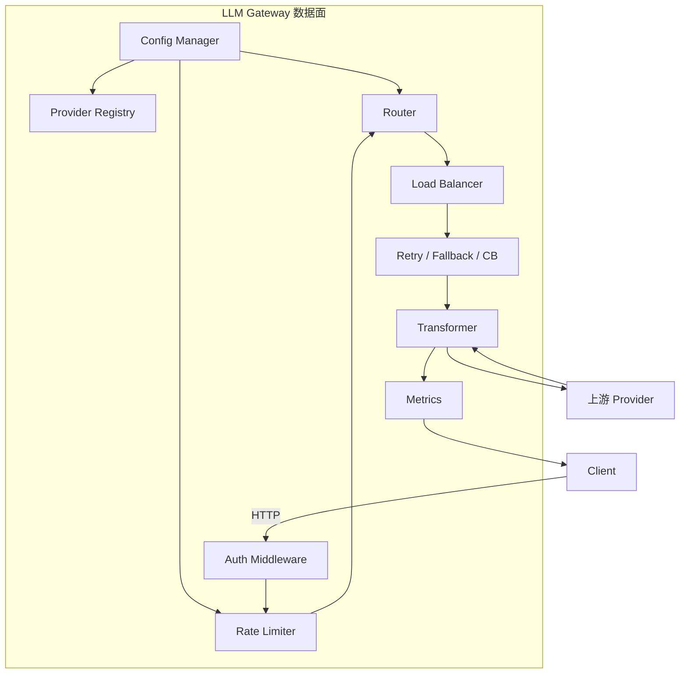

# 5. 核心模块

> 一句话理解：LLM Gateway 的功能可以被拆成若干独立模块，每个模块只负责一个横切关注点，并通过配置组合成完整的数据面流水线。

## 模块总览



## 1. Config Manager

职责：加载、校验、热更新网关配置。

配置通常分为：

- **provider 配置**：endpoint、model alias、timeout、retry、weight、priority。
- **路由规则**：按 model / tenant / header / prompt 特征匹配。
- **限流策略**：token bucket 参数、作用维度。
- **密钥映射**：api_key → tenant / quota / allowed_models。
- **转换模板**：OpenAI ↔ 上游私有协议的字段映射。

支持格式：YAML、JSON，生产环境常从对象存储或配置中心（Consul、etcd、Kubernetes ConfigMap）加载。

热更新要求：

- 配置变更后数据面不重启即可生效。
- 部分变更（如 provider 权重）应原子切换，避免 half state。
- 错误配置不应直接 panic，而是标记为 invalid 并保留旧配置。

## 2. Provider Registry

职责：管理所有上游 provider 的元数据与健康状态。

每个 provider 包含：

```yaml
providers:
  openai-primary:
    kind: openai
    api_base: https://api.openai.com/v1
    api_key_ref: vault://openai/api-key
    models: [gpt-4o, gpt-4o-mini]
    timeout: 30s
    weight: 70
    priority: 1
    health_check:
      path: /v1/models
      interval: 30s
```

Registry 需要：

- 按 model alias 索引 provider 列表。
- 维护 provider 健康状态（healthy / unhealthy / degraded）。
- 支持动态上下线，例如 canary 发布。
- 把真实 API key 的获取委托给 Secret Manager。

## 3. Auth Middleware

职责：验证请求身份，并注入 tenant / user / allowed_models 等上下文。

常见实现：

- **API Key**：从 `Authorization: Bearer <key>` 提取，查表得到 tenant。
- **JWT/OAuth2**：校验 token 签名与 scope，解析出用户身份。
- **mTLS**：服务间调用使用客户端证书。

关键注意：

- key 不要明文落盘；使用 hash 或外部 secret store。
- 认证失败立即返回 401，减少后续资源消耗。
- 可以在上下文中注入 `request_id`，用于全链路 tracing。

## 4. Rate Limiter

职责：按多维度控制请求速率，保护上游与自身。

常用 Token Bucket 实现：

```python
class TokenBucket:
    def __init__(self, capacity, refill_rate):
        self.capacity = capacity
        self.tokens = capacity
        self.refill_rate = refill_rate
        self.last_refill = time.monotonic()

    def allow(self, tokens=1):
        now = time.monotonic()
        self.tokens = min(self.capacity,
                          self.tokens + (now - self.last_refill) * self.refill_rate)
        self.last_refill = now
        if self.tokens >= tokens:
            self.tokens -= tokens
            return True
        return False
```

生产要点：

- 维度键：`<tenant>:<model>`、`<api_key>`、`<user>` 等。
- 分布式场景用 Redis 存储 bucket 状态，`INCR` + `EXPIRE` 实现滑动窗口。
- 响应头里返回剩余配额，方便客户端自适应降速。

## 5. Router

职责：根据策略从候选 provider 中选择目标。

常见策略已在 [核心思想](./02-core-ideas) 中介绍。Router 内部通常抽象为：

```python
def select(model_alias, context, candidates) -> Provider:
    strategy = get_strategy(model_alias, context)
    return strategy.pick(candidates, context)
```

Router 还要处理：

- 模型别名冲突：优先级与 tenant 隔离。
- provider 不可用：过滤掉不健康实例。
- A/B 测试：按 header / user_id 切流量。

## 6. Load Balancer

职责：在 provider 内部选择一个具体实例。

在自托管 vLLM/Triton 集群中，provider 往往有多个实例：

```yaml
providers:
  vllm-cluster:
    kind: openai
    instances:
      - url: http://10.0.1.10:8000
      - url: http://10.0.1.11:8000
      - url: http://10.0.1.12:8000
```

算法：

- **Round-robin**：简单公平。
- **Least-connections**：避免长连接堆积。
- **Least-queue / KV-cache-aware**：需要暴露实例内部队列长度或显存状态，较为高级。

## 7. Retry / Fallback / Circuit Breaker

职责：把上游的不稳定性封装起来，对外提供稳定服务。

### Retry

- 只对可重试错误（5xx、429、网络超时）。
- 指数退避：`backoff = min(base * 2^attempt, max_backoff)`。
- 带 jitter，避免惊群。

### Fallback

- 主 provider 失败后，降级到备用 provider 或更便宜模型。
- fallback 链：`primary → backup → cheapest → static error`。
- 注意：fallback 模型可能能力 weaker，业务需能容忍。

### Circuit Breaker

- 状态机：`CLOSED → OPEN → HALF-OPEN → CLOSED`。
- 触发条件：连续失败数或时间窗口失败率。
- 冷却时间与半开探测流量防止抖动。

## 8. Transformer

职责：统一不同 provider 的请求/响应格式。

OpenAI-compatible provider（vLLM、Triton OpenAI frontend、LiteLLM）通常直接透传。

非标准 provider 需要转换：

- 字段映射：`messages` → `prompt`。
- 参数适配：`temperature` 范围不一致时做 clamp。
- 流式格式：统一 SSE chunk schema。
- 错误码映射：把各 provider 的自定义错误码转成 OpenAI 风格。

## 9. Metrics

职责：采集并暴露网关运行指标。

核心指标：

| 指标名 | 类型 | 标签 | 说明 |
|---|---|---|---|
| `llm_gateway_requests_total` | Counter | `model`, `provider`, `status` | 请求总数 |
| `llm_gateway_latency_seconds` | Histogram | `model`, `provider`, `stage` | 各阶段延迟 |
| `llm_gateway_tokens_total` | Counter | `model`, `provider`, `type` | input/output token 数 |
| `llm_gateway_cost_usd_total` | Counter | `model`, `provider` | 预估成本 |
| `llm_gateway_rate_limited_total` | Counter | `model`, `tenant` | 被限流次数 |
| `llm_gateway_fallback_total` | Counter | `from`, `to` | fallback 次数 |
| `llm_gateway_circuit_breaker_state` | Gauge | `provider` | 熔断器状态 |

暴露方式：

- Prometheus `/metrics` 文本端点。
- OpenTelemetry trace：记录请求在各模块的耗时。
- 结构化日志：JSON 格式，包含 request_id、tenant、model、latency、token 用量。

## 10. Policy Plugin（可选扩展）

职责：执行更高级的安全与治理策略。

- **PII 检测**：识别并过滤身份证号、手机号、信用卡号。
- **敏感词/越狱检测**：基于规则或小型分类模型。
- **Prompt 缓存**：对重复 prompt 直接返回缓存结果。
- **响应后处理**：统一 format、长度限制、引用来源。

Policy Plugin 通常作为可插拔的 hook 链：

```text
request hook -> route -> upstream -> response hook -> return
```

## 本章小结

LLM Gateway 的 10 个核心模块——Config、Registry、Auth、Rate Limiter、Router、Load Balancer、Retry/Fallback/CB、Transformer、Metrics、Policy Plugin——覆盖了从配置到调用、从安全到观测的全链路。理解每个模块的职责边界，有助于在真实选型与自研时做出合理拆分。

**参考来源**

- [LiteLLM Proxy — Rate Limiting](https://docs.litellm.ai/docs/proxy/rate_limiting)
- [Envoy AI Gateway Filters](https://aigateway.envoyproxy.io/docs/)
- [Prometheus Best Practices](https://prometheus.io/docs/practices/naming/)
