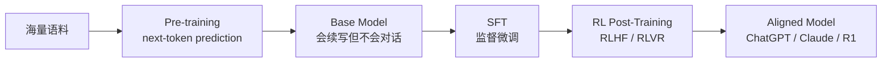

# 1. 背景

## 大模型训练的下半场

2022 年 ChatGPT 之后，大模型训练有一个公开的"两段式"共识：

- **Pre-training**：把互联网塞进模型，烧钱但工程成熟（Megatron-LM / DeepSpeed / FSDP）。
- **SFT**：用人工标注的 (instruction, response) 对做监督学习，教模型"怎么说话"。
- **RL Post-Training**：让模型通过**试错+奖励**继续提升，教模型"怎么思考"。

2024 年之前，业界普遍认为 RL 只是"对齐的点缀"——InstructGPT 论文里 RLHF 带来的提升有限，工程复杂度却极高。因此很多团队只做 SFT 就上线了。

## 2024-2025 年的两个拐点

### 拐点一：OpenAI o1（2024-09）

o1 证明了一件事：**RL 不只是对齐，它能解锁新能力**。通过 RL 训练模型生成长 chain-of-thought（思维链），模型在数学、编程、科学推理上的表现大幅跃升。这是 SFT 无法做到的——因为你无法人工标注"长推理过程"这种数据。

### 拐点二：DeepSeek-R1（2025-01）

R1 进一步证明：**纯 RL（不依赖 SFT 冷启动、不依赖 Reward Model）也能涌现出推理能力**。它用 **GRPO**（Group Relative Policy Optimization）+ **可验证奖励**（数学题对答案、代码跑单测），在 AIME、MATH-500 上追平 o1。

R1 的工程意义比算法意义更大：

- 奖励**不需要训练 Reward Model**，直接用脚本判定，工程上极度简化。
- 算法用 GRPO 替代 PPO，**去掉了 Critic 网络**，省一半显存。
- 训练框架是开源的（基于 veRL 改进），所有人都能复现。

## 为什么 RL 训练是基础设施难题

### 1. 计算的"三段式"异构性

一次 RL 训练 step 包含三个阶段，每个阶段的最优引擎完全不同：

| 阶段 | 计算特征 | 最优引擎 | 显存瓶颈 |
|---|---|---|---|
| **Rollout（生成）** | 自回归 decode，KV Cache 大，batch 大 | vLLM / SGLang / TensorRT-LLM | KV Cache |
| **Score（评分）** | 规则脚本 / Reward Model 前向 | 普通 Python / 推理引擎 | 小 |
| **Train（训练）** | 前向+反向，梯度同步 | Megatron-LM / FSDP / DeepSpeed | 参数+梯度+优化器 |

如果用一个引擎跑全部，任何一段都会成为瓶颈。**因此 RL 基建的核心是"三种引擎协同"**。

### 2. On-Policy 的强一致要求

PPO/GRPO 是 **On-Policy** 算法：训练数据必须由**当前策略**生成。这意味着：

- Rollout 用的模型权重必须是**最新的**（每个 step 都要同步）。
- 不能让 Rollout 跑在老权重上"偷懒"，否则算法收敛性破坏。
- 权重同步的频率（每 step / 每 N step）直接决定算法是 On-Policy 还是 Off-Policy。

权重同步是 RL 基建的"阿喀琉斯之踵"——70B 模型每次同步 140GB（BF16），万卡集群的网络压力极大。

### 3. 负载不均衡与长尾

Rollout 是**变长生成**：

- 同一个 batch 里，有的样本 100 token 就结束，有的要 8k token。
- 推理引擎的 Continuous Batching 能缓解但不能消除。
- Agentic RL 的多轮交互会进一步拉长方差。

如果 Train 阶段等所有 Rollout 完成，GPU 会空闲 30-50%。

### 4. Agentic RL 的环境复杂度

传统 RLVR 的"环境"就是一个评分脚本。Agentic RL 的环境是：

- 代码执行器（要沙箱）
- 浏览器（要渲染）
- 终端（要持久 session）
- 多轮工具调用（要 MCP / function calling）

环境本身就是一套**分布式系统**，需要专门的基建。

## 现有预训练基建为什么不够

| 能力 | Megatron-LM / DeepSpeed | RL Post-Training 需要 |
|---|---|---|
| 静态数据加载 | ✅ 完善 | ❌ 数据是动态生成的 |
| 推理引擎集成 | ❌ 没有 | ✅ 必需 vLLM/SGLang |
| 权重在线同步 | ❌ 没有 | ✅ 每 step 同步 |
| 多模型共存 | ❌ 只有 Policy | ✅ Policy / Ref / Reward / Critic |
| 异构调度 | ❌ 单一负载 | ✅ 生成+评分+训练混合 |
| 环境交互 | ❌ 没有 | ✅ Agentic RL 必需 |

因此诞生了专门的 RL 训练框架：**veRL（字节）、OpenRLHF（开源社区）、TRL（HuggingFace）、NeMo-RL（NVIDIA）、AReaL（蚂蚁）、slime（清华）、ROLL（阿里）**。

## RL Post-Training 的产业现状（2026 中）

| 团队 | 框架 | 公开实践 |
|---|---|---|
| DeepSeek | 自研（基于 veRL） | R1 用 GRPO + 可验证奖励，H800 集群 |
| 字节 Seed | veRL | 开源，支持 PPO/GRPO/DPO，FSDP + Megatron 后端 |
| 阿里 Qwen | 自研 + ROLL | Qwen3 用 GSPO，Agentic RL 强 |
| Kimi | 自研 | K2 用大规模 Agentic RL |
| OpenAI | 自研 | o1/o3/o4 系列，不公开细节 |
| Anthropic | 自研 | Constitutional AI / RLAIF，Claude 4 |
| Meta | 自研 + 开源 | Llama 4 用 RLHF + RLVR，TorchTitan + vLLM |
| NVIDIA | NeMo-RL | 开源，深度整合 TensorRT-LLM |
| HuggingFace | TRL | 社区最广泛，但性能不是为超大规模设计 |

## 一句话总结

> RL Post-Training 是把"强化学习"这个老概念，跑在"万卡集群 + 现代推理引擎 + 分布式训练框架"之上的新基础设施挑战。它的难度不在算法，而在工程。

## 本章小结

- 2024-2025 年 o1 和 R1 证明 RL 能解锁推理能力，RL Post-Training 成为大模型标配。
- RL 训练的"生成-评分-训练"三段式负载、On-Policy 强一致、长尾分布，让传统预训练基建不够用。
- 这催生了 veRL / OpenRLHF / NeMo-RL 等专门框架，以及一套新的基础设施范式。
