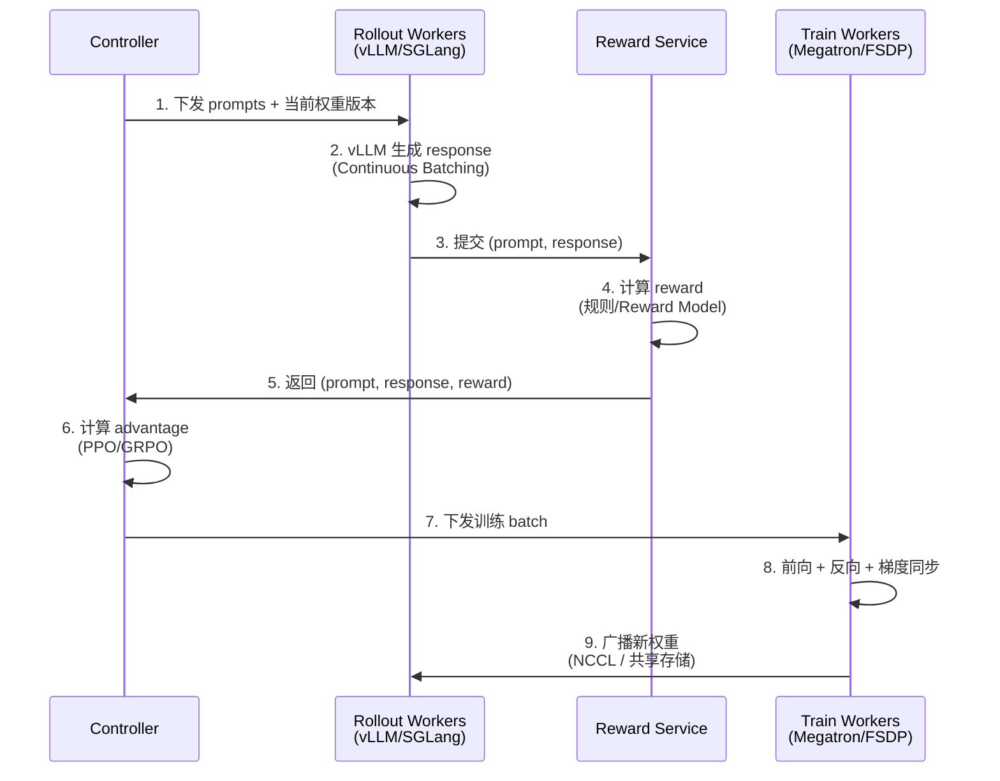

# 2. 核心思想

## 一句话理解

> RL Post-Training 的核心思想是：**让模型在自己生成的数据上学习，用奖励信号而非人工标注来引导方向**。基础设施的设计围绕"高效生成 → 准确评分 → 稳定更新"这个闭环展开。

## 五个核心抽象

### 1. Rollout（采样）

**Rollout** 是用当前策略（Policy）模型生成一批数据的过程。在 LLM 语境下，就是给一批 prompt，让模型生成 response。

```
prompts: [p1, p2, ..., pN]
   ↓ 当前 policy 模型
rollouts: [(p1, r1), (p2, r2), ..., (pN, rN)]
```

关键工程指标：

- **吞吐**：每秒生成多少 token（直接决定训练 wall time）
- **多样性**：通过 temperature / top_p / top_k 控制，影响探索
- **长度分布**：影响 KV Cache 占用与负载均衡

### 2. Reward（奖励）

**Reward** 是对每个 rollout 样本打分，告诉模型"这个 response 好不好"。奖励来源有三类：

| 类型 | 代表 | 优点 | 缺点 |
|---|---|---|---|
| **Reward Model** | 人工偏好数据训练的标量模型 | 通用、可打分主观任务 | 训练成本高、易被 hack |
| **可验证奖励（Verifiable Reward）** | 数学答案比对、代码跑测试 | 准确、不可 hack、零成本 | 只适用有标准答案的任务 |
| **规则 / AI 反馈** | Constitutional AI 的批判模型 | 灵活 | 实现复杂 |

DeepSeek-R1 的关键洞察是：**对于有标准答案的任务（数学、代码），可验证奖励 > Reward Model**。这简化了基建——不需要单独部署一个 Reward Model 服务。

### 3. Advantage（优势）

**Advantage** 衡量"这个 response 比平均水平好多少"。它是 PPO/GRPO 的核心：

- **PPO**：用一个 Critic 网络估计 Value，Advantage = Reward - Value。
- **GRPO**：用**同组（group）其他样本的平均 Reward** 作为基线，Advantage = Reward - group_mean。

GRPO 的工程优势：**省掉了 Critic 网络**，显存减半，工程链路大幅简化。代价是需要为每个 prompt 生成多个 response（通常 8-64 个），增加了 Rollout 压力。

```
# PPO（需要 Critic）
advantage = reward - critic(state)

# GRPO（用 group baseline）
advantage = reward - mean(rewards_in_group)
```

### 4. Policy Update（策略更新）

根据 advantage 更新 policy 模型的参数。核心是 **PPO  clipped objective**：

```
L = min(r(θ) * A, clip(r(θ), 1-ε, 1+ε) * A)
```

其中 `r(θ) = π_new(a|s) / π_old(a|s)` 是新旧策略的概率比，clip 防止更新过大。

**工程关键**：每次更新都要重新计算 `π_new` 对所有 rollout token 的概率，这是一次完整的前向+反向。

### 5. KL Penalty（KL 散度惩罚）

为了防止 policy 偏离 reference（原始 SFT 模型）太远导致崩溃，通常加一个 KL 惩罚项：

```
reward_total = reward - β * KL(π_policy || π_ref)
```

**工程关键**：这意味着**推理时需要同时部署 Policy 和 Reference 两个模型**，显存翻倍。

## 三个核心设计权衡

### 权衡一：On-Policy vs Off-Policy

| 模式 | 定义 | 优点 | 缺点 |
|---|---|---|---|
| **On-Policy** | 训练数据全部来自当前策略 | 算法收敛性最强 | Rollout 必须等最新权重，无法流水 |
| **Off-Policy** | 训练数据可以来自稍旧的策略 | 可以异步流水线，GPU 利用率高 | 需要 importance sampling 修正，可能不稳定 |

**工程折中**：**近端 On-Policy**——允许 Rollout 用滞后 1-N step 的权重，配合 ratio clipping 把偏差控制在可接受范围。veRL 和 OpenRLHF 都支持这种"半异步"模式。

### 权衡二：Rollout / Train 资源配比

Rollout 和 Train 消耗 GPU 的比例取决于：

- **模型大小**：70B 模型 Train 显存 6-8x，Rollout 显存 1-2x
- **生成长度**：长推理（8k-32k token）Rollout 时间是 Train 的 5-10 倍
- **GRPO group size**：group=32 意味着 Rollout 样本量是 Train 的 32 倍

**经验值**（R1 类长推理训练）：

- Rollout 占 60-80% GPU
- Train 占 20-40% GPU

### 权衡三：同卡部署 vs 分卡部署

| 模式 | 描述 | 优点 | 缺点 |
|---|---|---|---|
| **Co-located（同卡）** | Rollout 和 Train 跑在同一组 GPU 上，时间分片 | 资源利用率最高 | 需要频繁的引擎切换与权重重载 |
| **Disaggregated（分卡）** | Rollout 和 Train 各占一组 GPU | 引擎可独立优化 | 跨集群权重同步开销大 |

veRL 同时支持两种模式，用 `HybridEngine` 抽象；OpenRLHF 主推分卡 + Ray 调度。

## 与 SFT 训练的核心差异（工程视角）

| 维度 | SFT | RL Post-Training |
|---|---|---|
| 数据流 | 静态 dataloader → GPU | **在线生成 → 评分 → 训练** |
| 关键 metric | Loss | **Reward / KL / Response Length** |
| 引擎 | 单一训练框架 | **推理引擎 + 训练框架** |
| 显存占用 | 参数+梯度+优化器+激活 | 上述 + **KV Cache + Ref/Reward 模型** |
| 故障模式 | OOM、loss NaN | 上述 + **reward hacking、KL 爆炸、length collapse** |
| 调度单位 | Data parallel group | **Rollout worker group + Train worker group** |

## 一个 RL Step 的逻辑视图



## 本章小结

RL Post-Training 的核心思想可以浓缩为四句话：

1. **用模型生成数据，而非人工标注**（Rollout）。
2. **用可验证的奖励信号，而非主观偏好**（Verifiable Reward）。
3. **用组内相对优势代替绝对值函数**（GRPO 对 PPO 的简化）。
4. **推理和训练必须协同设计，不能独立优化**（Rollout/Train 一体化基建）。

下一章我们看这些思想如何落到具体的系统架构上。
