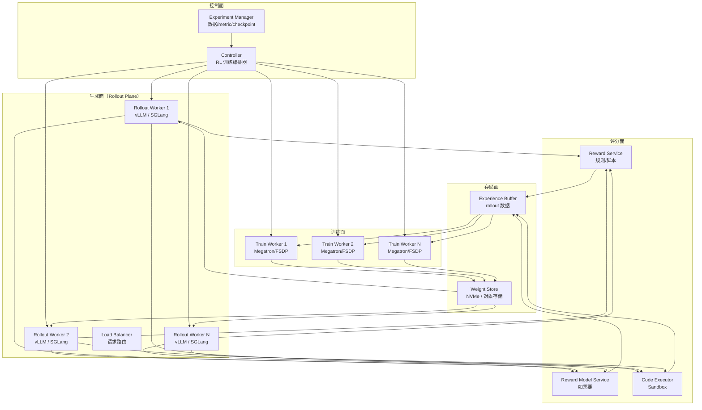

# 3. 架构设计

## 一句话理解

> RL Post-Training 系统的架构围绕一个核心矛盾展开：**Rollout 需要大 batch、长 KV Cache、低延迟；Train 需要高吞吐、梯度同步、显存复用**。架构的本质是把这两种异构负载组织到一个可控的闭环里。

## 总体架构：四大组件



## 三种主流拓扑

### 拓扑一：Co-located（同卡时分复用）

```
[GPU 0-7] Rollout (t0-t1) → Train (t1-t2) → Rollout (t2-t3) → ...
```

**代表**：veRL HybridEngine、TRL（单卡模式）。

**优点**：
- GPU 利用率理论最高（无闲置）
- 权重同步零网络开销（同一块卡）

**缺点**：
- 推理引擎和训练框架要在同一进程共存，显存需要精细管理
- 切换有开销（KV Cache 清空、CUDA graph 重建）
- 难以独立扩缩 Rollout / Train

**适用**：中小规模（单机到几十卡）、研究迭代期。

### 拓扑二：Disaggregated（分离部署）

```
[GPU 0-15]   → Rollout 专用集群（vLLM）
[GPU 16-31]  → Train 专用集群（Megatron）
                ↕ 权重同步（NCCL / RDMA / 对象存储）
```

**代表**：OpenRLHF、veRL（分离模式）、字节 Seed 生产系统。

**优点**：
- Rollout 和 Train 可独立优化与扩缩
- 推理引擎可以用 CUDA Graph、Continuous Batching 全力跑
- 故障隔离好

**缺点**：
- 权重同步是网络瓶颈（70B BF16 = 140GB / step）
- 需要专门的同步通道（NCCL over RDMA、nvlink、或共享 NVMe）

**适用**：大规模生产（百卡到万卡）。

### 拓扑三：Partial Disaggregation（部分分离 / Hybrid）

```
[GPU 0-7]   → Rollout + Train 共置
[GPU 8-15]  → Rollout 专用（应对长尾生成）
```

**代表**：AReaL、slime、阿里 ROLL。

**思路**：
- 大部分 Rollout 请求走同卡，利用时分复用。
- 长尾生成（如 32k token 的 reasoning）路由到专用 Rollout 节点，避免阻塞 Train。

这是 2025-2026 年长推理训练的主流折中。

## 关键数据流

### 1. Prompt 流

```
Dataset → Controller → Prompt Queue → Rollout Worker
```

- Prompt 通常按 **group** 组织：GRPO 要求每个 prompt 生成 G 个 response（G=8-64）。
- Controller 需要保证 group 内的样本路由到**同一个 Rollout Worker**（为了 prefix caching）。

### 2. Rollout 流

```
Rollout Worker → (prompt, response, logprobs, token_ids) → Experience Buffer
```

- 必须返回 **token-level logprobs**（用于 PPO ratio 计算）。
- 必须返回 **完整的 token ids**（不能只用 detokenized text，避免 retokenization 不一致）。
- vLLM V1 原生支持返回 logprobs；SGLang 用 `return_logprob=True`。

### 3. Reward 流

```
(prompt, response) → Reward Service → reward_score → Experience Buffer
```

- **可验证奖励**：直接调脚本（数学用 sympy 比对、代码用 subprocess 跑测试）。
- **Reward Model**：调用独立的推理服务（通常用 vLLM 部署）。
- **混合奖励**：加权求和，支持异步并发计算。

### 4. 权重流

```
Train Worker → save checkpoint → Weight Store → Rollout Worker reload
```

**三种同步方式**：

| 方式 | 延迟 | 网络开销 | 代表 |
|---|---|---|---|
| **NCCL 直传** | 秒级 | 高 | OpenRLHF（用 Ray Collective） |
| **共享 NVMe** | 10s 级 | 中 | veRL（NVMe over Fabrics） |
| **对象存储** | 分钟级 | 低 | 部分自建系统 |

**优化**：
- 只同步**增量**（delta weight）。
- 用 **FP8/INT8** 压缩传输，Rollout 端反量化。
- **流水线同步**：Train 一边 save，Rollout 一边 reload 旧的部分。

## 关键控制流

### Controller 的职责

Controller 是 RL 系统的"大脑"，职责包括：

1. **Step 编排**：决定何时触发 Rollout / Reward / Train。
2. **资源调度**：动态调整 Rollout / Train worker 数量。
3. **数据路由**：把 prompts 分给 Rollout，把样本分给 Train。
4. **版本管理**：记录每个样本是哪个 weight version 生成的。
5. **故障恢复**：worker 挂掉时重启 + 数据重放。
6. **Metric 收集**：reward / KL / length / throughput。

### 同步策略

| 策略 | 描述 | 收敛性 | GPU 利用率 |
|---|---|---|---|
| **同步（Sync）** | Rollout 完 → Reward 完 → Train 完 → 下一轮 | 最强 | 最低（30-50%） |
| **半异步（Semi-async）** | Rollout 用 N step 前的权重，Train 不等当前 Rollout | 强（需 ratio clip） | 中（60-75%） |
| **全异步（Full-async）** | Rollout/Train 完全独立，样本进 buffer 就训练 | 弱（off-policy） | 高（80-95%） |

**生产实践**：R1 类长推理通常用**同步或半异步**；Agentic RL 因为环境延迟长，更倾向于**全异步 + replay buffer**。

## 资源模型与弹性

### GPU 资源划分

一个 1024 卡的 RL 集群典型划分：

```
800 卡 → Rollout（vLLM，TP=8 × 100 instances）
200 卡 → Train（Megatron，TP=8 × PP=5 × DP=5）
 16 卡 → Reward Model（如需要）
  8 卡 → Controller + 数据服务
```

### 弹性伸缩

- **Rollout 弹性**：vLLM 实例可以加减，Controller 通过 LB 调整路由。
- **Train 弹性差**：Megatron 并行度调整成本高，通常训练期间不动。
- **spot 实例利用**：Rollout 可以用 spot，Train 必须用 reserved。

## 与 Kubernetes 的映射

| RL 组件 | K8s 资源 | 调度需求 |
|---|---|---|
| Controller | Deployment（单副本 + leader election） | 普通 CPU 节点 |
| Rollout Worker | StatefulSet / RayCluster | GPU + 大 NVMe（KV Cache offload） |
| Train Worker | Job / RayCluster | GPU + RDMA（NCCL） |
| Reward Service | Deployment | 普通 CPU 或 GPU（如有 RM） |
| Sandbox | Deployment + 安全策略 | 高隔离（gVisor/Kata） |
| Weight Store | PVC（NVMe）/ 对象存储 | 高吞吐 |

**调度挑战**：
- Train 需要 **Gang Scheduling**（参考 [GPU 在 Kubernetes 上的调度](/02-cloud-native/gpu-scheduling/)）。
- Rollout 需要 **拓扑感知**（同 NUMA 的 GPU 一组 TP）。
- 权重同步需要 **NCCL over RDMA**（参考 [计算机网络](/01-foundation/computer-networks/)）。

## 本章小结

RL Post-Training 架构的核心是：

1. **四大组件**：Controller / Rollout / Reward / Train，各司其职。
2. **三种拓扑**：Co-located / Disaggregated / Hybrid，按规模与延迟选择。
3. **两条数据流**：prompt → rollout → reward → train，以及 train → weight → rollout。
4. **三种同步策略**：Sync / Semi-async / Full-async，在收敛性与利用率之间权衡。

下一章我们看一次 RL step 在系统中的完整时序。
