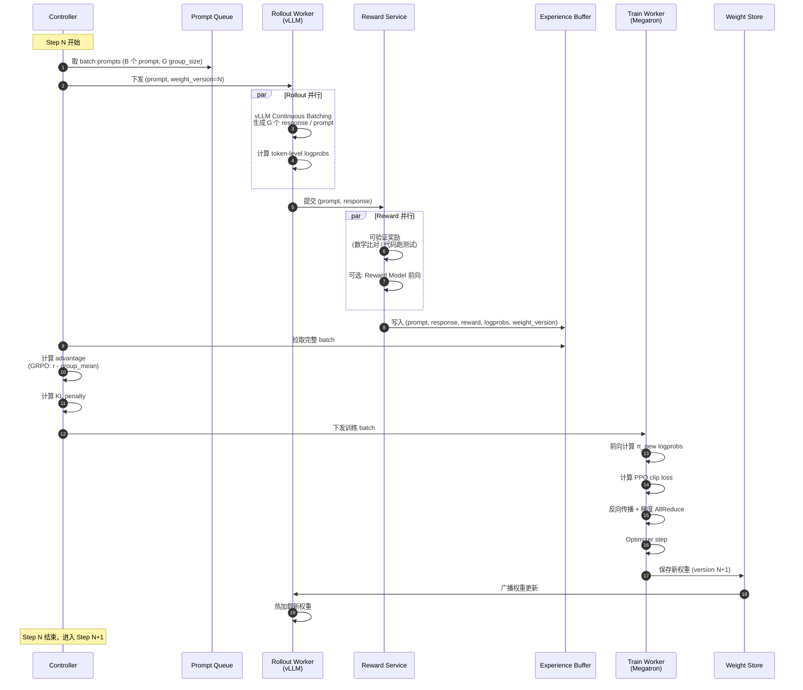

# 4. Runtime 工作流程

## 一句话理解

> 一次 RL step 是系统中最精细的协作舞蹈：**Controller 发令 → Rollout 生成 → Reward 评分 → 计算 Advantage → Train 更新 → 权重回流**。任何一环卡顿，整个集群都在等。

## 完整时序图



## 各阶段细节

### 阶段 1：Prompt 准备

```
Dataset (e.g., Math problems)
   ↓ sample B=512 prompts
Controller groups by group_size G=16
   ↓
Effective batch = B × G = 8192 sequences
```

**关键工程点**：
- **Group 路由**：同一个 prompt 的 G 个 sample 必须路由到**同一个 Rollout Worker**，这样可以利用 **Prefix Caching**（prompt 的 KV 共享），节省 50% 以上的 prefill 算力。
- **长度均衡**：尽量让同一 batch 内 prompt 长度接近，减少 padding 浪费。

### 阶段 2：Rollout 生成

**同步模式**：所有 Rollout Worker 跑完当前 batch 才进入下一阶段。

**关键工程点**：

1. **Continuous Batching**：vLLM 的 iteration-level 调度让长短不一的样本可以共存，GPU 不空转。
2. **Sampling 参数**：通常 `temperature=1.0, top_p=1.0, top_k=-1`（保证探索），但 reasoning 训练可能用 `temperature=0.6-0.7` 平衡探索与质量。
3. **Length 控制**：`max_tokens` 设为任务上限（如 8k），超长的会被截断并给 0 reward 或负 reward。
4. **logprobs 返回**：必须开启，PPO ratio 计算需要 π_old 的 logprobs。

**性能瓶颈**：长推理（reasoning model 生成 8k-32k token）时，Rollout 占整个 step 的 60-80% 时间。

### 阶段 3：Reward 计算

**三种实现**：

#### a) 规则脚本（可验证奖励）

```python
def math_reward(prompt, response):
    pred = extract_answer(response)
    gold = prompt["answer"]
    return 1.0 if sympy_equals(pred, gold) else 0.0

def code_reward(prompt, response):
    code = extract_code(response)
    return run_unittest(code, prompt["test_cases"])
```

**特点**：毫秒级、可并行、零 GPU。

#### b) Reward Model

独立的推理服务，通常用 vLLM 部署一个 7B-70B 的 scalar head 模型。

```python
def rm_reward(prompt, response):
    return rm_server.score(prompt + response)
```

**特点**：需要 GPU（占集群 5-10%），延迟几十到几百毫秒。

#### c) 混合奖励

```python
final_reward = (
    0.7 * verifiable_reward +
    0.2 * format_reward +      # 是否符合格式（如 <think>...</think>）
    0.1 * length_penalty       # 防止无限长
)
```

### 阶段 4：Advantage 计算

**PPO**（需要 Critic）：
```
A(s, a) = R - V(s)   # V 由 Critic 网络估计
```

**GRPO**（无需 Critic）：
```
# 对每个 prompt 的 G 个 response
A_i = (r_i - mean(r_1..r_G)) / (std(r_1..r_G) + eps)
```

**工程点**：
- GRPO 的 group 内归一化让 advantage 天然 zero-mean，稳定训练。
- 通常加 **KL penalty**：`reward_final = reward - β * KL(π || π_ref)`。

### 阶段 5：Train 更新

```python
# 伪代码
for mini_batch in split(batch, n_minibatch):
    logprobs_new = policy.forward(mini_batch)
    ratio = exp(logprobs_new - logprobs_old)
    
    surr1 = ratio * advantage
    surr2 = clip(ratio, 1-eps, 1+eps) * advantage
    policy_loss = -min(surr1, surr2).mean()
    
    kl = compute_kl(policy, ref_policy, mini_batch)
    loss = policy_loss + beta * kl
    
    loss.backward()
    optimizer.step()
```

**关键工程点**：

1. **Mini-batch 切分**：一个 RL batch（如 8192 样本）会切成多个 mini-batch 做多次梯度更新（典型 1-4 次）。
2. **梯度累积**：显存不够时，把一个 mini-batch 再切小。
3. **Megatron 并行**：TP=8, PP=4, DP=N，与预训练一致。
4. **混合精度**：BF16 训练 + FP32 optimizer states。

### 阶段 6：权重同步

**三种方式（详细对比见架构章节）**：

| 方式 | 流程 | 延迟 | 网络 |
|---|---|---|---|
| NCCL 直传 | Train rank 0 → 广播到所有 Rollout rank | 秒级 | 高 |
| 共享 NVMe | Train save → Rollout load | 10s | 中 |
| 对象存储 | Train upload → Rollout download | 分钟 | 低 |

**优化技术**：

1. **增量同步**：只同步 delta = new_weight - old_weight，配合低秩压缩。
2. **量化传输**：FP8 量化后传输，Rollout 端反量化。
3. **流水线**：Train 一边保存 layer i，Rollout 一边加载 layer i-1。

## 长尾与负载均衡

### 长尾问题

一个 batch 内，response 长度差异巨大：

```
sample 1:  200 tokens    (1s)
sample 2:  500 tokens    (2s)
...
sample N: 8000 tokens    (30s)  ← 长尾
```

**解决思路**：

1. **Continuous Batching**：vLLM 让短样本先完成，长样本继续跑。
2. **Partial Rollout**：不等最长的样本，达到 80% 完成度就进入 Train。
3. **Length-aware batching**：按预估长度分桶，相似长度一起跑。
4. **Early abort**：超过 max_length 的样本强制截断，避免无限等待。

### GPU 利用率目标

| 阶段 | 目标利用率 | 实际常见 | 瓶颈 |
|---|---|---|---|
| Rollout | >80% | 50-70% | 长尾 + Continuous Batching 效率 |
| Train | >50% MFU | 30-45% | 小 batch + 频繁切换 |
| 整体 wall time | - | Rollout 占 60-80% | - |

## 故障恢复

### 常见故障

| 故障 | 影响 | 恢复策略 |
|---|---|---|
| Rollout Worker 挂 | 当前 batch 部分样本丢失 | 重跑该 worker 的 prompt |
| Train Worker 挂 | 当前 step 失败 | 从最近 checkpoint 重启 |
| Reward Service 超时 | 某些样本无 reward | 标记为 reward=0 或重试 |
| 权重同步失败 | Rollout 用旧权重 | 暂停 Train，等同步成功 |

### Checkpoint 策略

- **Train checkpoint**：每 N step 保存（含 optimizer state），用于崩溃恢复。
- **Rollout 状态**：通常不 checkpoint，因为可以重新生成。
- **Experience buffer**：可选项，用于离线分析或 off-policy 训练。

## Metric 监控

**关键指标**：

| 指标 | 健康范围 | 异常信号 |
|---|---|---|
| reward_mean | 缓慢上升 | 突然飙升（reward hacking）或骤降（训练崩溃） |
| kl_divergence | 1-10 | >50（策略漂移过快） |
| response_length | 缓慢上升（reasoning） | 突然归零（length collapse）或爆炸 |
| ratio_clip_frac | 5-20% | >50%（更新太激进） |
| Rollout throughput | 稳定 | 持续下降（KV cache 泄露） |
| Train MFU | >35% | <20%（通信瓶颈） |

## 本章小结

一次 RL step 是"生成-评分-训练-同步"四段流水线。理解每个阶段的瓶颈：

- **Rollout** 是 wall time 大头（60-80%），关键在 Continuous Batching 与长尾治理。
- **Reward** 尽量用可验证奖励，避免 Reward Model 的额外部署。
- **Train** 用 GRPO 简化 Critic，用 PPO clip 控制更新幅度。
- **Weight Sync** 是 On-Policy 的"阿喀琉斯之踵"，需要 NCCL / 量化 / 流水线优化。

下一章我们看每个核心模块的具体实现。
