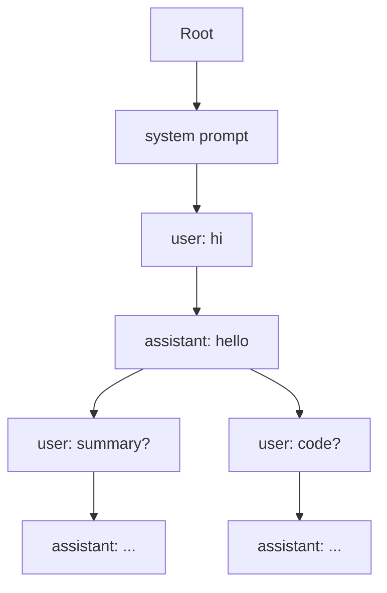

# 2. 核心思想

## 一句话理解

> SGLang 把 LLM 推理当成一段“程序”来编译和执行：程序中的调用点被调度、缓存、约束，最终变成高效 GPU 执行图。

## 核心抽象

### 1. LLM Program（LLM 程序）

SGLang 不满足于单次 `generate`。它提供了一组原语，让用户把多轮、结构化、分支化的交互表达为程序：

- `gen`：让模型生成一段文本（相当于 `completion`）。
- `select`：让模型从给定选项中选择（相当于分类 / 多选）。
- `fork`：把当前上下文复制成多个独立分支，并行执行。
- `run`：触发一次实际的模型执行，把前面累积的程序提交给 Runtime。
- `stream`：流式获取生成结果。

这些原语可以嵌套组合，例如：

```python
with sgl.assistant():
    sgl.gen("reasoning", max_tokens=256)
    sgl.select("action", ["search", "calculate", "answer"])
    with sgl.fork(num=3):
        sgl.gen("candidate", max_tokens=128)
```

### 2. RadixAttention（Radix Tree 前缀缓存）

SGLang 论文提出的核心优化。与 vLLM 的 Block-level Prefix Caching 不同，RadixAttention 使用 **Radix Tree（基数树 / 压缩前缀树）** 管理 KV Cache：

- 每个节点代表一段 token 序列的公共前缀。
- 新请求自动匹配最长公共前缀，复用已缓存 KV。
- 分支（如 `fork`、不同用户轮次）自然形成树状结构。
- 引用计数 + LRU 回收保证显存可控。



### 3. Structured Generation（结构化生成）

通过正则表达式、JSON Schema、EBNF 或函数签名约束模型输出，使模型每一步只能生成合法的 token。实现上通常依赖：

- **FSM（有限状态机）**：把约束编译成状态转移图。
- **Token Mask**：每步根据当前 FSM 状态，把不合法的 token 的 logits 置为 `-inf`。
- **XGrammar-2**：SGLang 当前主推的结构化解码后端，支持 JSON、EBNF、regex。

### 4. Compiler + Runtime

SGLang 的 Frontend 把用户程序编译成中间表示（IR），Runtime 负责：

- 调度：决定哪些 token 在本次 forward 中计算。
- 前缀匹配：用 Radix Tree 找出可复用 KV。
- 执行：调用 Attention Backend、Sampler、Structured Decode。
- 缓存更新：把新生成的 KV 插入 Radix Tree。

## 设计哲学

| 设计选择 | 解决的问题 | Trade-off |
|---|---|---|
| LLM Program 抽象 | 复杂交互难以表达 | 增加学习成本 |
| Radix Tree 缓存 | 多轮/多分支前缀重复计算 | 树结构维护比 Block Table 复杂 |
| 结构化生成 | 输出不可控、后校验浪费 | 约束编译可能增加延迟 |
| Compiler + Runtime | 多次调用之间缺乏全局优化 | 调试链路变长 |

## 与 vLLM 核心思想的对比

| 维度 | vLLM | SGLang |
|---|---|---|
| 缓存结构 | Block Table（分页） | Radix Tree（前缀树） |
| 复用粒度 | Block（通常 16 tokens） | 任意 token 边界 |
| 用户感知 | 配置 `enable_prefix_caching` | 自动、透明 |
| 编程模型 | 单次请求 | 程序 + 多调用 |
| 结构化 | 后端插件 | 原生集成 |

## 本章小结

SGLang 的核心思想可以概括为：**用程序抽象表达复杂交互，用 Radix Tree 自动复用前缀，用 FSM/编译器约束和优化执行**。这三个机制共同解决了 LLM 程序执行中的效率与可控性问题。
