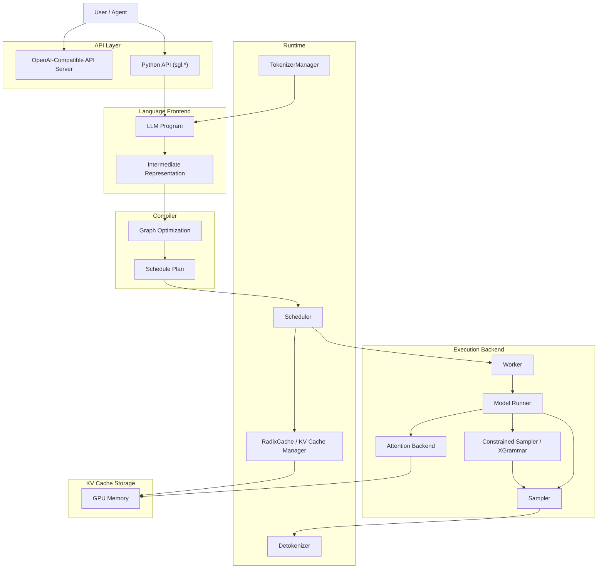

# 3. 架构设计

SGLang 的架构围绕“如何把一段 LLM 程序高效地编译、调度、执行并缓存”展开。整体可以分为语言前端、编译器、运行时和执行后端四层。

## 整体架构图



## 各组件职责

### 1. Python API / OpenAI API Server

- **Python API**：面向开发者的程序式接口，提供 `sgl.gen`、`sgl.select`、`sgl.fork` 等原语。
- **OpenAI API Server**：兼容 `/v1/completions` 和 `/v1/chat/completions`，让现有应用低迁移成本接入。

### 2. Language Frontend

把用户写的 LLM Program 解析成中间表示（IR）。IR 中记录了：

- 每个 `gen` / `select` 调用的约束、采样参数、最大长度。
- `fork` / `join` 形成的分支结构。
- 变量之间的数据依赖。

### 3. Compiler

对 IR 做图级优化：

- **调用合并**：把多个可以并行执行的 `gen` 合并到一次 forward。
- **前缀复用分析**：识别程序中可共享的上下文片段。
- **调度计划**：生成每轮需要计算的 token 集合。

### 4. Scheduler

运行时调度器，决定本轮哪些 token 需要计算。与 vLLM V1 类似，SGLang 也采用统一调度视角：

- 维护每个请求已计算的 token 数和待计算的 token 数。
- 根据 token budget 决定每轮计算量。
- 支持 chunked prefill 和 continuous batching。

### 5. RadixCache / KV Cache Manager

SGLang 的核心差异点：

- 使用 **Radix Tree** 组织 KV Cache。
- 新请求自动最长前缀匹配。
- `fork` 产生的分支共享父节点，写时复制（Copy-on-Write）。
- 引用计数 + LRU 回收。
- 2026 年 v0.5.12 起引入 **HiCache + UnifiedRadixTree**，支持滑动窗口 attention（SWA）、SSD offload（通过 Mooncake store）和更稳定的回收策略。

### 6. TokenizerManager / Detokenizer

- 负责 prompt / 输出的编解码。
- 结构化生成时，需要把 token 约束映射回文本约束（如 regex 字符类）。

### 7. Worker / Model Runner

执行实际模型推理：

- 加载模型权重。
- 执行 forward（prefill / decode）。
- 调用 Attention Backend 和 Sampler。

### 8. Constrained Sampler / XGrammar

- 把 regex / JSON Schema / EBNF 编译成 FSM 或 grammar。
- 每轮生成合法 token mask。
- 与 Sampler 结合，只从合法 token 中采样。

### 9. Attention Backend

SGLang 复用了与 vLLM 类似的 attention kernel 生态：

- FlashAttention
- FlashInfer
- MLA / FlashMLA（DeepSeek 系列）
- 自定义 kernel（如 Kimi-Linear CuteDSL prefill kernel on Blackwell）

## 分布式推理

SGLang 支持多种并行策略：

### Tensor Parallelism（TP）

把模型层内切分到多个 GPU。适合单节点多卡。

```bash
python -m sglang.launch_server --model-path meta-llama/Llama-3.1-8B --tp-size 2
```

### Pipeline Parallelism（PP）

把模型按层切分到多个 GPU / 节点。适合超大模型。

### Data Parallelism（DP）

每个 GPU 持有完整模型副本，服务不同请求。SGLang 支持 DP attention 等优化。

### PD 分离（Prefill-Decode Disaggregation）

把 prefill 阶段和 decode 阶段解耦到不同实例，分别优化。SGLang 在 2026 年版本中持续强化 PD 分离，支持 decode radix cache 和 Mooncake 集成。

## 本章小结

SGLang 的架构清晰分层：前端表达程序，编译器优化执行图，运行时管理调度和 Radix Tree 缓存，后端执行模型并施加结构化约束。RadixCache 和 Compiler 是 SGLang 区别于 vLLM 的核心。
