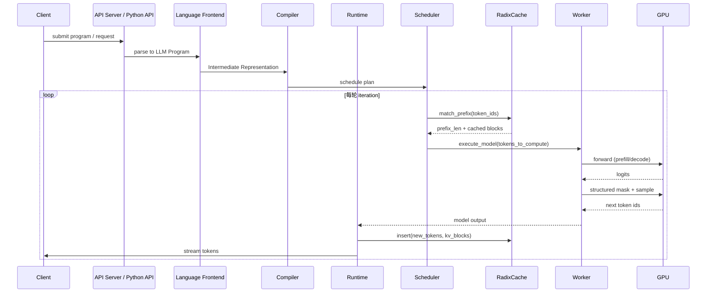

# 4. Runtime 工作流程

本章从一段 LLM Program（或一条 OpenAI API 请求）进入 SGLang 开始，讲到最终 token 返回客户端，完整描述 SGLang 的运行时生命周期。

## 完整时序图

## 阶段一：请求接入与程序编译

1. 用户通过 Python API 或 HTTP API 提交一段 LLM Program（或一条 chat completion 请求）。
2. Language Frontend 把程序解析为 IR，记录每个 `gen` / `select` 的约束、采样参数、依赖关系。
3. Compiler 对 IR 做图优化：合并可并行调用、识别可共享前缀、生成调度计划。

## 阶段二：Radix Tree 前缀匹配

4. Runtime 把每个待执行调用需要的 token 序列交给 Scheduler。
5. Scheduler 调用 RadixCache 的 `match_prefix`：
   - 从根节点开始，沿着 token 序列遍历 Radix Tree。
   - 直到遇到树中没有的 token，记录 `prefix_len`。
   - 返回已缓存的 KV 块列表。

如果该程序是某次多轮对话的延续，通常能匹配到 system prompt + 历史对话的完整前缀；如果使用了 `fork`，多个分支会共享父节点前缀。

## 阶段三：调度（Schedule）

6. Scheduler 根据 token budget、显存预算和当前 batch 状态，决定本轮要计算哪些 token。
7. 只有前缀之后的 suffix token 需要真正参与 forward；前缀 KV 直接复用。

## 阶段四：模型执行（Execute Model）

8. Worker 接收到调度结果后执行 forward：
   - 对于新 token 较多的是 prefill 风格计算。
   - 对于单个新 token 的是 decode 风格计算。
   - SGLang 当前版本也采用统一调度，prefill 和 decode 可以在同一 batch 中混合。

## 阶段五：结构化采样

9. 如果当前调用有结构化约束（regex / JSON Schema / EBNF），Constrained Sampler 会：
   - 根据当前 FSM / grammar 状态计算合法 token 集合。
   - 生成 mask，把非法 token 的 logits 置为 `-inf`。
   - 调用 Sampler 从合法 token 中采样。

## 阶段六：Radix Tree 更新与输出

10. Worker 把新 token 的 KV 返回给 Runtime。
11. Runtime 调用 RadixCache 的 `insert`，把新 token 序列作为新路径插入树中。
12. 如果请求完成，更新引用计数；如果还有后续调用，保留节点供下一轮复用。
13. Detokenizer 把 token id 解码为文本，流式或非流式返回给客户端。

## 与 vLLM Runtime 的异同

| 步骤 | vLLM V1 | SGLang |
|---|---|---|
| 输入抽象 | Request / SequenceGroup | LLM Program / IR |
| 前缀缓存 | KVCacheManager + Block Hash | RadixCache + Radix Tree |
| 复用触发 | 配置 enable_prefix_caching | 自动、透明 |
| 结构化 | 后端集成 | 原生编译到执行图 |
| 调度 | EngineCore 统一调度 | Runtime 统一调度 |

## 本章小结

SGLang 的运行时可以概括为：`接入 → 编译 → 前缀匹配 → 调度 → 执行 → 约束采样 → Radix Tree 更新 → 输出`。Radix Tree 的自动前缀复用贯穿整个生命周期，是降低多轮/多分支场景 prefill 开销的关键。
