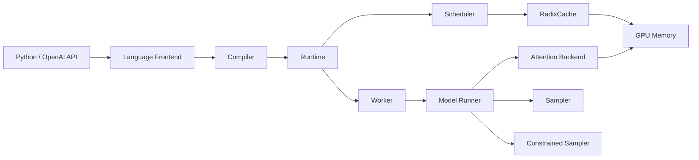

# 5. 核心模块

本章拆解 SGLang 中每个核心模块的职责、输入、输出、生命周期、异常处理与扩展方式。

## 1. Python API / OpenAI API Server

### 职责

提供用户入口，把程序或 HTTP 请求交给 Language Frontend。

### 输入

- Python `sgl.*` 程序
- HTTP 请求（OpenAI 兼容格式）

### 输出

- 生成的文本 / token 流
- 结构化输出（JSON、函数调用结果）

### 扩展方式

Python API 可以自定义 `function`、工具调用、prompt template；API Server 基于 FastAPI，可扩展中间件与认证。

---

## 2. Language Frontend

### 职责

把用户程序编译成 IR，并捕获变量、约束、依赖。

### 输入

- `sgl.gen`、`sgl.select`、`sgl.fork` 等调用
- 采样参数、约束条件

### 输出

- Intermediate Representation（IR）
- 执行图中的变量绑定

### 生命周期

随程序构建而创建，IR 生成后交给 Compiler。

---

## 3. Compiler

### 职责

对 IR 做全局优化，生成执行计划。

### 优化手段

- 合并多个 `gen` 调用到同一次 forward。
- 识别可共享前缀，提前调度复用。
- 为结构化约束生成 FSM / grammar。

### 输出

- Schedule Plan
- 约束编译结果

---

## 4. Runtime

### 职责

SGLang 的控制中心，连接编译器、调度器、缓存和执行后端。

### 输入

- Schedule Plan
- 新请求 / 程序

### 输出

- 执行命令给 Worker
- 输出 token 给 Detokenizer

### 生命周期

服务启动时初始化，直到进程退出。

---

## 5. Scheduler

### 职责

决定每轮 iteration 计算哪些 token。

### 输入

- 待执行调用列表
- 各调用已计算/待计算 token 数
- token budget / 显存预算

### 输出

- 本轮需要 forward 的 token 集合
- 每个调用对应的新 token 数

### 关键行为

- 统一处理 prefill / decode。
- 与 RadixCache 交互，只计算未缓存 suffix。
- 支持 continuous batching 和 chunked prefill。

---

## 6. RadixCache / KV Cache Manager

### 职责

用 Radix Tree 管理 KV Cache，实现自动前缀复用。

### 输入

- token 序列
- KV block 元数据

### 输出

- 最长匹配前缀长度
- 可复用的 KV block 列表

### 生命周期

伴随 Runtime 整个生命周期。

### 异常处理

- 显存不足：触发 LRU 回收。
- 树过大：按引用计数和最近使用策略淘汰。

### 扩展方式

2026 年的 HiCache / UnifiedRadixTree 支持 SSD offload、SWA、更大规模的分布式缓存。

---

## 7. TokenizerManager / Detokenizer

### 职责

文本与 token ID 互转；处理 unicode 多字节字符；在结构化生成中维护 token-to-char 映射。

---

## 8. Worker / Model Runner

### 职责

执行模型 forward，管理 GPU。

### 输入

- token ids
- RadixCache 提供的 KV 布局
- attention metadata

### 输出

- logits
- sampled tokens

### 扩展方式

支持本地 Worker、多节点 Worker、TP / PP / DP。

---

## 9. Constrained Sampler / XGrammar

### 职责

把结构化约束编译成可执行形式，并在每轮采样时生成合法 token mask。

### 输入

- regex / JSON Schema / EBNF
- 当前 FSM / grammar 状态
- logits

### 输出

- masked logits
- 下一个合法 token

### 关键后端

- **XGrammar-2**：SGLang 当前主推，支持 JSON、EBNF、regex。
- **Outlines**：社区常用，提供 FSM-based 约束。

---

## 10. Attention Backend

### 实现选项

- FlashAttention
- FlashInfer
- MLA / FlashMLA
- 自定义 kernel（如 CuteDSL prefill kernel for Blackwell）

### 选择逻辑

根据 GPU 架构、模型类型、是否使用 prefix caching / structured generation 自动选择。

## 模块协作图

## 本章小结

SGLang 的模块划分清晰，Compiler 和 RadixCache 是其与 vLLM 最大的差异点。理解 Runtime 如何协调这两个模块，是掌握 SGLang 的关键。
