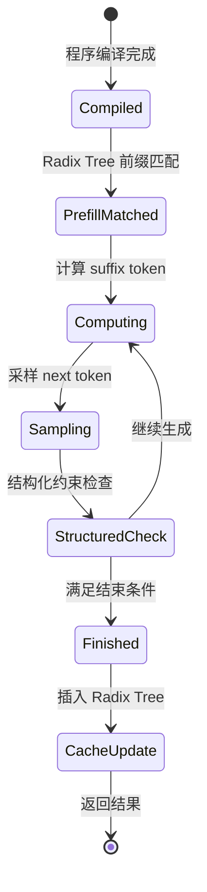

# 6. 源码分析

本章基于 SGLang GitHub 源码，分析其目录结构、模块划分、入口函数与调用链。内容基于 2026 年 7 月主分支（v0.5.14 前后）。

## 仓库结构

```
sglang/
├── python/sglang/
│   ├── api.py                # Python API：sgl.gen / select / fork 等
│   ├── lang/
│   │   ├── frontend.py       # Language Frontend / IR
│   │   ├── ir.py             # 中间表示
│   │   └── interpreter.py    # 解释执行层
│   ├── srt/
│   │   ├── entrypoints/
│   │   │   ├── http_server.py    # OpenAI 兼容 HTTP server
│   │   │   └── launch_server.py  # 服务启动入口
│   │   ├── managers/
│   │   │   ├── scheduler.py      # 调度器
│   │   │   ├── radix_cache.py    # RadixCache / Radix Tree
│   │   │   ├── tokenizer_manager.py
│   │   │   └── io_struct.py
│   │   ├── models/
│   │   │   └── ...               # 各模型实现
│   │   ├── workers/
│   │   │   ├── worker.py         # Worker 进程
│   │   │   └── model_runner.py   # Model Runner
│   │   ├── layers/
│   │   ├── sampling/
│   │   │   └── ...               # Sampler / Constrained Sampler
│   │   └── utils.py
│   └── test/
├── sgl-kernel/               # 自定义 CUDA kernel
├── cpp/                      # C++ 高性能组件（Radix Tree、cache 等）
└── docs/
```

## 关键入口函数

### 1. `launch_server`

服务启动入口，解析参数，初始化 Runtime、Scheduler、RadixCache、Worker。

### 2. `Runtime`

SGLang Runtime 的核心类，职责包括：

- 接收来自 Frontend 的 IR / 执行计划。
- 调用 Scheduler 和 RadixCache。
- 把执行请求分发给 Worker。
- 收集输出并返回给 Frontend / API Server。

### 3. `Scheduler.schedule`

每轮调度的核心：

```python
# 伪代码
prefix_len, cached_blocks = radix_cache.match_prefix(token_ids)
tokens_to_compute = token_ids[prefix_len:]
# 根据 token_budget 决定本轮计算量
# 调用 worker.execute_model
# 把新 KV 插入 radix_cache
```

### 4. `RadixCache.match_prefix` / `insert`

Radix Tree 的最长前缀匹配与新节点插入。

### 5. `Worker.execute_model`

执行模型 forward，由 Model Runner 实际运行。

### 6. `ConstrainedSampler.step` / XGrammar integration

根据当前 grammar 状态生成合法 token mask，再交给 Sampler。

## 调用链

一条 Python API 程序的完整调用链：

```
sgl.gen(prompt, regex=...)
  → Language Frontend 构建 IR
    → Compiler 生成 Schedule Plan
      → Runtime.run
        → Scheduler.schedule
          → RadixCache.match_prefix
        → Worker.execute_model
          → ModelRunner.forward
            → Attention Backend
            → ConstrainedSampler (if structured)
            → Sampler
        → RadixCache.insert
    → Detokenizer
  → yield token
```

## 状态流转

### Radix Tree 节点状态

- **Shared**：被多个请求或分支共享（ref_count > 1）。
- **Exclusive**：只被一个请求引用（ref_count == 1）。
- **Cached**：有 KV 数据 attached。
- **Evicted**：被 LRU 淘汰，释放显存。

### LLM Program 执行状态



## 设计思路

SGLang 源码的核心设计思想：

1. **程序即数据**：把 LLM 调用抽象成 IR，让编译器做全局优化。
2. **自动前缀复用**：Radix Tree 让前缀复用对用户透明。
3. **结构化生成原生**：约束编译与采样紧密集成，不是后处理。
4. **与 vLLM 共享执行层**：Attention Backend、Model Runner 等大量复用成熟实现。

## 本章小结

SGLang 源码虽然庞大，但核心路径清晰：Frontend → Compiler → Runtime → Scheduler → RadixCache → Worker → Sampler。理解这条主线，就能把握整个系统。
